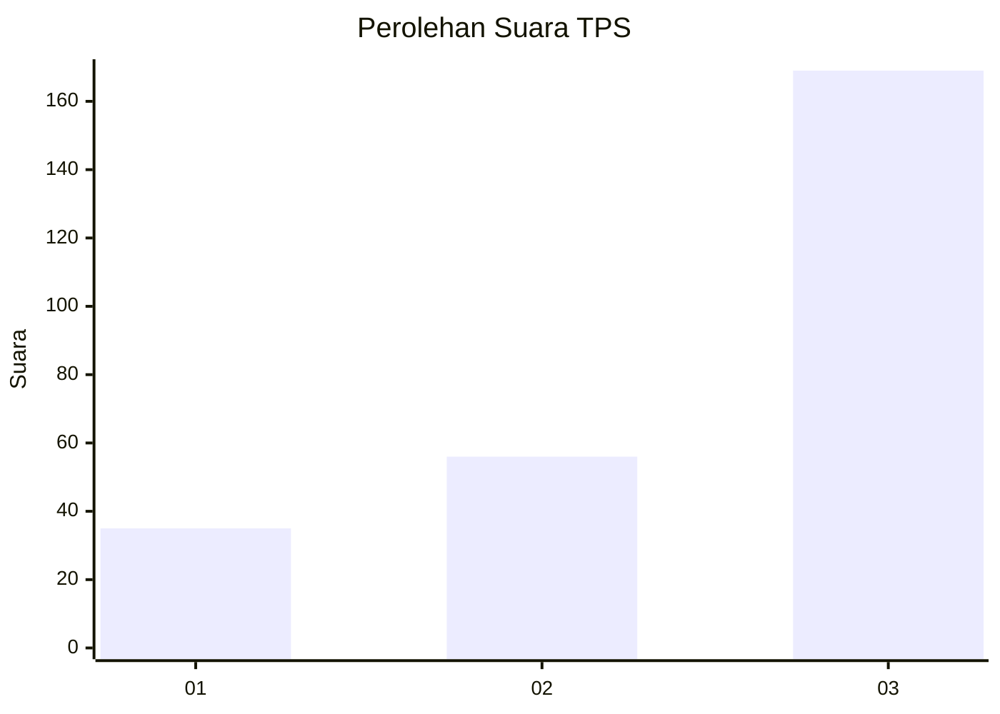
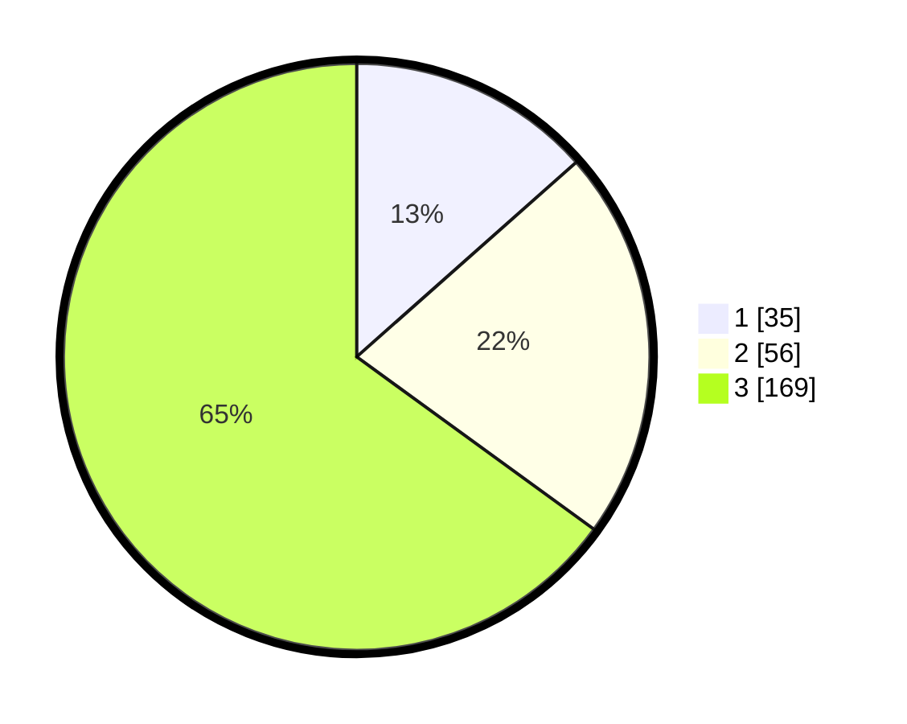

# Hasil

## Grafik

## Tabel

| No. | Nama Paslon    | Suara | Suara (raw) | Persentase |
|:--- |:-------------- | -----:| -----------:| ----------:|
| 1   | ANIES MUHAIMIN | 35    | [35][p-1]   | 13,46      |
| 2   | PRABOWO GIBRAN | 56    | [56][p-2]   | 21,54      |
| 3   | GANJAR MAHFUD  | 169   | [169][p-3]  | 65,00      |

[p-1]: https://github.com/gigit-pemilu/pemilu-2024-33-jawa-tengah/blob/main/pilpres/hitung-suara/sub/33-jawa-tengah/sub/03-purbalingga/sub/10-karangreja/sub/2001-serang/sub/022-tps/sub/paslon-1.txt
[p-2]: https://github.com/gigit-pemilu/pemilu-2024-33-jawa-tengah/blob/main/pilpres/hitung-suara/sub/33-jawa-tengah/sub/03-purbalingga/sub/10-karangreja/sub/2001-serang/sub/022-tps/sub/paslon-2.txt
[p-3]: https://github.com/gigit-pemilu/pemilu-2024-33-jawa-tengah/blob/main/pilpres/hitung-suara/sub/33-jawa-tengah/sub/03-purbalingga/sub/10-karangreja/sub/2001-serang/sub/022-tps/sub/paslon-3.txt

## Foto C Plano

https://sirekap-obj-formc.kpu.go.id/5c83/pemilu/ppwp/33/03/10/20/01/3303102001022-20240215-003904--041769fd-f492-4574-a3d7-a6309af81b13.jpg

https://sirekap-obj-formc.kpu.go.id/5c83/pemilu/ppwp/33/03/10/20/01/3303102001022-20240215-004043--f172c39c-1123-4fea-9cae-470bfe4ea8c3.jpg

https://sirekap-obj-formc.kpu.go.id/5c83/pemilu/ppwp/33/03/10/20/01/3303102001022-20240215-004110--f41ca3f1-dfe6-4858-b834-790cd47152ad.jpg

## Metadata

| Key        | Value               |
| ---------- | ------------------- |
| Time Stamp | 2024-02-15 15:00:29 |

