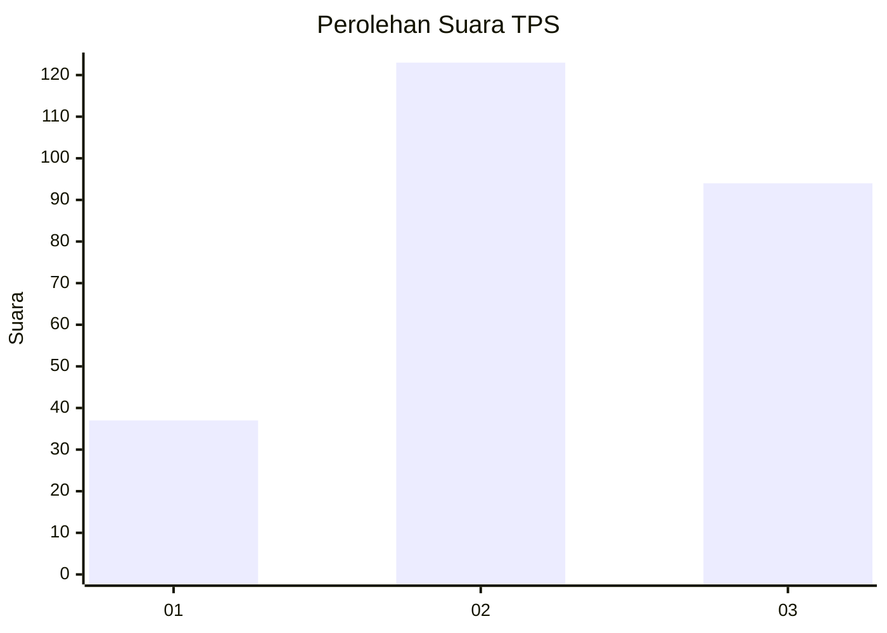
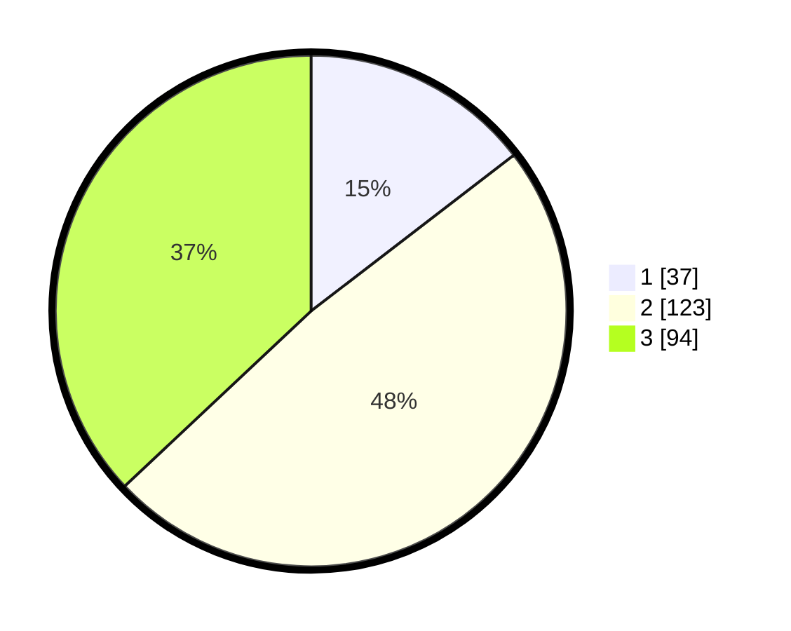

# Hasil

## Grafik

## Tabel

| No. | Nama Paslon    | Suara | Suara (raw) | Persentase |
|:--- |:-------------- | -----:| -----------:| ----------:|
| 1   | ANIES MUHAIMIN | 37    | [37][p-1]   | 14,57      |
| 2   | PRABOWO GIBRAN | 123   | [123][p-2]  | 48,43      |
| 3   | GANJAR MAHFUD  | 94    | [94][p-3]   | 37,01      |

[p-1]: https://github.com/gigit-pemilu/pemilu-2024-33-jawa-tengah/blob/main/pilpres/hitung-suara/sub/33-jawa-tengah/sub/03-purbalingga/sub/10-karangreja/sub/2002-kutabawa/sub/005-tps/sub/paslon-1.txt
[p-2]: https://github.com/gigit-pemilu/pemilu-2024-33-jawa-tengah/blob/main/pilpres/hitung-suara/sub/33-jawa-tengah/sub/03-purbalingga/sub/10-karangreja/sub/2002-kutabawa/sub/005-tps/sub/paslon-2.txt
[p-3]: https://github.com/gigit-pemilu/pemilu-2024-33-jawa-tengah/blob/main/pilpres/hitung-suara/sub/33-jawa-tengah/sub/03-purbalingga/sub/10-karangreja/sub/2002-kutabawa/sub/005-tps/sub/paslon-3.txt

## Foto C Plano

https://sirekap-obj-formc.kpu.go.id/b114/pemilu/ppwp/33/03/10/20/02/3303102002005-20240215-034722--f8c0bf49-e969-4efc-9125-5f72e5d53c8e.jpg

https://sirekap-obj-formc.kpu.go.id/b114/pemilu/ppwp/33/03/10/20/02/3303102002005-20240215-034952--e01df50f-bfb0-46d0-86a0-1403dfbc477a.jpg

https://sirekap-obj-formc.kpu.go.id/b114/pemilu/ppwp/33/03/10/20/02/3303102002005-20240215-035118--442054ff-6469-42ae-8ffc-cebce96ef8b3.jpg

## Metadata

| Key        | Value               |
| ---------- | ------------------- |
| Time Stamp | 2024-02-15 12:00:28 |

