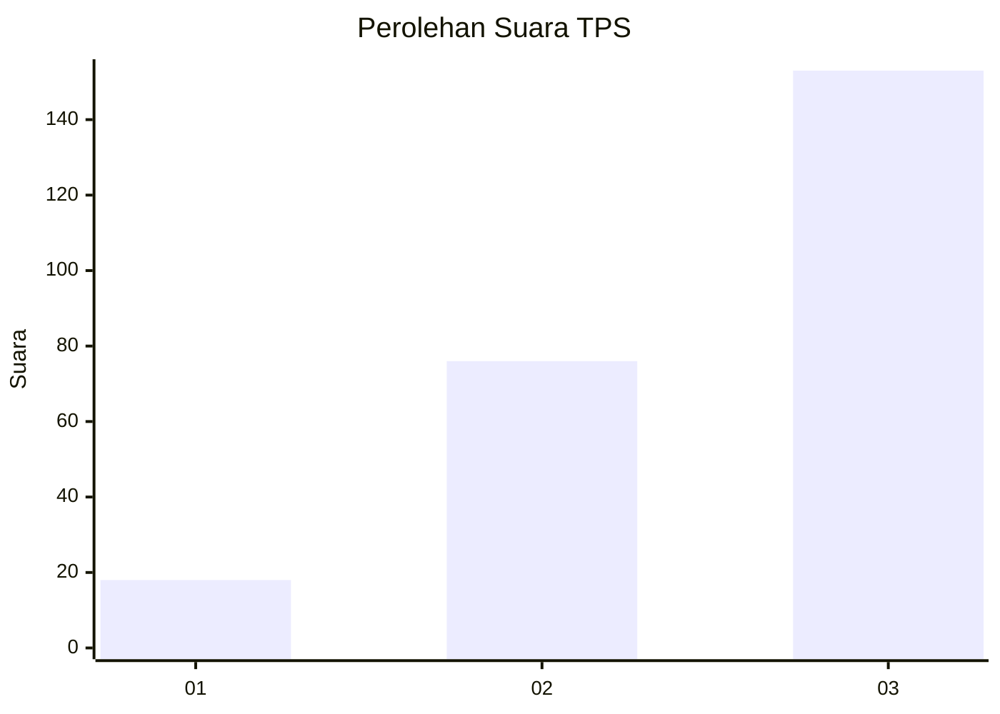
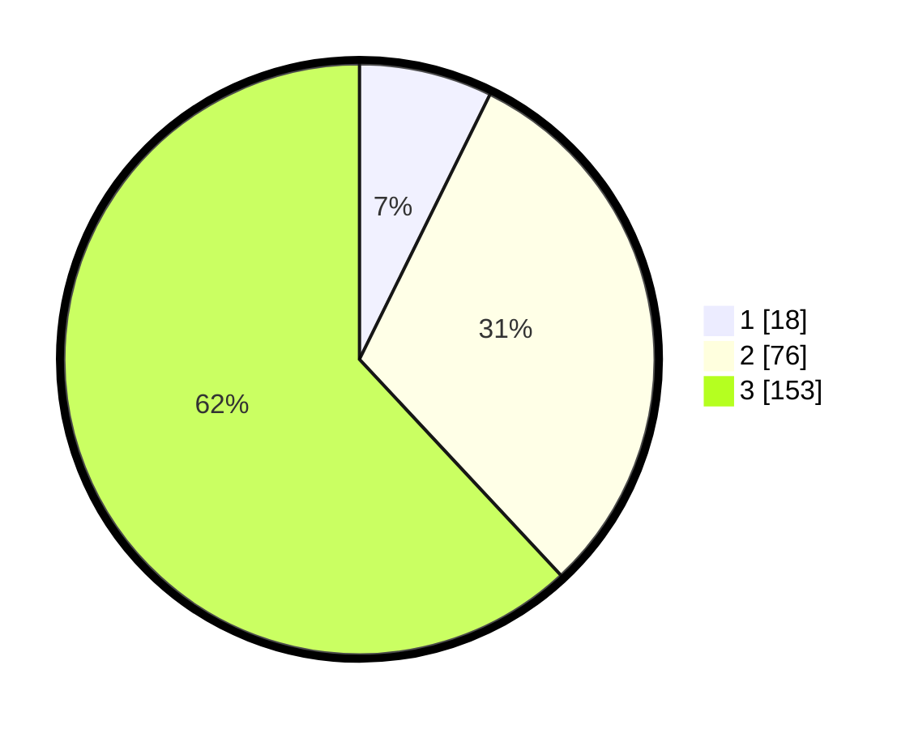

# Hasil

## Grafik

## Tabel

| No. | Nama Paslon    | Suara | Suara (raw) | Persentase |
|:--- |:-------------- | -----:| -----------:| ----------:|
| 1   | ANIES MUHAIMIN | 18    | [18][p-1]   | 7,29       |
| 2   | PRABOWO GIBRAN | 76    | [76][p-2]   | 30,77      |
| 3   | GANJAR MAHFUD  | 153   | [153][p-3]  | 61,94      |

[p-1]: https://github.com/gigit-pemilu/pemilu-2024-33-jawa-tengah/blob/main/pilpres/hitung-suara/sub/33-jawa-tengah/sub/03-purbalingga/sub/10-karangreja/sub/2002-kutabawa/sub/015-tps/sub/paslon-1.txt
[p-2]: https://github.com/gigit-pemilu/pemilu-2024-33-jawa-tengah/blob/main/pilpres/hitung-suara/sub/33-jawa-tengah/sub/03-purbalingga/sub/10-karangreja/sub/2002-kutabawa/sub/015-tps/sub/paslon-2.txt
[p-3]: https://github.com/gigit-pemilu/pemilu-2024-33-jawa-tengah/blob/main/pilpres/hitung-suara/sub/33-jawa-tengah/sub/03-purbalingga/sub/10-karangreja/sub/2002-kutabawa/sub/015-tps/sub/paslon-3.txt

## Foto C Plano

https://sirekap-obj-formc.kpu.go.id/072e/pemilu/ppwp/33/03/10/20/02/3303102002015-20240214-234254--5c5a10e1-e9e2-4c97-b3b6-490c5ec9fdbc.jpg

https://sirekap-obj-formc.kpu.go.id/072e/pemilu/ppwp/33/03/10/20/02/3303102002015-20240214-234504--2fcac2a9-8519-4243-bcf7-fe48bd98b8ea.jpg

https://sirekap-obj-formc.kpu.go.id/072e/pemilu/ppwp/33/03/10/20/02/3303102002015-20240214-234640--1a3ef824-2ae9-47dd-b3df-1194a3d3a5ae.jpg

## Metadata

| Key        | Value               |
| ---------- | ------------------- |
| Time Stamp | 2024-02-15 12:00:28 |

