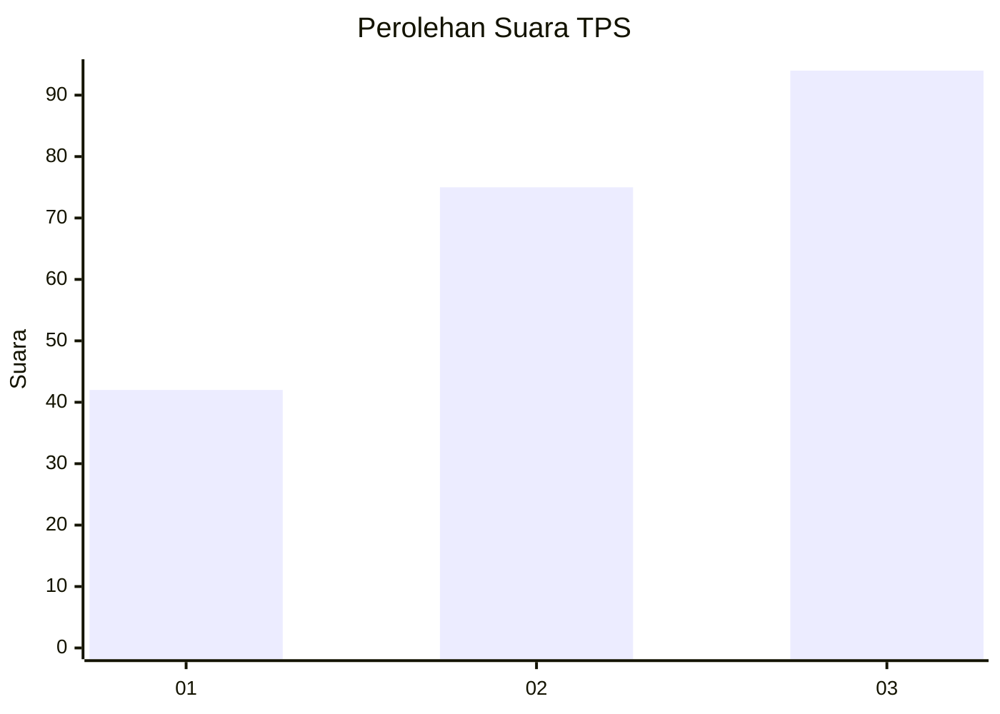
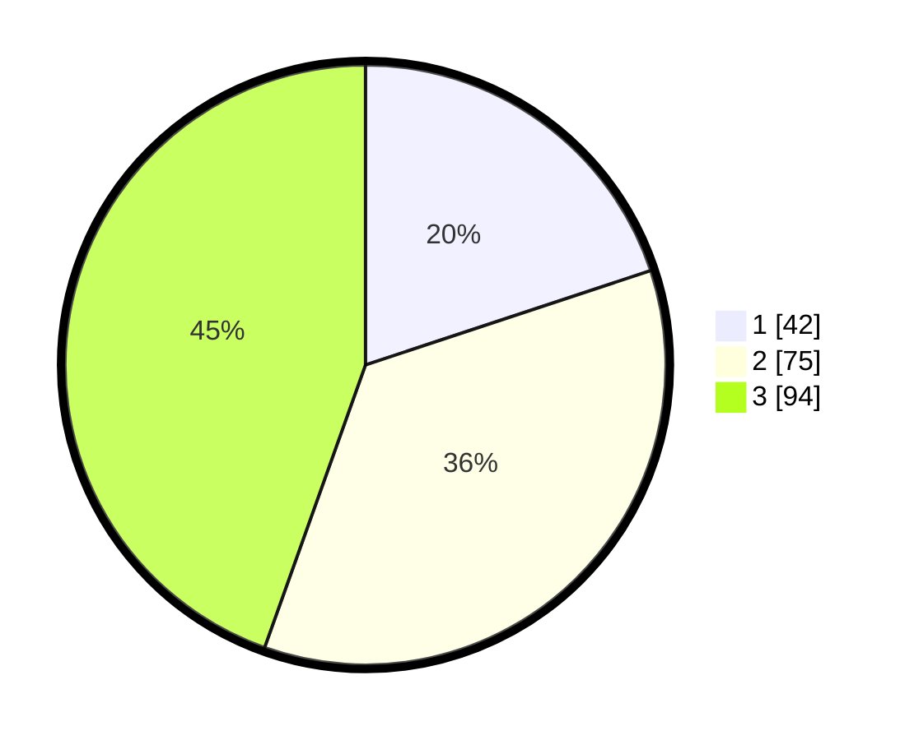

# Hasil

## Grafik

## Tabel

| No. | Nama Paslon    | Suara | Suara (raw) | Persentase |
|:--- |:-------------- | -----:| -----------:| ----------:|
| 1   | ANIES MUHAIMIN | 42    | [42][p-1]   | 19,91      |
| 2   | PRABOWO GIBRAN | 75    | [75][p-2]   | 35,55      |
| 3   | GANJAR MAHFUD  | 94    | [94][p-3]   | 44,55      |

[p-1]: https://github.com/gigit-pemilu/pemilu-2024/blob/main/pilpres/hitung-suara/sub/33-jawa-tengah/sub/03-purbalingga/sub/10-karangreja/sub/2004-tlahab-lor/sub/001-tps/sub/paslon-1.txt
[p-2]: https://github.com/gigit-pemilu/pemilu-2024/blob/main/pilpres/hitung-suara/sub/33-jawa-tengah/sub/03-purbalingga/sub/10-karangreja/sub/2004-tlahab-lor/sub/001-tps/sub/paslon-2.txt
[p-3]: https://github.com/gigit-pemilu/pemilu-2024/blob/main/pilpres/hitung-suara/sub/33-jawa-tengah/sub/03-purbalingga/sub/10-karangreja/sub/2004-tlahab-lor/sub/001-tps/sub/paslon-3.txt

## Foto C Plano

https://sirekap-obj-formc.kpu.go.id/6c17/pemilu/ppwp/33/03/10/20/04/3303102004001-20240214-141507--bb66632a-7f10-425c-bac6-a94ef72a933a.jpg

https://sirekap-obj-formc.kpu.go.id/6c17/pemilu/ppwp/33/03/10/20/04/3303102004001-20240214-141558--70239899-09d4-4517-bf6d-db20f27e4bc8.jpg

https://sirekap-obj-formc.kpu.go.id/6c17/pemilu/ppwp/33/03/10/20/04/3303102004001-20240214-141624--381a3263-cde7-46a6-bbf7-6cf958be0916.jpg

## Metadata

| Key        | Value               |
| ---------- | ------------------- |
| Time Stamp | 2024-02-15 15:00:29 |

