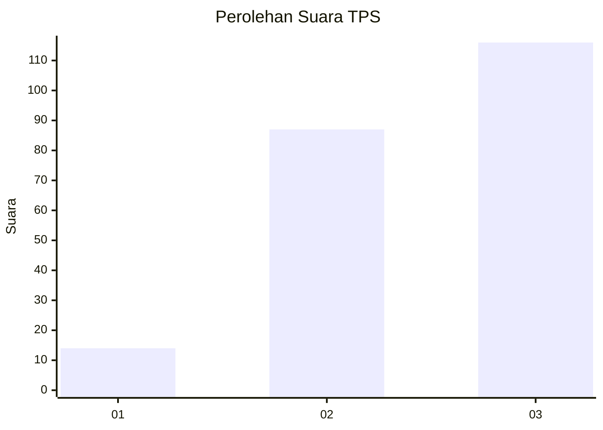
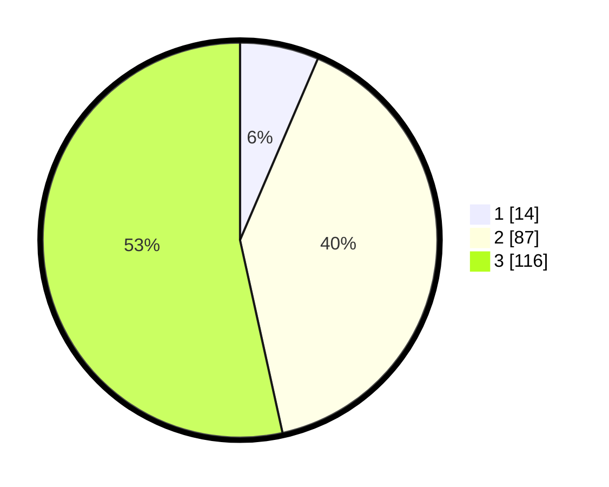

# Hasil

## Grafik

## Tabel

| No. | Nama Paslon    | Suara | Suara (raw) | Persentase |
|:--- |:-------------- | -----:| -----------:| ----------:|
| 1   | ANIES MUHAIMIN | 14    | [14][p-1]   | 6,45       |
| 2   | PRABOWO GIBRAN | 87    | [87][p-2]   | 40,09      |
| 3   | GANJAR MAHFUD  | 116   | [116][p-3]  | 53,46      |

[p-1]: https://github.com/gigit-pemilu/pemilu-2024-33-jawa-tengah/blob/main/pilpres/hitung-suara/sub/33-jawa-tengah/sub/03-purbalingga/sub/10-karangreja/sub/2004-tlahab-lor/sub/015-tps/sub/paslon-1.txt
[p-2]: https://github.com/gigit-pemilu/pemilu-2024-33-jawa-tengah/blob/main/pilpres/hitung-suara/sub/33-jawa-tengah/sub/03-purbalingga/sub/10-karangreja/sub/2004-tlahab-lor/sub/015-tps/sub/paslon-2.txt
[p-3]: https://github.com/gigit-pemilu/pemilu-2024-33-jawa-tengah/blob/main/pilpres/hitung-suara/sub/33-jawa-tengah/sub/03-purbalingga/sub/10-karangreja/sub/2004-tlahab-lor/sub/015-tps/sub/paslon-3.txt

## Foto C Plano

https://sirekap-obj-formc.kpu.go.id/69c9/pemilu/ppwp/33/03/10/20/04/3303102004015-20240215-013613--3e88d0f3-e9e5-4dde-b986-2b3ae79e884e.jpg

https://sirekap-obj-formc.kpu.go.id/69c9/pemilu/ppwp/33/03/10/20/04/3303102004015-20240215-013825--7b0f6387-1374-4ccb-987d-e24bd94cc24e.jpg

https://sirekap-obj-formc.kpu.go.id/69c9/pemilu/ppwp/33/03/10/20/04/3303102004015-20240215-013932--fe320f3b-78ed-4cd9-84dd-3a2b4ee5fa48.jpg

## Metadata

| Key        | Value               |
| ---------- | ------------------- |
| Time Stamp | 2024-02-15 12:00:28 |

