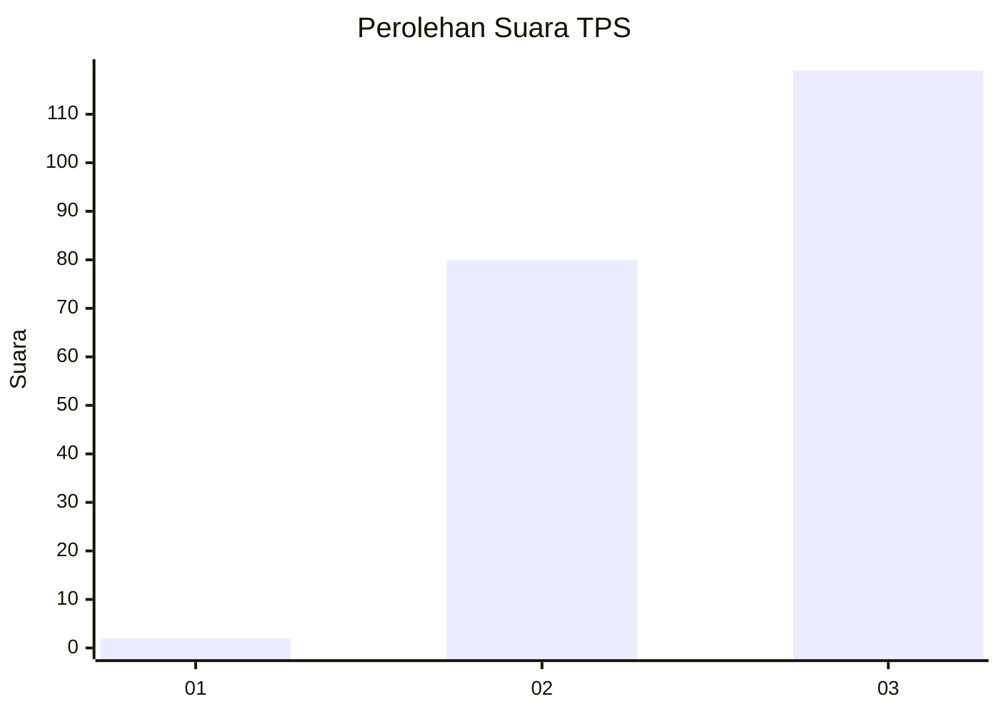
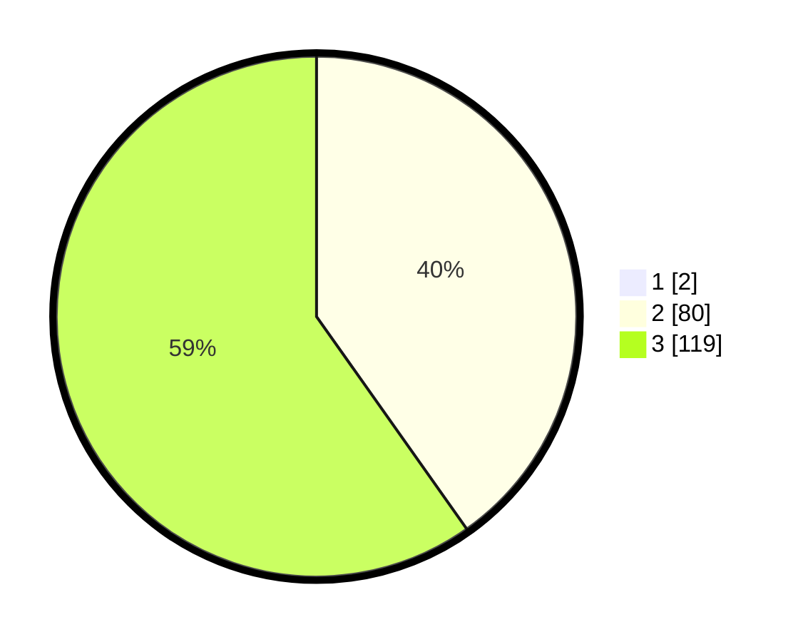

# Hasil

## Grafik

## Tabel

| No. | Nama Paslon    | Suara | Suara (raw) | Persentase |
|:--- |:-------------- | -----:| -----------:| ----------:|
| 1   | ANIES MUHAIMIN | 2     | [2][p-1]    | 1,00       |
| 2   | PRABOWO GIBRAN | 80    | [80][p-2]   | 39,80      |
| 3   | GANJAR MAHFUD  | 119   | [119][p-3]  | 59,20      |

[p-1]: https://github.com/gigit-pemilu/pemilu-2024/blob/main/pilpres/hitung-suara/sub/33-jawa-tengah/sub/03-purbalingga/sub/10-karangreja/sub/2004-tlahab-lor/sub/016-tps/sub/paslon-1.txt
[p-2]: https://github.com/gigit-pemilu/pemilu-2024/blob/main/pilpres/hitung-suara/sub/33-jawa-tengah/sub/03-purbalingga/sub/10-karangreja/sub/2004-tlahab-lor/sub/016-tps/sub/paslon-2.txt
[p-3]: https://github.com/gigit-pemilu/pemilu-2024/blob/main/pilpres/hitung-suara/sub/33-jawa-tengah/sub/03-purbalingga/sub/10-karangreja/sub/2004-tlahab-lor/sub/016-tps/sub/paslon-3.txt

## Foto C Plano

https://sirekap-obj-formc.kpu.go.id/53d4/pemilu/ppwp/33/03/10/20/04/3303102004016-20240215-000651--703bb9c0-a0ef-4fb6-a6e3-d9068d003fc7.jpg

https://sirekap-obj-formc.kpu.go.id/53d4/pemilu/ppwp/33/03/10/20/04/3303102004016-20240215-001146--ad3ed95d-21a7-4df9-9307-f71c6b5ea248.jpg

https://sirekap-obj-formc.kpu.go.id/53d4/pemilu/ppwp/33/03/10/20/04/3303102004016-20240215-014703--ebd4aaab-f39d-4c20-aa2f-7c36afed2a15.jpg

## Metadata

| Key        | Value               |
| ---------- | ------------------- |
| Time Stamp | 2024-02-15 21:01:18 |

