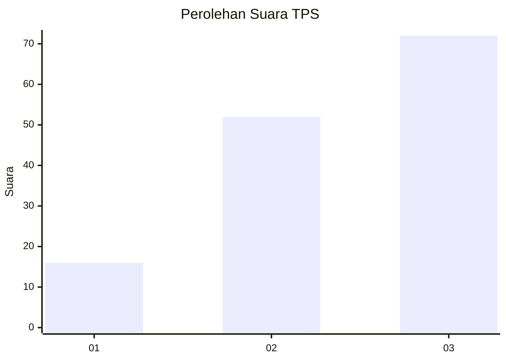
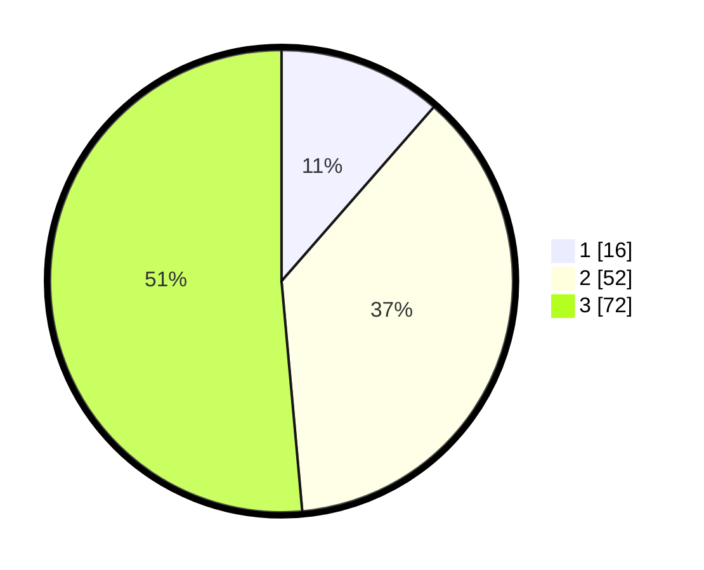

# Hasil

## Grafik

## Tabel

| No. | Nama Paslon    | Suara | Suara (raw) | Persentase |
|:--- |:-------------- | -----:| -----------:| ----------:|
| 1   | ANIES MUHAIMIN | 16    | [16][p-1]   | 11,43      |
| 2   | PRABOWO GIBRAN | 52    | [52][p-2]   | 37,14      |
| 3   | GANJAR MAHFUD  | 72    | [72][p-3]   | 51,43      |

[p-1]: https://github.com/gigit-pemilu/pemilu-2024/blob/main/pilpres/hitung-suara/sub/33-jawa-tengah/sub/03-purbalingga/sub/10-karangreja/sub/2005-tlahab-kidul/sub/005-tps/sub/paslon-1.txt
[p-2]: https://github.com/gigit-pemilu/pemilu-2024/blob/main/pilpres/hitung-suara/sub/33-jawa-tengah/sub/03-purbalingga/sub/10-karangreja/sub/2005-tlahab-kidul/sub/005-tps/sub/paslon-2.txt
[p-3]: https://github.com/gigit-pemilu/pemilu-2024/blob/main/pilpres/hitung-suara/sub/33-jawa-tengah/sub/03-purbalingga/sub/10-karangreja/sub/2005-tlahab-kidul/sub/005-tps/sub/paslon-3.txt

## Foto C Plano

https://sirekap-obj-formc.kpu.go.id/555a/pemilu/ppwp/33/03/10/20/05/3303102005005-20240215-043226--f80a17e3-cb49-4175-b5e1-752f9d04ff5b.jpg

https://sirekap-obj-formc.kpu.go.id/555a/pemilu/ppwp/33/03/10/20/05/3303102005005-20240215-043433--11b1f26b-efb0-4122-983f-223c299c4cab.jpg

https://sirekap-obj-formc.kpu.go.id/555a/pemilu/ppwp/33/03/10/20/05/3303102005005-20240214-204953--64b0ca00-ec26-42f9-9538-483f1daaee83.jpg

## Metadata

| Key        | Value               |
| ---------- | ------------------- |
| Time Stamp | 2024-02-15 15:00:29 |

