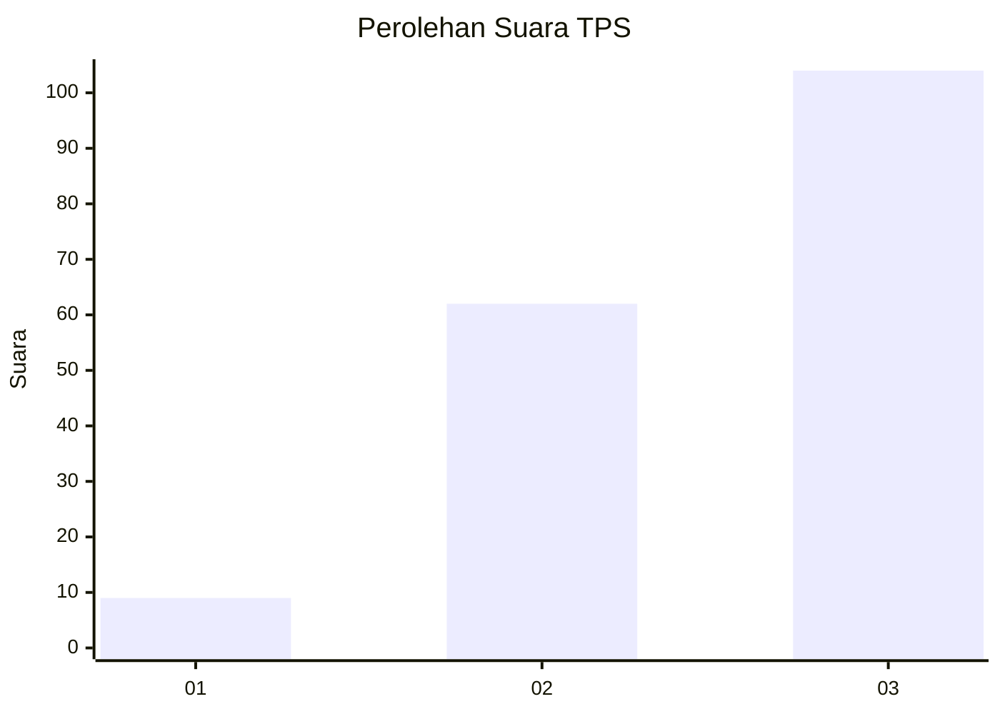
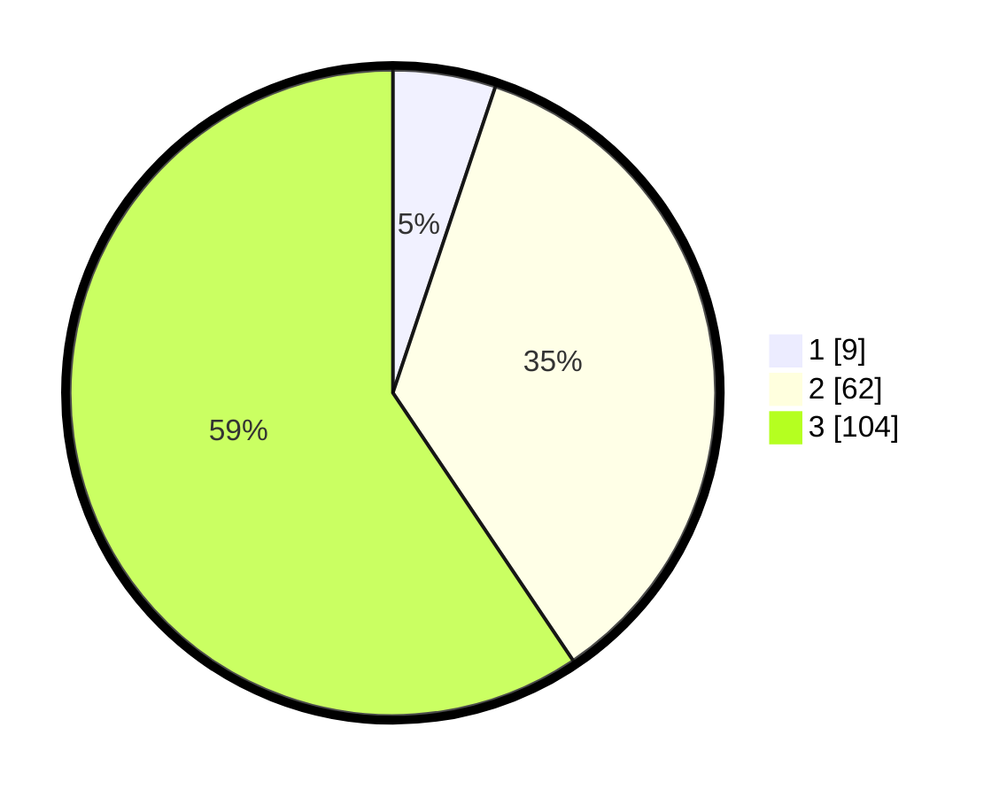

# Hasil

## Grafik

## Tabel

| No. | Nama Paslon    | Suara | Suara (raw) | Persentase |
|:--- |:-------------- | -----:| -----------:| ----------:|
| 1   | ANIES MUHAIMIN | 9     | [9][p-1]    | 5,14       |
| 2   | PRABOWO GIBRAN | 62    | [62][p-2]   | 35,43      |
| 3   | GANJAR MAHFUD  | 104   | [104][p-3]  | 59,43      |

[p-1]: https://github.com/gigit-pemilu/pemilu-2024-33-jawa-tengah/blob/main/pilpres/hitung-suara/sub/33-jawa-tengah/sub/03-purbalingga/sub/10-karangreja/sub/2007-gondang/sub/003-tps/sub/paslon-1.txt
[p-2]: https://github.com/gigit-pemilu/pemilu-2024-33-jawa-tengah/blob/main/pilpres/hitung-suara/sub/33-jawa-tengah/sub/03-purbalingga/sub/10-karangreja/sub/2007-gondang/sub/003-tps/sub/paslon-2.txt
[p-3]: https://github.com/gigit-pemilu/pemilu-2024-33-jawa-tengah/blob/main/pilpres/hitung-suara/sub/33-jawa-tengah/sub/03-purbalingga/sub/10-karangreja/sub/2007-gondang/sub/003-tps/sub/paslon-3.txt

## Foto C Plano

https://sirekap-obj-formc.kpu.go.id/c2c2/pemilu/ppwp/33/03/10/20/07/3303102007003-20240214-211942--a432d6a7-9527-45cc-9715-366b496ffe92.jpg

https://sirekap-obj-formc.kpu.go.id/c2c2/pemilu/ppwp/33/03/10/20/07/3303102007003-20240214-212023--46cb59c2-eb02-4dca-910a-102f673c140b.jpg

https://sirekap-obj-formc.kpu.go.id/c2c2/pemilu/ppwp/33/03/10/20/07/3303102007003-20240214-212052--c7bc95e9-5d8f-41d0-aec6-3674060766c8.jpg

## Metadata

| Key        | Value               |
| ---------- | ------------------- |
| Time Stamp | 2024-02-15 15:00:29 |

