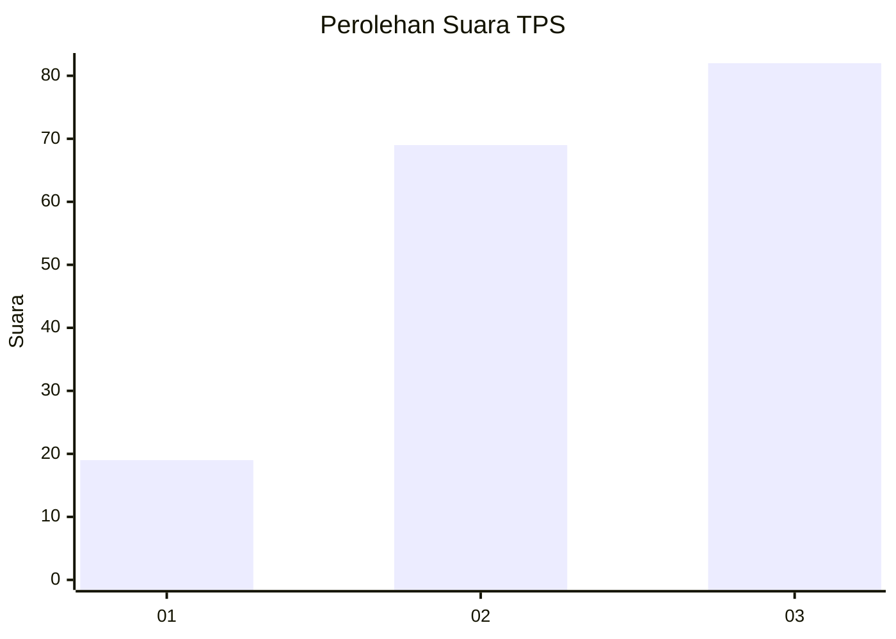
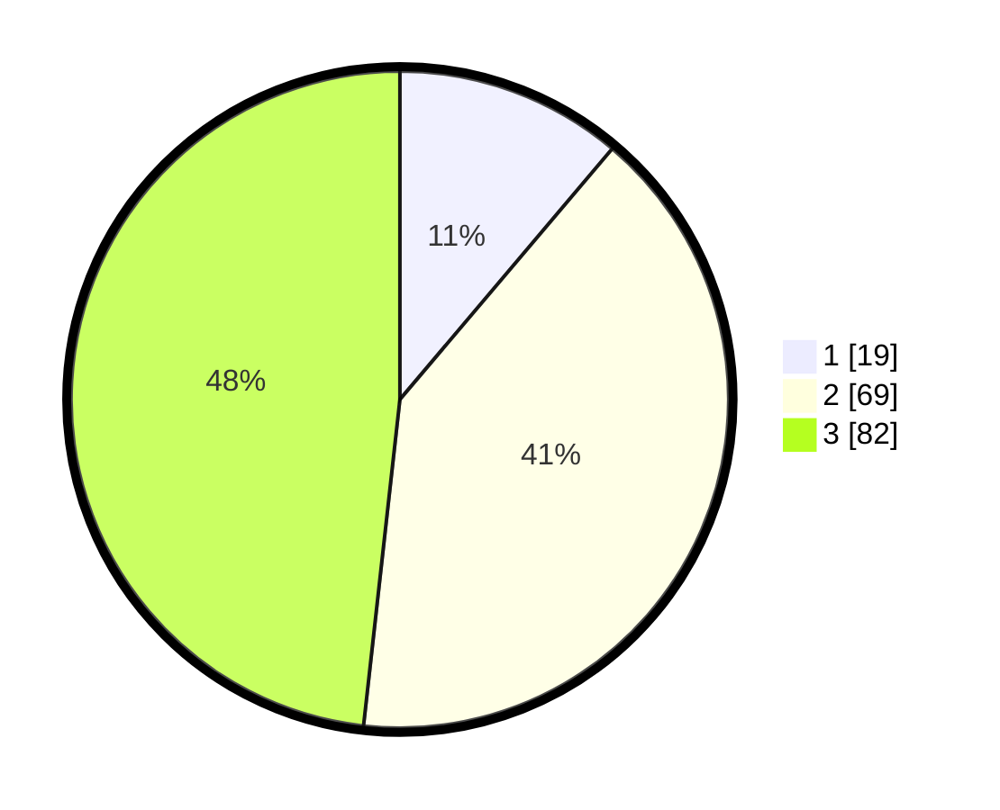

# Hasil

## Grafik

## Tabel

| No. | Nama Paslon    | Suara | Suara (raw) | Persentase |
|:--- |:-------------- | -----:| -----------:| ----------:|
| 1   | ANIES MUHAIMIN | 19    | [19][p-1]   | 11,18      |
| 2   | PRABOWO GIBRAN | 69    | [69][p-2]   | 40,59      |
| 3   | GANJAR MAHFUD  | 82    | [82][p-3]   | 48,24      |

[p-1]: https://github.com/gigit-pemilu/pemilu-2024/blob/main/pilpres/hitung-suara/sub/33-jawa-tengah/sub/03-purbalingga/sub/11-karanganyar/sub/2002-buara/sub/003-tps/sub/paslon-1.txt
[p-2]: https://github.com/gigit-pemilu/pemilu-2024/blob/main/pilpres/hitung-suara/sub/33-jawa-tengah/sub/03-purbalingga/sub/11-karanganyar/sub/2002-buara/sub/003-tps/sub/paslon-2.txt
[p-3]: https://github.com/gigit-pemilu/pemilu-2024/blob/main/pilpres/hitung-suara/sub/33-jawa-tengah/sub/03-purbalingga/sub/11-karanganyar/sub/2002-buara/sub/003-tps/sub/paslon-3.txt

## Foto C Plano

https://sirekap-obj-formc.kpu.go.id/b7b5/pemilu/ppwp/33/03/11/20/02/3303112002003-20240214-220037--53fa9e82-cf30-4147-aa93-f573ba580076.jpg

https://sirekap-obj-formc.kpu.go.id/b7b5/pemilu/ppwp/33/03/11/20/02/3303112002003-20240214-215556--52b02959-4697-4940-b292-f1617266c83d.jpg

https://sirekap-obj-formc.kpu.go.id/b7b5/pemilu/ppwp/33/03/11/20/02/3303112002003-20240214-220832--d7e38eaf-b01f-44b6-9a56-136d6f23c357.jpg

## Metadata

| Key        | Value               |
| ---------- | ------------------- |
| Time Stamp | 2024-02-15 20:30:46 |

