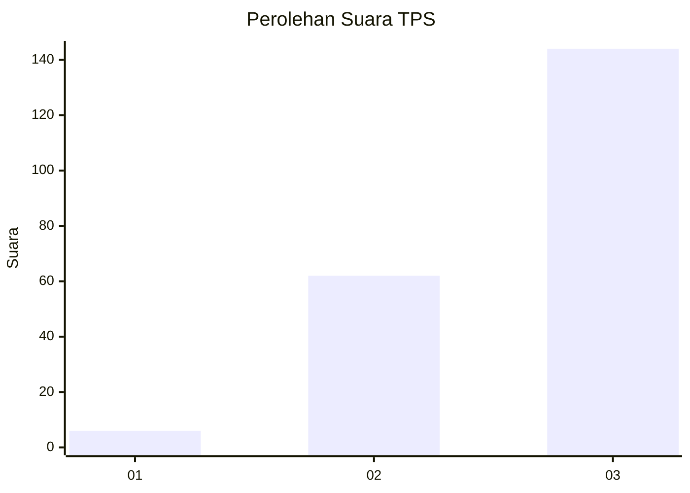
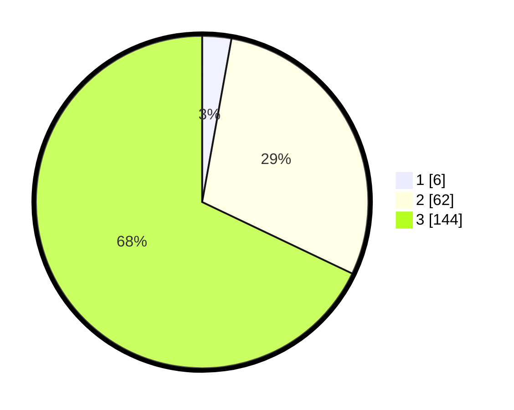

# Hasil

## Grafik

## Tabel

| No. | Nama Paslon    | Suara | Suara (raw) | Persentase |
|:--- |:-------------- | -----:| -----------:| ----------:|
| 1   | ANIES MUHAIMIN | 6     | [6][p-1]    | 2,83       |
| 2   | PRABOWO GIBRAN | 62    | [62][p-2]   | 29,25      |
| 3   | GANJAR MAHFUD  | 144   | [144][p-3]  | 67,92      |

[p-1]: https://github.com/gigit-pemilu/pemilu-2024-33-jawa-tengah/blob/main/pilpres/hitung-suara/sub/33-jawa-tengah/sub/03-purbalingga/sub/11-karanganyar/sub/2012-banjarkerta/sub/001-tps/sub/paslon-1.txt
[p-2]: https://github.com/gigit-pemilu/pemilu-2024-33-jawa-tengah/blob/main/pilpres/hitung-suara/sub/33-jawa-tengah/sub/03-purbalingga/sub/11-karanganyar/sub/2012-banjarkerta/sub/001-tps/sub/paslon-2.txt
[p-3]: https://github.com/gigit-pemilu/pemilu-2024-33-jawa-tengah/blob/main/pilpres/hitung-suara/sub/33-jawa-tengah/sub/03-purbalingga/sub/11-karanganyar/sub/2012-banjarkerta/sub/001-tps/sub/paslon-3.txt

## Foto C Plano

https://sirekap-obj-formc.kpu.go.id/7af0/pemilu/ppwp/33/03/11/20/12/3303112012001-20240214-221258--c7f3101f-c3ff-4d3b-9674-bcc39c35c92c.jpg

https://sirekap-obj-formc.kpu.go.id/7af0/pemilu/ppwp/33/03/11/20/12/3303112012001-20240214-222044--31201866-2436-444d-974e-5e449bc84287.jpg

https://sirekap-obj-formc.kpu.go.id/7af0/pemilu/ppwp/33/03/11/20/12/3303112012001-20240214-222627--2a1224ae-4cbe-418c-a850-426e809f5e9a.jpg

## Metadata

| Key        | Value               |
| ---------- | ------------------- |
| Time Stamp | 2024-02-16 12:51:22 |

