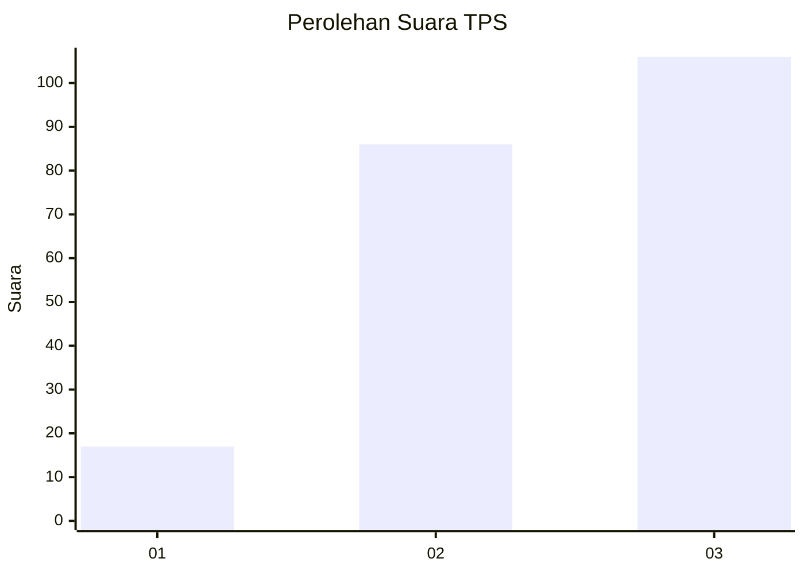
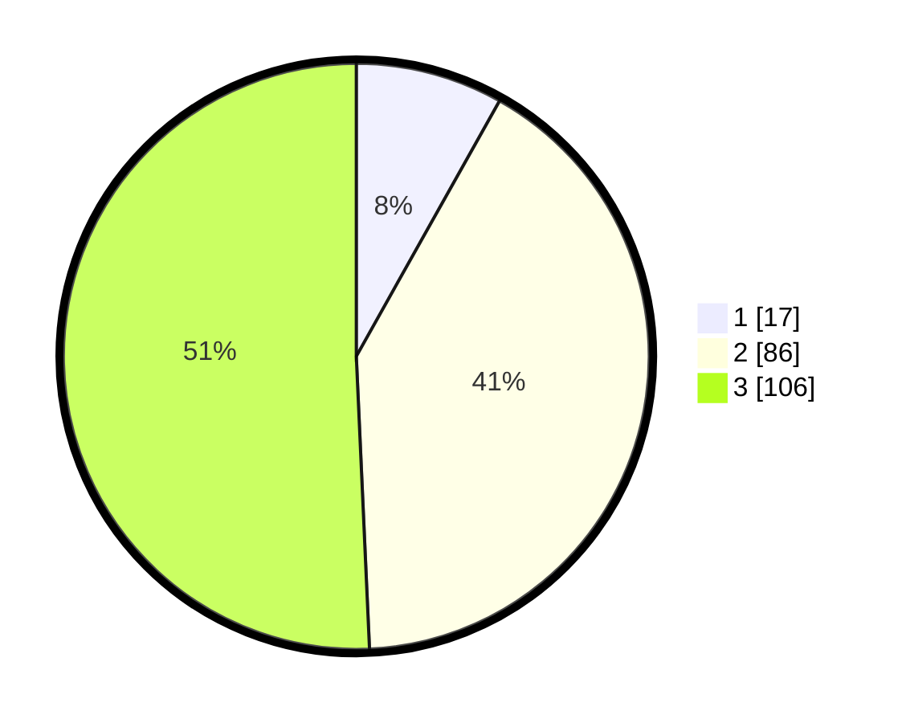

# Hasil

## Grafik

## Tabel

| No. | Nama Paslon    | Suara | Suara (raw) | Persentase |
|:--- |:-------------- | -----:| -----------:| ----------:|
| 1   | ANIES MUHAIMIN | 17    | [17][p-1]   | 8,13       |
| 2   | PRABOWO GIBRAN | 86    | [86][p-2]   | 41,15      |
| 3   | GANJAR MAHFUD  | 106   | [106][p-3]  | 50,72      |

[p-1]: https://github.com/gigit-pemilu/pemilu-2024/blob/main/pilpres/hitung-suara/sub/33-jawa-tengah/sub/03-purbalingga/sub/11-karanganyar/sub/2012-banjarkerta/sub/002-tps/sub/paslon-1.txt
[p-2]: https://github.com/gigit-pemilu/pemilu-2024/blob/main/pilpres/hitung-suara/sub/33-jawa-tengah/sub/03-purbalingga/sub/11-karanganyar/sub/2012-banjarkerta/sub/002-tps/sub/paslon-2.txt
[p-3]: https://github.com/gigit-pemilu/pemilu-2024/blob/main/pilpres/hitung-suara/sub/33-jawa-tengah/sub/03-purbalingga/sub/11-karanganyar/sub/2012-banjarkerta/sub/002-tps/sub/paslon-3.txt

## Foto C Plano

https://sirekap-obj-formc.kpu.go.id/c09c/pemilu/ppwp/33/03/11/20/12/3303112012002-20240218-105953--4a8ba05a-3b62-4de2-b786-230dbfb6e40a.jpg

https://sirekap-obj-formc.kpu.go.id/c09c/pemilu/ppwp/33/03/11/20/12/3303112012002-20240215-030606--bd694938-c3d9-4ae7-a99a-7de2dbed94aa.jpg

https://sirekap-obj-formc.kpu.go.id/c09c/pemilu/ppwp/33/03/11/20/12/3303112012002-20240215-030634--b8004acb-3c4e-40d1-bed4-20483ac63498.jpg

## Metadata

| Key        | Value               |
| ---------- | ------------------- |
| Time Stamp | 2024-02-19 06:16:00 |

