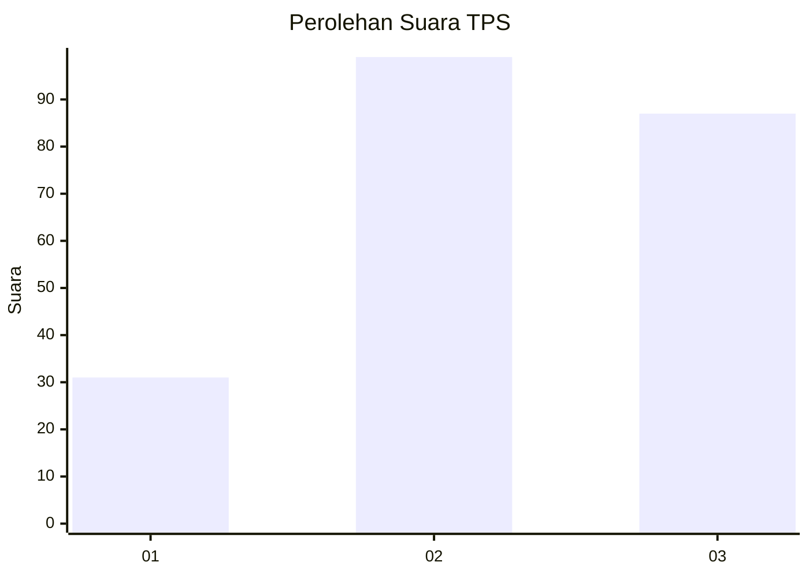
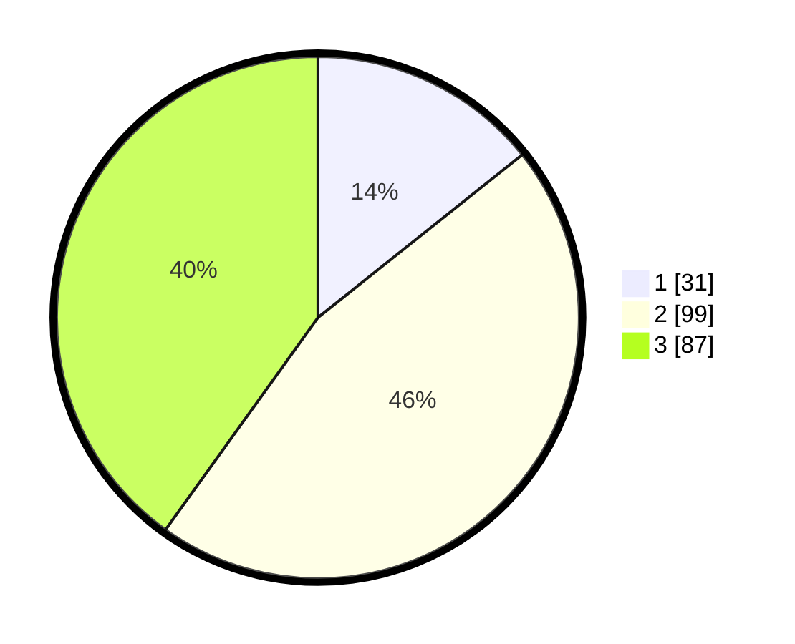

# Hasil

## Grafik

## Tabel

| No. | Nama Paslon    | Suara | Suara (raw) | Persentase |
|:--- |:-------------- | -----:| -----------:| ----------:|
| 1   | ANIES MUHAIMIN | 31    | [31][p-1]   | 14,29      |
| 2   | PRABOWO GIBRAN | 99    | [99][p-2]   | 45,62      |
| 3   | GANJAR MAHFUD  | 87    | [87][p-3]   | 40,09      |

[p-1]: https://github.com/gigit-pemilu/pemilu-2024-33-jawa-tengah/blob/main/pilpres/hitung-suara/sub/33-jawa-tengah/sub/03-purbalingga/sub/11-karanganyar/sub/2012-banjarkerta/sub/004-tps/sub/paslon-1.txt
[p-2]: https://github.com/gigit-pemilu/pemilu-2024-33-jawa-tengah/blob/main/pilpres/hitung-suara/sub/33-jawa-tengah/sub/03-purbalingga/sub/11-karanganyar/sub/2012-banjarkerta/sub/004-tps/sub/paslon-2.txt
[p-3]: https://github.com/gigit-pemilu/pemilu-2024-33-jawa-tengah/blob/main/pilpres/hitung-suara/sub/33-jawa-tengah/sub/03-purbalingga/sub/11-karanganyar/sub/2012-banjarkerta/sub/004-tps/sub/paslon-3.txt

## Foto C Plano

https://sirekap-obj-formc.kpu.go.id/7d7f/pemilu/ppwp/33/03/11/20/12/3303112012004-20240215-033724--0687b605-d914-4226-bb7b-aa2b0e7cf805.jpg

https://sirekap-obj-formc.kpu.go.id/7d7f/pemilu/ppwp/33/03/11/20/12/3303112012004-20240215-024337--51f48520-c8bf-418a-84c2-0d72decb1811.jpg

https://sirekap-obj-formc.kpu.go.id/7d7f/pemilu/ppwp/33/03/11/20/12/3303112012004-20240215-024429--d48aae35-1502-4756-ae64-2040101328a4.jpg

## Metadata

| Key        | Value               |
| ---------- | ------------------- |
| Time Stamp | 2024-02-15 16:30:25 |

