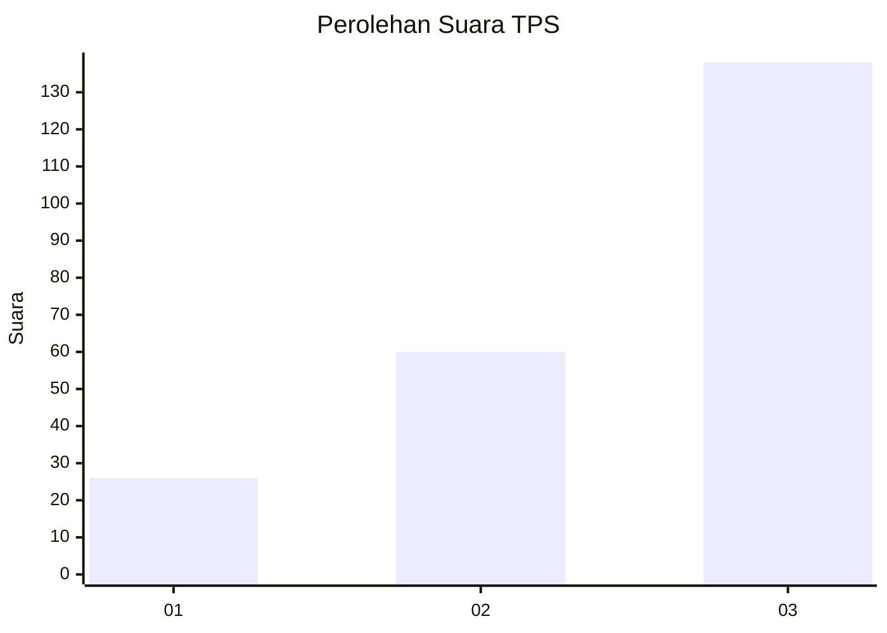
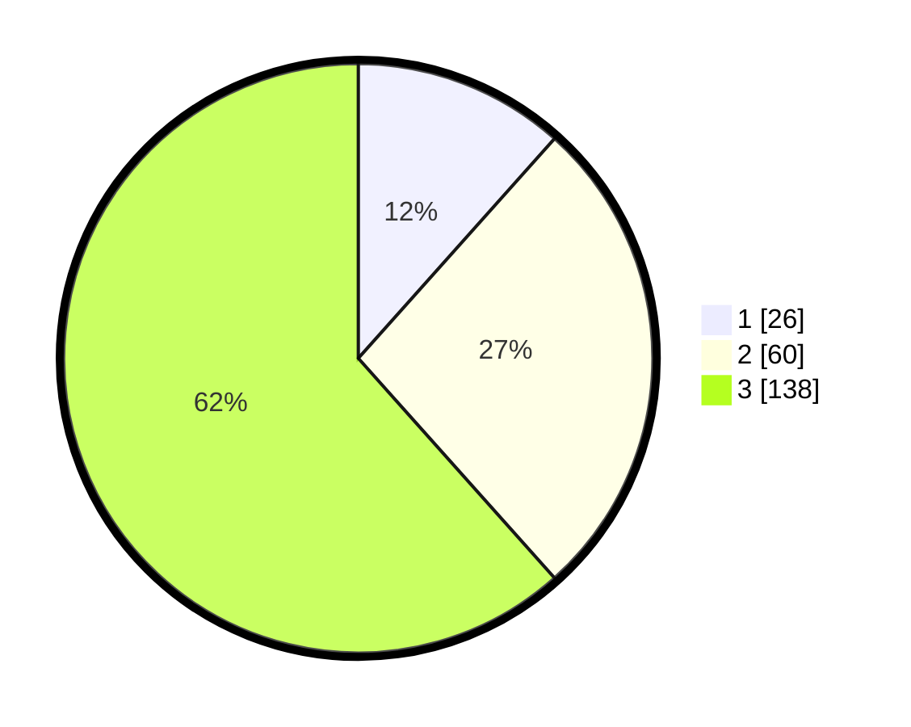

# Hasil

## Grafik

## Tabel

| No. | Nama Paslon    | Suara | Suara (raw) | Persentase |
|:--- |:-------------- | -----:| -----------:| ----------:|
| 1   | ANIES MUHAIMIN | 26    | [26][p-1]   | 11,61      |
| 2   | PRABOWO GIBRAN | 60    | [60][p-2]   | 26,79      |
| 3   | GANJAR MAHFUD  | 138   | [138][p-3]  | 61,61      |

[p-1]: https://github.com/gigit-pemilu/pemilu-2024-33-jawa-tengah/blob/main/pilpres/hitung-suara/sub/33-jawa-tengah/sub/03-purbalingga/sub/11-karanganyar/sub/2013-kalijaran/sub/003-tps/sub/paslon-1.txt
[p-2]: https://github.com/gigit-pemilu/pemilu-2024-33-jawa-tengah/blob/main/pilpres/hitung-suara/sub/33-jawa-tengah/sub/03-purbalingga/sub/11-karanganyar/sub/2013-kalijaran/sub/003-tps/sub/paslon-2.txt
[p-3]: https://github.com/gigit-pemilu/pemilu-2024-33-jawa-tengah/blob/main/pilpres/hitung-suara/sub/33-jawa-tengah/sub/03-purbalingga/sub/11-karanganyar/sub/2013-kalijaran/sub/003-tps/sub/paslon-3.txt

## Foto C Plano

https://sirekap-obj-formc.kpu.go.id/3b10/pemilu/ppwp/33/03/11/20/13/3303112013003-20240214-224518--fb904dd2-6899-42fb-9c53-971b5b1649e3.jpg

https://sirekap-obj-formc.kpu.go.id/3b10/pemilu/ppwp/33/03/11/20/13/3303112013003-20240214-224601--2f9cd08d-86e9-4d22-9de9-466417d12050.jpg

https://sirekap-obj-formc.kpu.go.id/3b10/pemilu/ppwp/33/03/11/20/13/3303112013003-20240214-224631--bac24b1b-9b50-4a23-b308-8d0e6c4b75ee.jpg

## Metadata

| Key        | Value               |
| ---------- | ------------------- |
| Time Stamp | 2024-02-15 12:00:28 |

