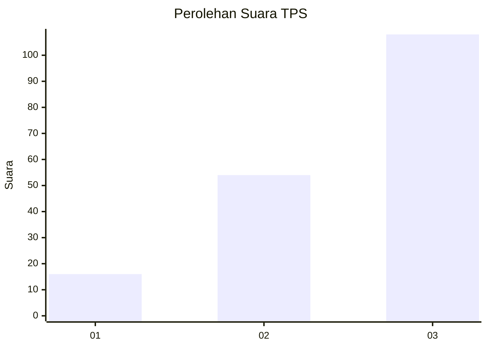
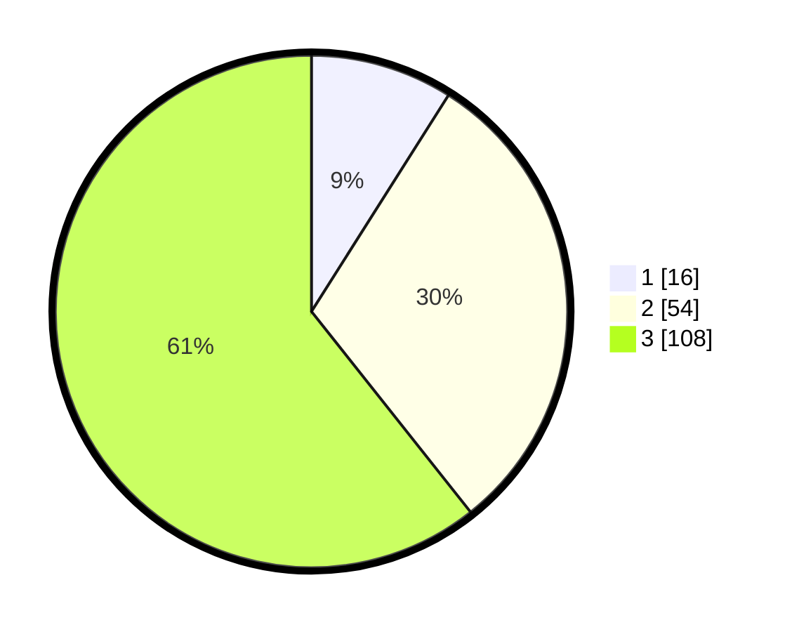

# Hasil

## Grafik

## Tabel

| No. | Nama Paslon    | Suara | Suara (raw) | Persentase |
|:--- |:-------------- | -----:| -----------:| ----------:|
| 1   | ANIES MUHAIMIN | 16    | [16][p-1]   | 8,99       |
| 2   | PRABOWO GIBRAN | 54    | [54][p-2]   | 30,34      |
| 3   | GANJAR MAHFUD  | 108   | [108][p-3]  | 60,67      |

[p-1]: https://github.com/gigit-pemilu/pemilu-2024-33-jawa-tengah/blob/main/pilpres/hitung-suara/sub/33-jawa-tengah/sub/03-purbalingga/sub/11-karanganyar/sub/2013-kalijaran/sub/007-tps/sub/paslon-1.txt
[p-2]: https://github.com/gigit-pemilu/pemilu-2024-33-jawa-tengah/blob/main/pilpres/hitung-suara/sub/33-jawa-tengah/sub/03-purbalingga/sub/11-karanganyar/sub/2013-kalijaran/sub/007-tps/sub/paslon-2.txt
[p-3]: https://github.com/gigit-pemilu/pemilu-2024-33-jawa-tengah/blob/main/pilpres/hitung-suara/sub/33-jawa-tengah/sub/03-purbalingga/sub/11-karanganyar/sub/2013-kalijaran/sub/007-tps/sub/paslon-3.txt

## Foto C Plano

https://sirekap-obj-formc.kpu.go.id/5ac5/pemilu/ppwp/33/03/11/20/13/3303112013007-20240216-124311--ecccf923-0b31-435b-9953-dd7cbda73f3c.jpg

https://sirekap-obj-formc.kpu.go.id/5ac5/pemilu/ppwp/33/03/11/20/13/3303112013007-20240216-181951--062f6664-dd8e-412c-a8e0-43b25d70ede3.jpg

https://sirekap-obj-formc.kpu.go.id/5ac5/pemilu/ppwp/33/03/11/20/13/3303112013007-20240214-223624--2dfc0ebb-6981-4096-9cee-18f116762273.jpg

## Metadata

| Key        | Value               |
| ---------- | ------------------- |
| Time Stamp | 2024-02-16 21:01:00 |

