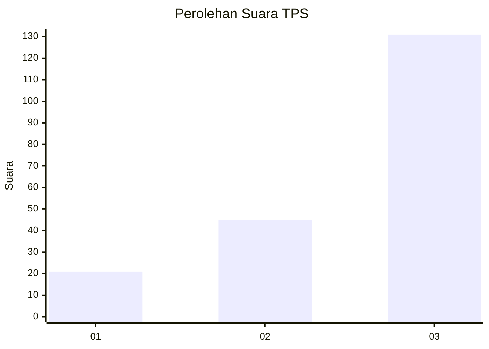
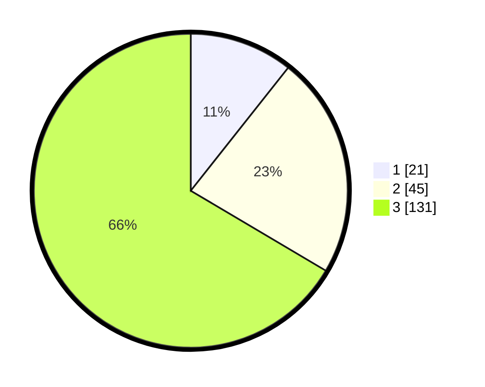

# Hasil

## Grafik

## Tabel

| No. | Nama Paslon    | Suara | Suara (raw) | Persentase |
|:--- |:-------------- | -----:| -----------:| ----------:|
| 1   | ANIES MUHAIMIN | 21    | [21][p-1]   | 10,66      |
| 2   | PRABOWO GIBRAN | 45    | [45][p-2]   | 22,84      |
| 3   | GANJAR MAHFUD  | 131   | [131][p-3]  | 66,50      |

[p-1]: https://github.com/gigit-pemilu/pemilu-2024/blob/main/pilpres/hitung-suara/sub/33-jawa-tengah/sub/03-purbalingga/sub/11-karanganyar/sub/2013-kalijaran/sub/014-tps/sub/paslon-1.txt
[p-2]: https://github.com/gigit-pemilu/pemilu-2024/blob/main/pilpres/hitung-suara/sub/33-jawa-tengah/sub/03-purbalingga/sub/11-karanganyar/sub/2013-kalijaran/sub/014-tps/sub/paslon-2.txt
[p-3]: https://github.com/gigit-pemilu/pemilu-2024/blob/main/pilpres/hitung-suara/sub/33-jawa-tengah/sub/03-purbalingga/sub/11-karanganyar/sub/2013-kalijaran/sub/014-tps/sub/paslon-3.txt

## Foto C Plano

https://sirekap-obj-formc.kpu.go.id/c359/pemilu/ppwp/33/03/11/20/13/3303112013014-20240217-152323--7da9a9df-ef5d-4cb8-82df-edcc02d1885d.jpg

https://sirekap-obj-formc.kpu.go.id/c359/pemilu/ppwp/33/03/11/20/13/3303112013014-20240217-152809--9fe342f7-18ef-4768-ac26-6e8aaa9f6eba.jpg

https://sirekap-obj-formc.kpu.go.id/c359/pemilu/ppwp/33/03/11/20/13/3303112013014-20240217-152928--c5af7b9a-f36a-49ad-b738-44c869a13265.jpg

## Metadata

| Key        | Value               |
| ---------- | ------------------- |
| Time Stamp | 2024-02-17 18:00:00 |

