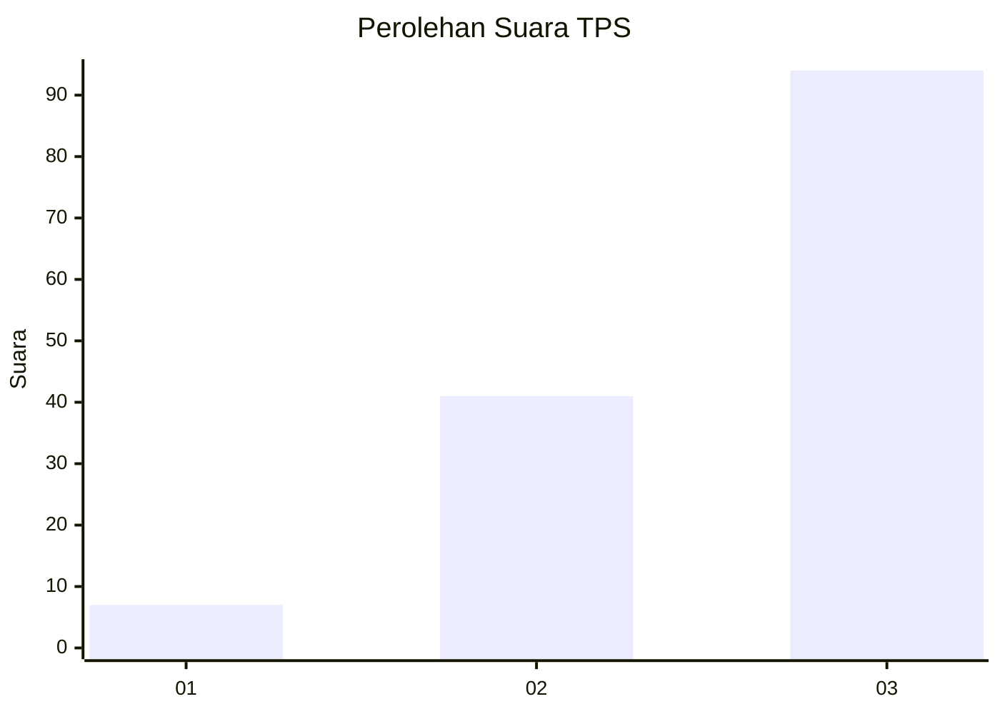
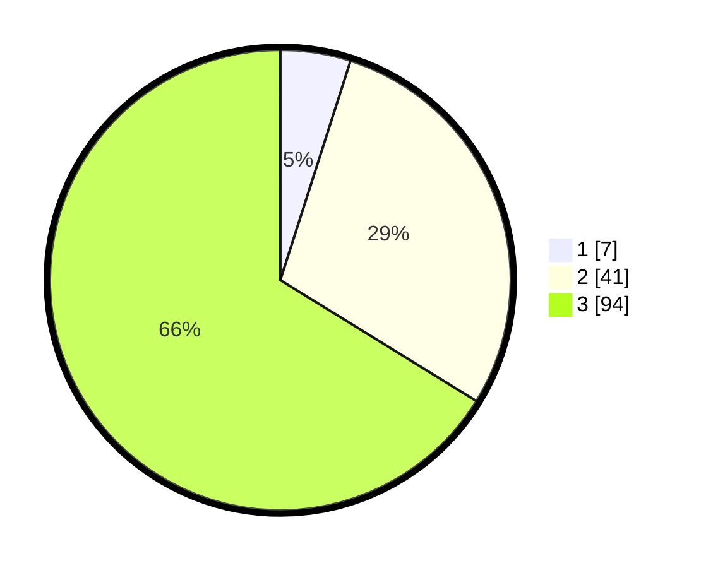

# Hasil

## Grafik

## Tabel

| No. | Nama Paslon    | Suara | Suara (raw) | Persentase |
|:--- |:-------------- | -----:| -----------:| ----------:|
| 1   | ANIES MUHAIMIN | 7     | [7][p-1]    | 4,93       |
| 2   | PRABOWO GIBRAN | 41    | [41][p-2]   | 28,87      |
| 3   | GANJAR MAHFUD  | 94    | [94][p-3]   | 66,20      |

[p-1]: https://github.com/gigit-pemilu/pemilu-2024/blob/main/pilpres/hitung-suara/sub/33-jawa-tengah/sub/03-purbalingga/sub/12-karangmoncol/sub/2004-grantung/sub/003-tps/sub/paslon-1.txt
[p-2]: https://github.com/gigit-pemilu/pemilu-2024/blob/main/pilpres/hitung-suara/sub/33-jawa-tengah/sub/03-purbalingga/sub/12-karangmoncol/sub/2004-grantung/sub/003-tps/sub/paslon-2.txt
[p-3]: https://github.com/gigit-pemilu/pemilu-2024/blob/main/pilpres/hitung-suara/sub/33-jawa-tengah/sub/03-purbalingga/sub/12-karangmoncol/sub/2004-grantung/sub/003-tps/sub/paslon-3.txt

## Foto C Plano

https://sirekap-obj-formc.kpu.go.id/b0b2/pemilu/ppwp/33/03/12/20/04/3303122004003-20240214-211033--5eead90e-b6d3-464d-904a-286632a87b94.jpg

https://sirekap-obj-formc.kpu.go.id/b0b2/pemilu/ppwp/33/03/12/20/04/3303122004003-20240215-101239--262fa2a3-92db-4155-90ba-db1002abea57.jpg

## Metadata

| Key        | Value               |
| ---------- | ------------------- |
| Time Stamp | 2024-02-15 12:00:28 |

