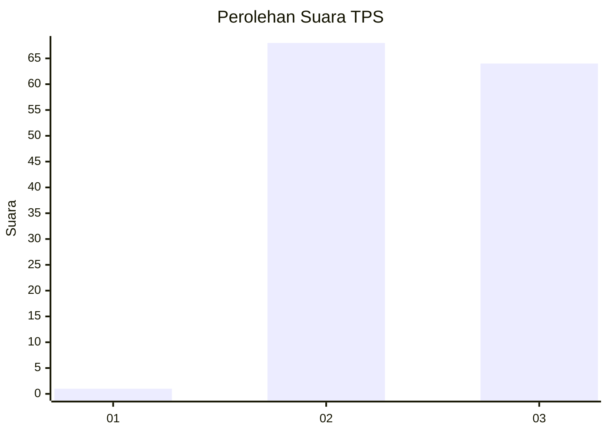
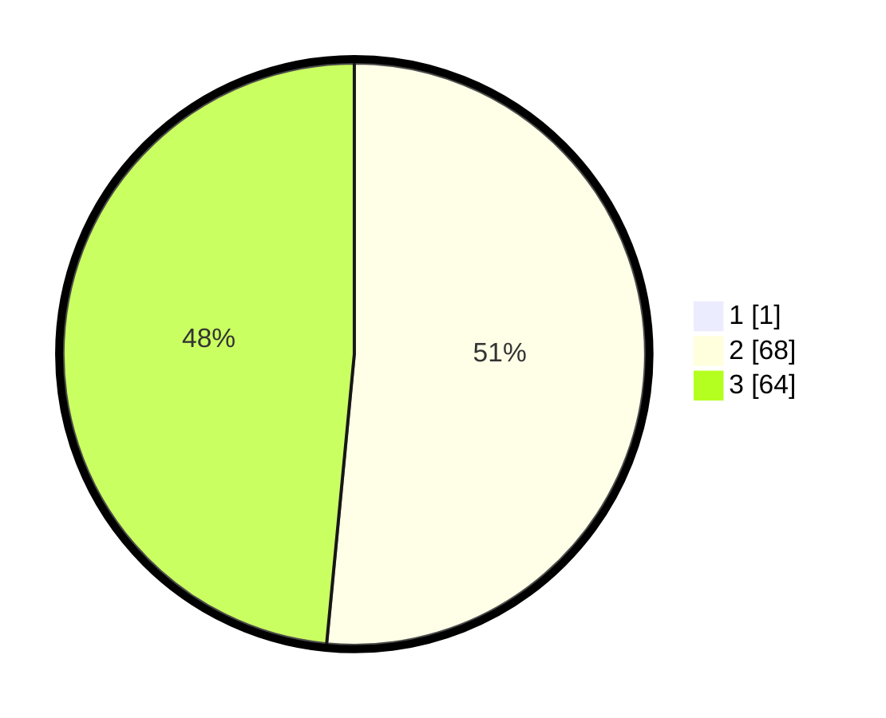

# Hasil

## Grafik

## Tabel

| No. | Nama Paslon    | Suara | Suara (raw) | Persentase |
|:--- |:-------------- | -----:| -----------:| ----------:|
| 1   | ANIES MUHAIMIN | 1     | [1][p-1]    | 0,75       |
| 2   | PRABOWO GIBRAN | 68    | [68][p-2]   | 51,13      |
| 3   | GANJAR MAHFUD  | 64    | [64][p-3]   | 48,12      |

[p-1]: https://github.com/gigit-pemilu/pemilu-2024/blob/main/pilpres/hitung-suara/sub/33-jawa-tengah/sub/03-purbalingga/sub/13-rembang/sub/2002-bantarbarang/sub/028-tps/sub/paslon-1.txt
[p-2]: https://github.com/gigit-pemilu/pemilu-2024/blob/main/pilpres/hitung-suara/sub/33-jawa-tengah/sub/03-purbalingga/sub/13-rembang/sub/2002-bantarbarang/sub/028-tps/sub/paslon-2.txt
[p-3]: https://github.com/gigit-pemilu/pemilu-2024/blob/main/pilpres/hitung-suara/sub/33-jawa-tengah/sub/03-purbalingga/sub/13-rembang/sub/2002-bantarbarang/sub/028-tps/sub/paslon-3.txt

## Foto C Plano

https://sirekap-obj-formc.kpu.go.id/c27a/pemilu/ppwp/33/03/13/20/02/3303132002028-20240217-010744--f6c27cfc-1ed8-4d7c-b639-3d571127d309.jpg

https://sirekap-obj-formc.kpu.go.id/c27a/pemilu/ppwp/33/03/13/20/02/3303132002028-20240217-010950--014143f4-f782-4a6d-91ec-be6c41a30ad7.jpg

https://sirekap-obj-formc.kpu.go.id/c27a/pemilu/ppwp/33/03/13/20/02/3303132002028-20240217-013259--3abac9bb-d6d5-4ee8-b827-59b1bc692d1b.jpg

## Metadata

| Key        | Value               |
| ---------- | ------------------- |
| Time Stamp | 2024-02-25 18:00:00 |

