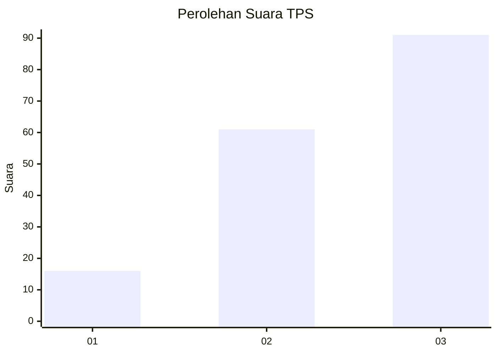
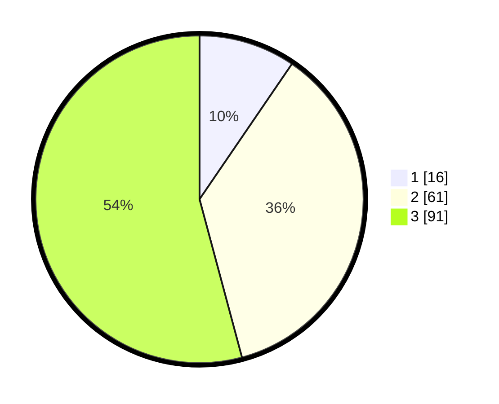

# Hasil

## Grafik

## Tabel

| No. | Nama Paslon    | Suara | Suara (raw) | Persentase |
|:--- |:-------------- | -----:| -----------:| ----------:|
| 1   | ANIES MUHAIMIN | 16    | [16][p-1]   | 9,52       |
| 2   | PRABOWO GIBRAN | 61    | [61][p-2]   | 36,31      |
| 3   | GANJAR MAHFUD  | 91    | [91][p-3]   | 54,17      |

[p-1]: https://github.com/gigit-pemilu/pemilu-2024-33-jawa-tengah/blob/main/pilpres/hitung-suara/sub/33-jawa-tengah/sub/03-purbalingga/sub/13-rembang/sub/2004-gunungwuled/sub/011-tps/sub/paslon-1.txt
[p-2]: https://github.com/gigit-pemilu/pemilu-2024-33-jawa-tengah/blob/main/pilpres/hitung-suara/sub/33-jawa-tengah/sub/03-purbalingga/sub/13-rembang/sub/2004-gunungwuled/sub/011-tps/sub/paslon-2.txt
[p-3]: https://github.com/gigit-pemilu/pemilu-2024-33-jawa-tengah/blob/main/pilpres/hitung-suara/sub/33-jawa-tengah/sub/03-purbalingga/sub/13-rembang/sub/2004-gunungwuled/sub/011-tps/sub/paslon-3.txt

## Foto C Plano

https://sirekap-obj-formc.kpu.go.id/203d/pemilu/ppwp/33/03/13/20/04/3303132004011-20240215-002300--ee7c6604-edc7-4eaf-91ad-24d9871da0ce.jpg

https://sirekap-obj-formc.kpu.go.id/203d/pemilu/ppwp/33/03/13/20/04/3303132004011-20240215-002505--1b1ea832-e699-44ae-ae11-0a8936a46613.jpg

https://sirekap-obj-formc.kpu.go.id/203d/pemilu/ppwp/33/03/13/20/04/3303132004011-20240215-002904--b3635db6-4f14-4fe5-bc66-df24db6b7f2c.jpg

## Metadata

| Key        | Value               |
| ---------- | ------------------- |
| Time Stamp | 2024-02-15 19:30:26 |

