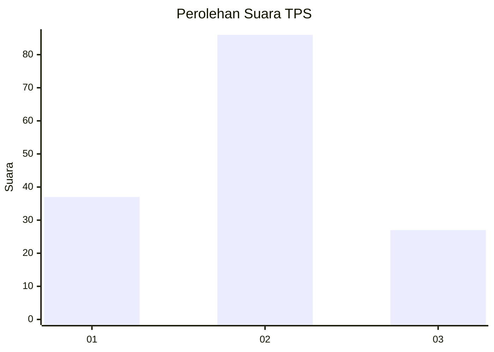
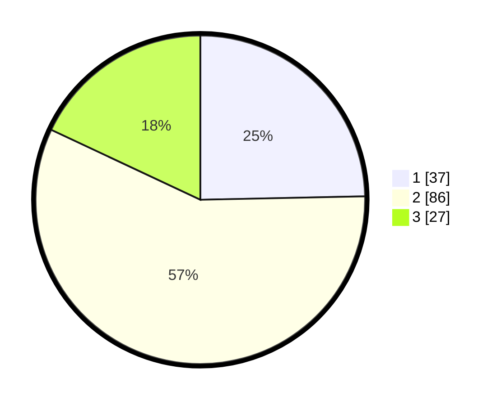

# Hasil

## Grafik

## Tabel

| No. | Nama Paslon    | Suara | Suara (raw) | Persentase |
|:--- |:-------------- | -----:| -----------:| ----------:|
| 1   | ANIES MUHAIMIN | 37    | [37][p-1]   | 24,67      |
| 2   | PRABOWO GIBRAN | 86    | [86][p-2]   | 57,33      |
| 3   | GANJAR MAHFUD  | 27    | [27][p-3]   | 18,00      |

[p-1]: https://github.com/gigit-pemilu/pemilu-2024-33-jawa-tengah/blob/main/pilpres/hitung-suara/sub/33-jawa-tengah/sub/03-purbalingga/sub/13-rembang/sub/2005-losari/sub/006-tps/sub/paslon-1.txt
[p-2]: https://github.com/gigit-pemilu/pemilu-2024-33-jawa-tengah/blob/main/pilpres/hitung-suara/sub/33-jawa-tengah/sub/03-purbalingga/sub/13-rembang/sub/2005-losari/sub/006-tps/sub/paslon-2.txt
[p-3]: https://github.com/gigit-pemilu/pemilu-2024-33-jawa-tengah/blob/main/pilpres/hitung-suara/sub/33-jawa-tengah/sub/03-purbalingga/sub/13-rembang/sub/2005-losari/sub/006-tps/sub/paslon-3.txt

## Foto C Plano

https://sirekap-obj-formc.kpu.go.id/fc24/pemilu/ppwp/33/03/13/20/05/3303132005006-20240215-012836--326dd4a6-7dc7-4dd3-b4b6-42e1b313f6cf.jpg

https://sirekap-obj-formc.kpu.go.id/fc24/pemilu/ppwp/33/03/13/20/05/3303132005006-20240215-013023--c5bffc9c-1c1a-407f-97d8-6fb0679616c1.jpg

https://sirekap-obj-formc.kpu.go.id/fc24/pemilu/ppwp/33/03/13/20/05/3303132005006-20240215-013121--29ce1327-e2b6-4aa0-baa0-ff9411fd229c.jpg

## Metadata

| Key        | Value               |
| ---------- | ------------------- |
| Time Stamp | 2024-02-15 17:30:25 |

