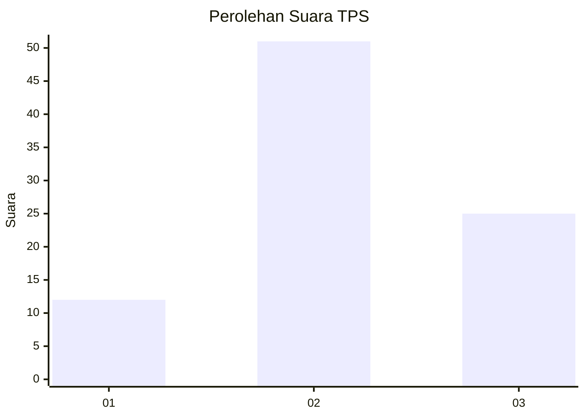
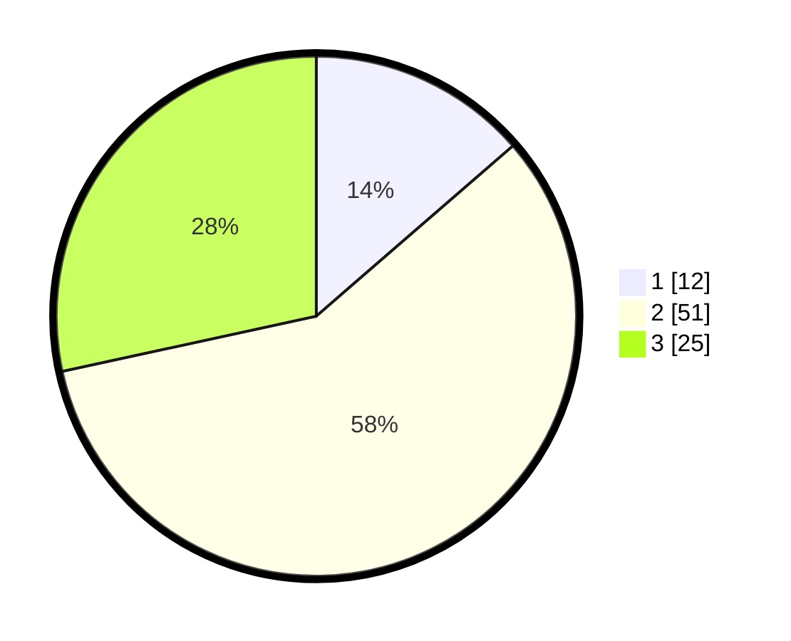

# Hasil

## Grafik

## Tabel

| No. | Nama Paslon    | Suara | Suara (raw) | Persentase |
|:--- |:-------------- | -----:| -----------:| ----------:|
| 1   | ANIES MUHAIMIN | 12    | [12][p-1]   | 13,64      |
| 2   | PRABOWO GIBRAN | 51    | [51][p-2]   | 57,95      |
| 3   | GANJAR MAHFUD  | 25    | [25][p-3]   | 28,41      |

[p-1]: https://github.com/gigit-pemilu/pemilu-2024/blob/main/pilpres/hitung-suara/sub/33-jawa-tengah/sub/03-purbalingga/sub/13-rembang/sub/2005-losari/sub/020-tps/sub/paslon-1.txt
[p-2]: https://github.com/gigit-pemilu/pemilu-2024/blob/main/pilpres/hitung-suara/sub/33-jawa-tengah/sub/03-purbalingga/sub/13-rembang/sub/2005-losari/sub/020-tps/sub/paslon-2.txt
[p-3]: https://github.com/gigit-pemilu/pemilu-2024/blob/main/pilpres/hitung-suara/sub/33-jawa-tengah/sub/03-purbalingga/sub/13-rembang/sub/2005-losari/sub/020-tps/sub/paslon-3.txt

## Foto C Plano

https://sirekap-obj-formc.kpu.go.id/ab2b/pemilu/ppwp/33/03/13/20/05/3303132005020-20240215-001314--25aa1af7-fde1-4aa9-807f-243dec70d01c.jpg

https://sirekap-obj-formc.kpu.go.id/ab2b/pemilu/ppwp/33/03/13/20/05/3303132005020-20240215-003824--750ef8d3-0ab2-4424-b3a9-946db67a69b4.jpg

https://sirekap-obj-formc.kpu.go.id/ab2b/pemilu/ppwp/33/03/13/20/05/3303132005020-20240215-001830--eb057638-776e-4b25-b7c7-82a6fd3b9bde.jpg

## Metadata

| Key        | Value               |
| ---------- | ------------------- |
| Time Stamp | 2024-02-15 19:00:26 |

