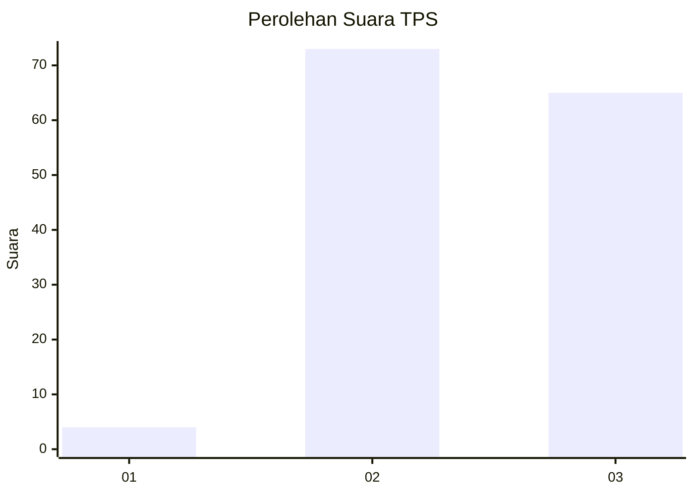
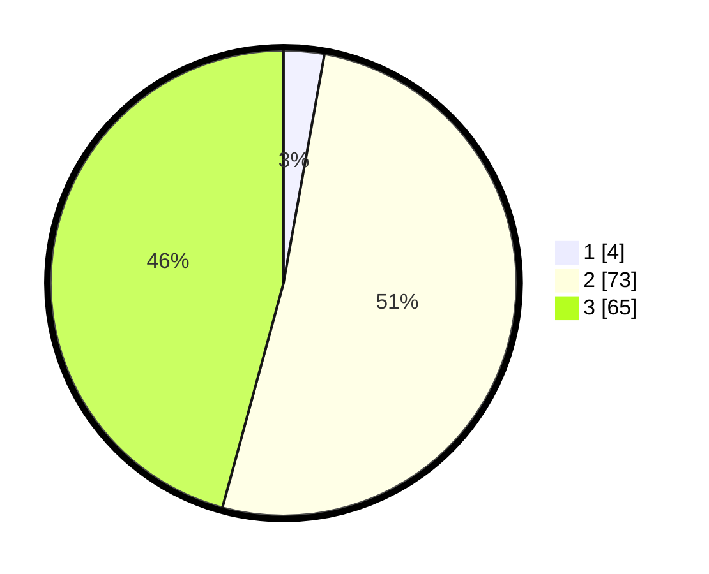

# Hasil

## Grafik

## Tabel

| No. | Nama Paslon    | Suara | Suara (raw) | Persentase |
|:--- |:-------------- | -----:| -----------:| ----------:|
| 1   | ANIES MUHAIMIN | 4     | [4][p-1]    | 2,82       |
| 2   | PRABOWO GIBRAN | 73    | [73][p-2]   | 51,41      |
| 3   | GANJAR MAHFUD  | 65    | [65][p-3]   | 45,77      |

[p-1]: https://github.com/gigit-pemilu/pemilu-2024-33-jawa-tengah/blob/main/pilpres/hitung-suara/sub/33-jawa-tengah/sub/03-purbalingga/sub/13-rembang/sub/2005-losari/sub/022-tps/sub/paslon-1.txt
[p-2]: https://github.com/gigit-pemilu/pemilu-2024-33-jawa-tengah/blob/main/pilpres/hitung-suara/sub/33-jawa-tengah/sub/03-purbalingga/sub/13-rembang/sub/2005-losari/sub/022-tps/sub/paslon-2.txt
[p-3]: https://github.com/gigit-pemilu/pemilu-2024-33-jawa-tengah/blob/main/pilpres/hitung-suara/sub/33-jawa-tengah/sub/03-purbalingga/sub/13-rembang/sub/2005-losari/sub/022-tps/sub/paslon-3.txt

## Foto C Plano

https://sirekap-obj-formc.kpu.go.id/e3a6/pemilu/ppwp/33/03/13/20/05/3303132005022-20240214-215842--00414b4c-2470-4448-b2a5-04949b63ccc5.jpg

https://sirekap-obj-formc.kpu.go.id/e3a6/pemilu/ppwp/33/03/13/20/05/3303132005022-20240214-220016--7d67f68e-256a-4959-9ed6-ed3149ff60fb.jpg

https://sirekap-obj-formc.kpu.go.id/e3a6/pemilu/ppwp/33/03/13/20/05/3303132005022-20240214-220109--a01f7d54-2382-4453-a6d2-f3a831ac592b.jpg

## Metadata

| Key        | Value               |
| ---------- | ------------------- |
| Time Stamp | 2024-02-15 16:00:26 |

