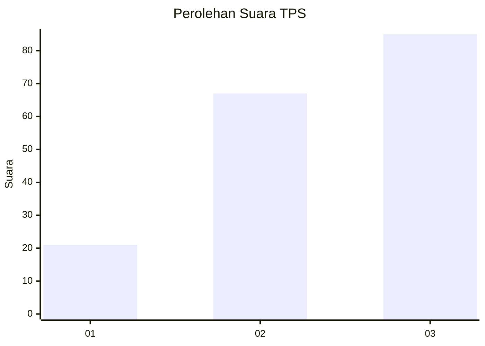
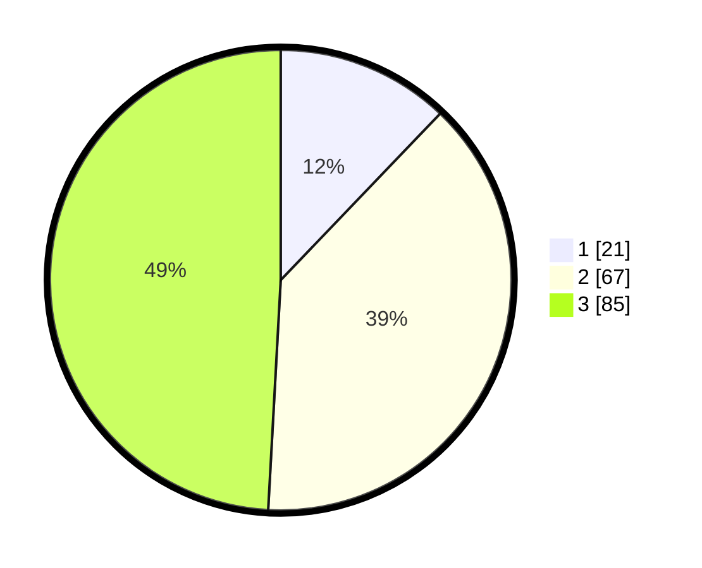

# Hasil

## Grafik

## Tabel

| No. | Nama Paslon    | Suara | Suara (raw) | Persentase |
|:--- |:-------------- | -----:| -----------:| ----------:|
| 1   | ANIES MUHAIMIN | 21    | [21][p-1]   | 12,14      |
| 2   | PRABOWO GIBRAN | 67    | [67][p-2]   | 38,73      |
| 3   | GANJAR MAHFUD  | 85    | [85][p-3]   | 49,13      |

[p-1]: https://github.com/gigit-pemilu/pemilu-2024/blob/main/pilpres/hitung-suara/sub/33-jawa-tengah/sub/03-purbalingga/sub/13-rembang/sub/2008-wanogara-kulon/sub/004-tps/sub/paslon-1.txt
[p-2]: https://github.com/gigit-pemilu/pemilu-2024/blob/main/pilpres/hitung-suara/sub/33-jawa-tengah/sub/03-purbalingga/sub/13-rembang/sub/2008-wanogara-kulon/sub/004-tps/sub/paslon-2.txt
[p-3]: https://github.com/gigit-pemilu/pemilu-2024/blob/main/pilpres/hitung-suara/sub/33-jawa-tengah/sub/03-purbalingga/sub/13-rembang/sub/2008-wanogara-kulon/sub/004-tps/sub/paslon-3.txt

## Foto C Plano

https://sirekap-obj-formc.kpu.go.id/4364/pemilu/ppwp/33/03/13/20/08/3303132008004-20240214-155757--2767f0f3-b2db-4f0d-b4d3-e5a9961bc9fa.jpg

https://sirekap-obj-formc.kpu.go.id/4364/pemilu/ppwp/33/03/13/20/08/3303132008004-20240214-155802--0e509036-97da-4334-b846-576c51218ad0.jpg

https://sirekap-obj-formc.kpu.go.id/4364/pemilu/ppwp/33/03/13/20/08/3303132008004-20240214-155808--0952d62e-558b-44bf-9b8b-fa6f411bb3f6.jpg

## Metadata

| Key        | Value               |
| ---------- | ------------------- |
| Time Stamp | 2024-02-15 15:00:29 |

