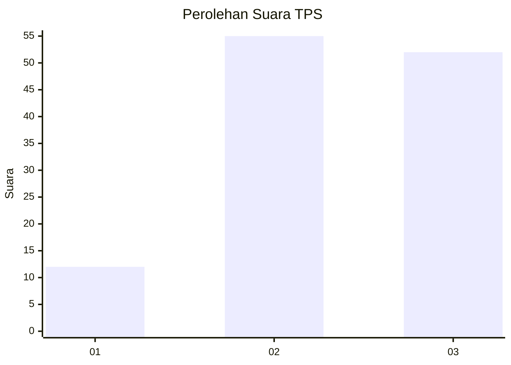
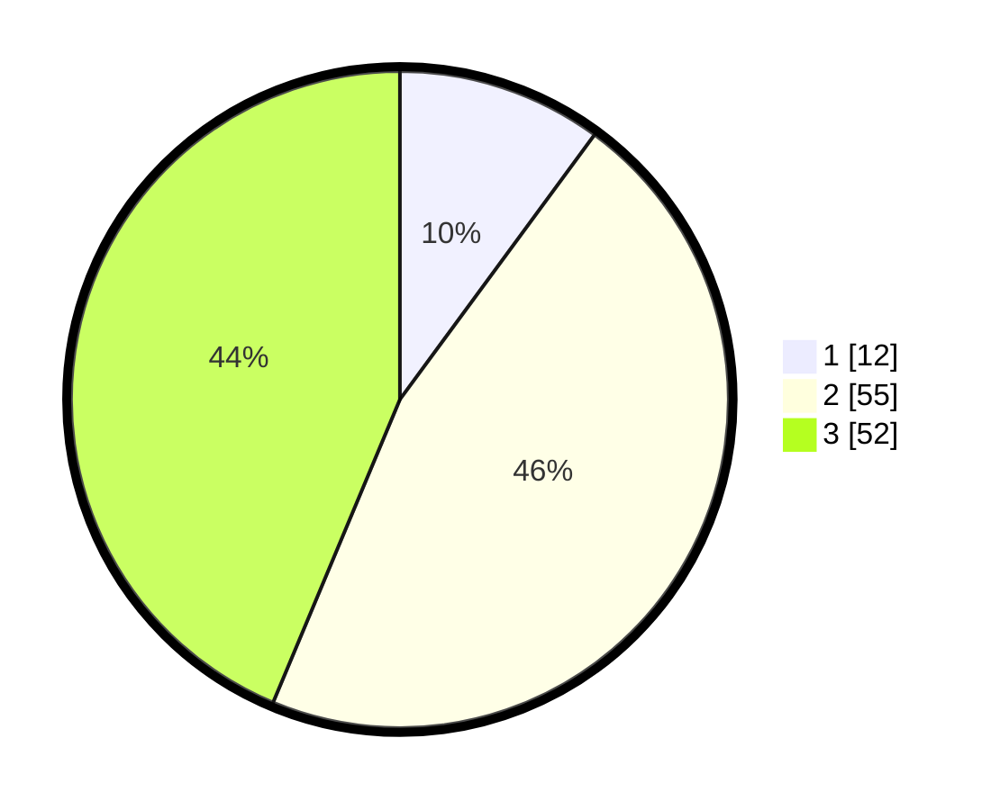

# Hasil

## Grafik

## Tabel

| No. | Nama Paslon    | Suara | Suara (raw) | Persentase |
|:--- |:-------------- | -----:| -----------:| ----------:|
| 1   | ANIES MUHAIMIN | 12    | [12][p-1]   | 10,08      |
| 2   | PRABOWO GIBRAN | 55    | [55][p-2]   | 46,22      |
| 3   | GANJAR MAHFUD  | 52    | [52][p-3]   | 43,70      |

[p-1]: https://github.com/gigit-pemilu/pemilu-2024-33-jawa-tengah/blob/main/pilpres/hitung-suara/sub/33-jawa-tengah/sub/03-purbalingga/sub/13-rembang/sub/2009-makam/sub/012-tps/sub/paslon-1.txt
[p-2]: https://github.com/gigit-pemilu/pemilu-2024-33-jawa-tengah/blob/main/pilpres/hitung-suara/sub/33-jawa-tengah/sub/03-purbalingga/sub/13-rembang/sub/2009-makam/sub/012-tps/sub/paslon-2.txt
[p-3]: https://github.com/gigit-pemilu/pemilu-2024-33-jawa-tengah/blob/main/pilpres/hitung-suara/sub/33-jawa-tengah/sub/03-purbalingga/sub/13-rembang/sub/2009-makam/sub/012-tps/sub/paslon-3.txt

## Foto C Plano

https://sirekap-obj-formc.kpu.go.id/2e06/pemilu/ppwp/33/03/13/20/09/3303132009012-20240215-005850--f4161303-8b02-4e44-892f-07387b13b953.jpg

https://sirekap-obj-formc.kpu.go.id/2e06/pemilu/ppwp/33/03/13/20/09/3303132009012-20240215-010139--e6652768-4871-47e1-bc39-e0bbf8fb6167.jpg

https://sirekap-obj-formc.kpu.go.id/2e06/pemilu/ppwp/33/03/13/20/09/3303132009012-20240215-010214--da1c7558-5c32-4dde-9d08-f3f493c4ce1f.jpg

## Metadata

| Key        | Value               |
| ---------- | ------------------- |
| Time Stamp | 2024-02-15 15:00:29 |

