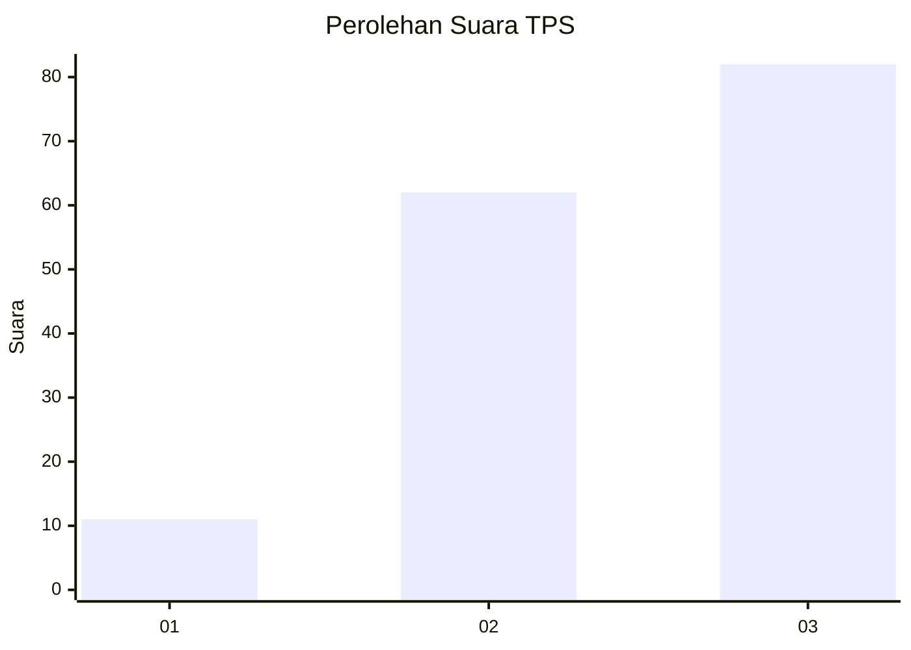
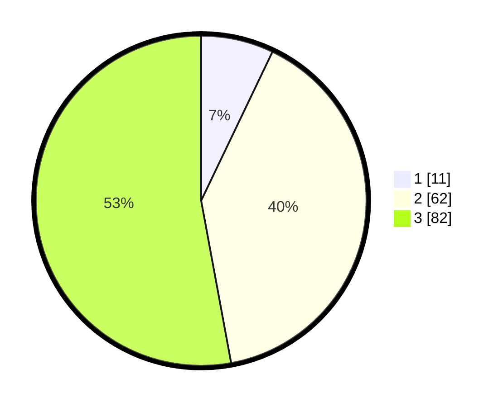

# Hasil

## Grafik

## Tabel

| No. | Nama Paslon    | Suara | Suara (raw) | Persentase |
|:--- |:-------------- | -----:| -----------:| ----------:|
| 1   | ANIES MUHAIMIN | 11    | [11][p-1]   | 7,10       |
| 2   | PRABOWO GIBRAN | 62    | [62][p-2]   | 40,00      |
| 3   | GANJAR MAHFUD  | 82    | [82][p-3]   | 52,90      |

[p-1]: https://github.com/gigit-pemilu/pemilu-2024-33-jawa-tengah/blob/main/pilpres/hitung-suara/sub/33-jawa-tengah/sub/03-purbalingga/sub/13-rembang/sub/2009-makam/sub/013-tps/sub/paslon-1.txt
[p-2]: https://github.com/gigit-pemilu/pemilu-2024-33-jawa-tengah/blob/main/pilpres/hitung-suara/sub/33-jawa-tengah/sub/03-purbalingga/sub/13-rembang/sub/2009-makam/sub/013-tps/sub/paslon-2.txt
[p-3]: https://github.com/gigit-pemilu/pemilu-2024-33-jawa-tengah/blob/main/pilpres/hitung-suara/sub/33-jawa-tengah/sub/03-purbalingga/sub/13-rembang/sub/2009-makam/sub/013-tps/sub/paslon-3.txt

## Foto C Plano

https://sirekap-obj-formc.kpu.go.id/6616/pemilu/ppwp/33/03/13/20/09/3303132009013-20240214-185407--dd711ea1-0495-4fdd-a898-63eb154b3fee.jpg

https://sirekap-obj-formc.kpu.go.id/6616/pemilu/ppwp/33/03/13/20/09/3303132009013-20240214-193126--7ef43cd4-c1cd-4995-8858-6aaa3f55d3b5.jpg

https://sirekap-obj-formc.kpu.go.id/6616/pemilu/ppwp/33/03/13/20/09/3303132009013-20240214-194145--ea7fd4b9-b08d-441e-95d2-8ae598eacde2.jpg

## Metadata

| Key        | Value               |
| ---------- | ------------------- |
| Time Stamp | 2024-02-16 21:01:00 |

