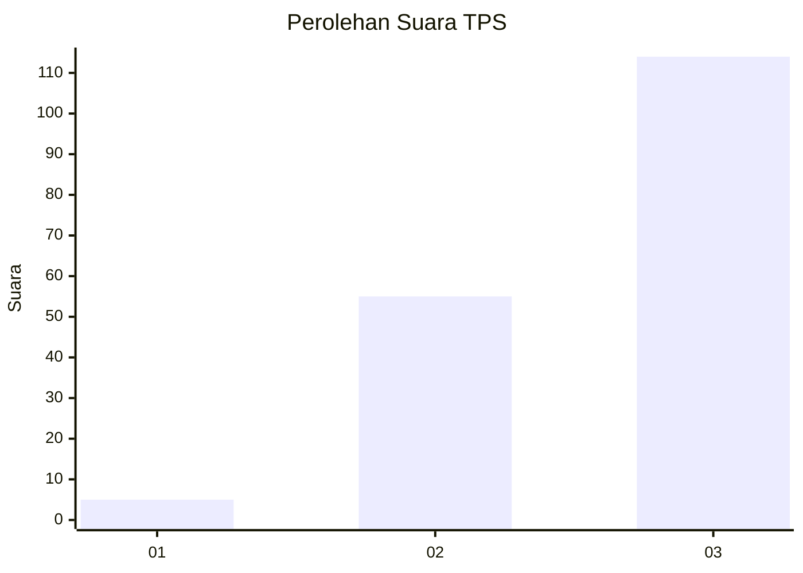
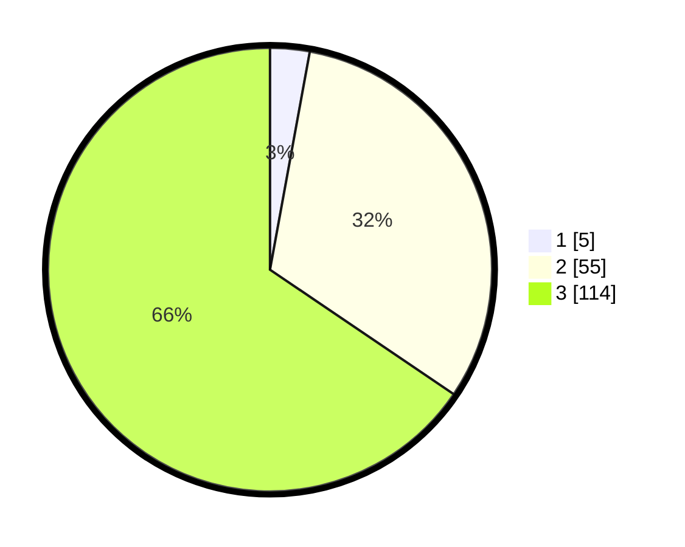

# Hasil

## Grafik

## Tabel

| No. | Nama Paslon    | Suara | Suara (raw) | Persentase |
|:--- |:-------------- | -----:| -----------:| ----------:|
| 1   | ANIES MUHAIMIN | 5     | [5][p-1]    | 2,87       |
| 2   | PRABOWO GIBRAN | 55    | [55][p-2]   | 31,61      |
| 3   | GANJAR MAHFUD  | 114   | [114][p-3]  | 65,52      |

[p-1]: https://github.com/gigit-pemilu/pemilu-2024-33-jawa-tengah/blob/main/pilpres/hitung-suara/sub/33-jawa-tengah/sub/03-purbalingga/sub/13-rembang/sub/2009-makam/sub/014-tps/sub/paslon-1.txt
[p-2]: https://github.com/gigit-pemilu/pemilu-2024-33-jawa-tengah/blob/main/pilpres/hitung-suara/sub/33-jawa-tengah/sub/03-purbalingga/sub/13-rembang/sub/2009-makam/sub/014-tps/sub/paslon-2.txt
[p-3]: https://github.com/gigit-pemilu/pemilu-2024-33-jawa-tengah/blob/main/pilpres/hitung-suara/sub/33-jawa-tengah/sub/03-purbalingga/sub/13-rembang/sub/2009-makam/sub/014-tps/sub/paslon-3.txt

## Foto C Plano

https://sirekap-obj-formc.kpu.go.id/982a/pemilu/ppwp/33/03/13/20/09/3303132009014-20240215-034335--0a6e91e1-541f-4437-937b-840fcd3363d1.jpg

https://sirekap-obj-formc.kpu.go.id/982a/pemilu/ppwp/33/03/13/20/09/3303132009014-20240215-034514--a306d9fd-6e7b-4fb3-8158-0750d520fda9.jpg

https://sirekap-obj-formc.kpu.go.id/982a/pemilu/ppwp/33/03/13/20/09/3303132009014-20240215-025909--bd0cd67d-1f65-43b5-aa43-21c5e76d55a8.jpg

## Metadata

| Key        | Value               |
| ---------- | ------------------- |
| Time Stamp | 2024-02-15 15:00:29 |

