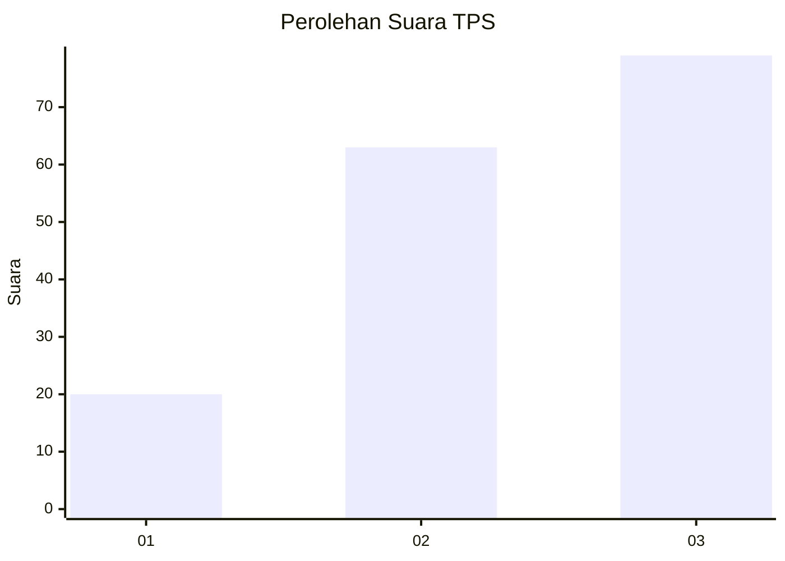
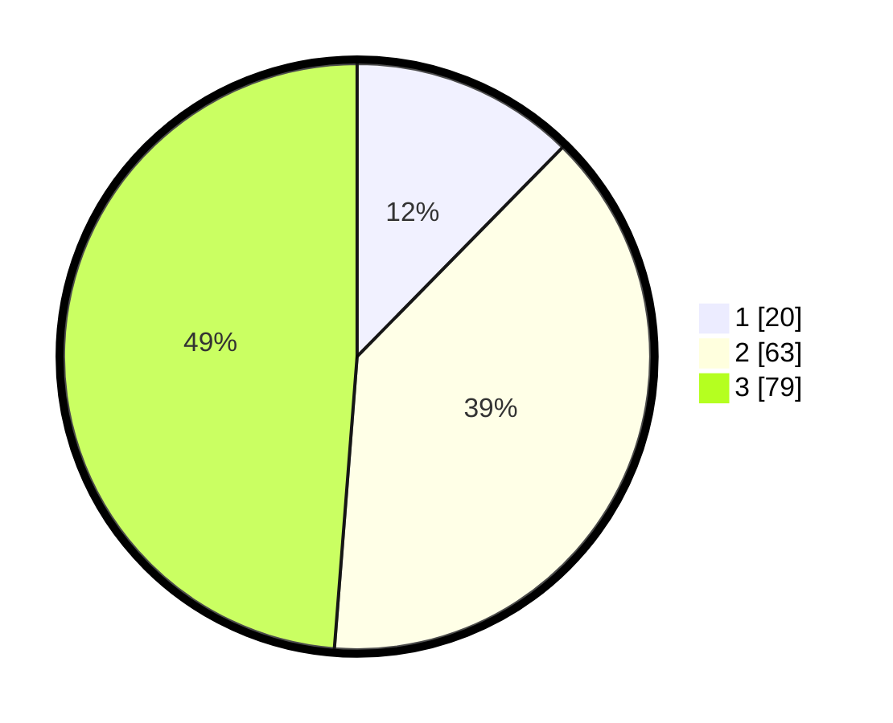

# Hasil

## Grafik

## Tabel

| No. | Nama Paslon    | Suara | Suara (raw) | Persentase |
|:--- |:-------------- | -----:| -----------:| ----------:|
| 1   | ANIES MUHAIMIN | 20    | [20][p-1]   | 12,35      |
| 2   | PRABOWO GIBRAN | 63    | [63][p-2]   | 38,89      |
| 3   | GANJAR MAHFUD  | 79    | [79][p-3]   | 48,77      |

[p-1]: https://github.com/gigit-pemilu/pemilu-2024-33-jawa-tengah/blob/main/pilpres/hitung-suara/sub/33-jawa-tengah/sub/03-purbalingga/sub/13-rembang/sub/2010-sumampir/sub/008-tps/sub/paslon-1.txt
[p-2]: https://github.com/gigit-pemilu/pemilu-2024-33-jawa-tengah/blob/main/pilpres/hitung-suara/sub/33-jawa-tengah/sub/03-purbalingga/sub/13-rembang/sub/2010-sumampir/sub/008-tps/sub/paslon-2.txt
[p-3]: https://github.com/gigit-pemilu/pemilu-2024-33-jawa-tengah/blob/main/pilpres/hitung-suara/sub/33-jawa-tengah/sub/03-purbalingga/sub/13-rembang/sub/2010-sumampir/sub/008-tps/sub/paslon-3.txt

## Foto C Plano

https://sirekap-obj-formc.kpu.go.id/2d1b/pemilu/ppwp/33/03/13/20/10/3303132010008-20240214-232141--7b324d52-c590-4b77-9cd5-d57c1fdf2696.jpg

https://sirekap-obj-formc.kpu.go.id/2d1b/pemilu/ppwp/33/03/13/20/10/3303132010008-20240214-232409--d948c106-41cc-421f-b890-c2b419264ce5.jpg

https://sirekap-obj-formc.kpu.go.id/2d1b/pemilu/ppwp/33/03/13/20/10/3303132010008-20240214-232529--f885a018-5a2b-4a94-8b5e-792b6242a2d8.jpg

## Metadata

| Key        | Value               |
| ---------- | ------------------- |
| Time Stamp | 2024-02-15 15:00:29 |

