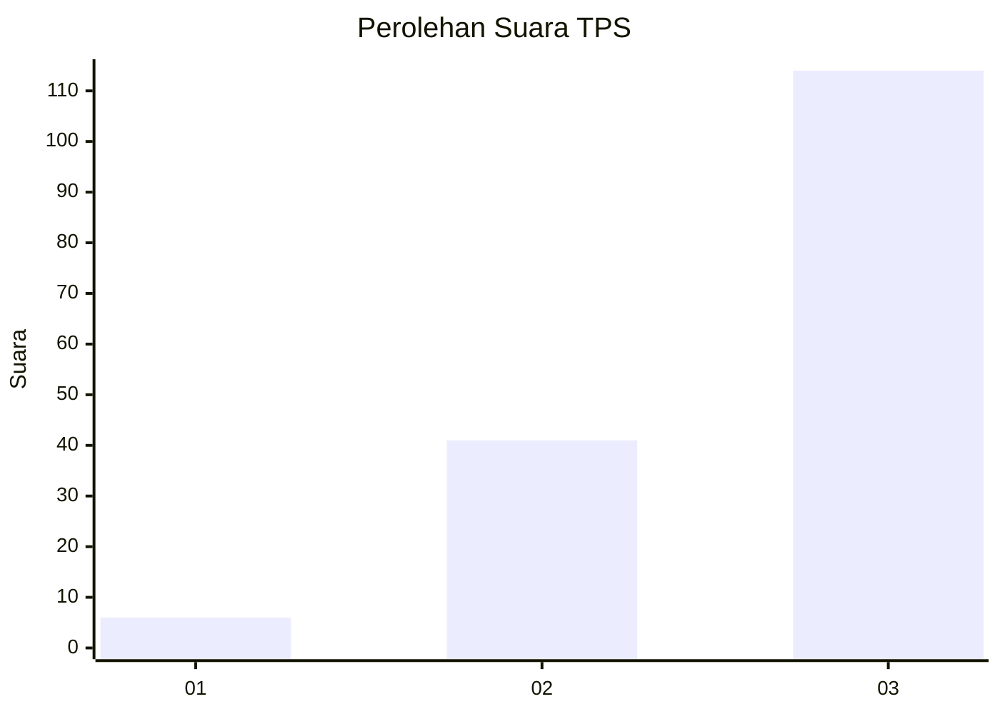
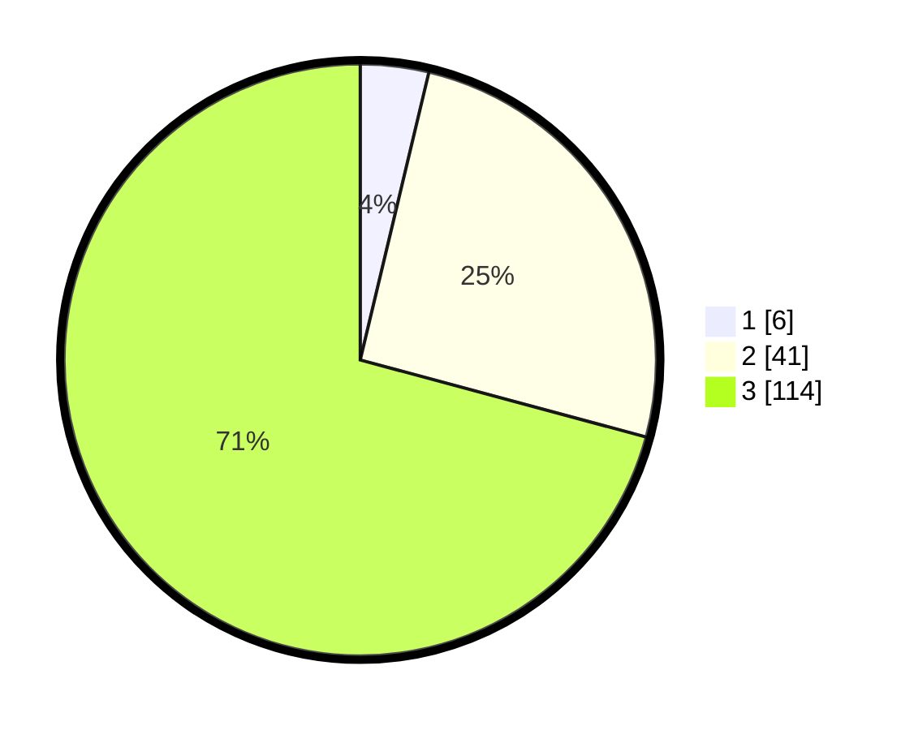

# Hasil

## Grafik

## Tabel

| No. | Nama Paslon    | Suara | Suara (raw) | Persentase |
|:--- |:-------------- | -----:| -----------:| ----------:|
| 1   | ANIES MUHAIMIN | 6     | [6][p-1]    | 3,73       |
| 2   | PRABOWO GIBRAN | 41    | [41][p-2]   | 25,47      |
| 3   | GANJAR MAHFUD  | 114   | [114][p-3]  | 70,81      |

[p-1]: https://github.com/gigit-pemilu/pemilu-2024-33-jawa-tengah/blob/main/pilpres/hitung-suara/sub/33-jawa-tengah/sub/03-purbalingga/sub/13-rembang/sub/2010-sumampir/sub/022-tps/sub/paslon-1.txt
[p-2]: https://github.com/gigit-pemilu/pemilu-2024-33-jawa-tengah/blob/main/pilpres/hitung-suara/sub/33-jawa-tengah/sub/03-purbalingga/sub/13-rembang/sub/2010-sumampir/sub/022-tps/sub/paslon-2.txt
[p-3]: https://github.com/gigit-pemilu/pemilu-2024-33-jawa-tengah/blob/main/pilpres/hitung-suara/sub/33-jawa-tengah/sub/03-purbalingga/sub/13-rembang/sub/2010-sumampir/sub/022-tps/sub/paslon-3.txt

## Foto C Plano

https://sirekap-obj-formc.kpu.go.id/2ab6/pemilu/ppwp/33/03/13/20/10/3303132010022-20240215-000157--f161524c-26d5-4807-8a06-1311a6fb1ab4.jpg

https://sirekap-obj-formc.kpu.go.id/2ab6/pemilu/ppwp/33/03/13/20/10/3303132010022-20240215-001037--af3f886d-cd7f-486a-97b8-db06e51a489f.jpg

https://sirekap-obj-formc.kpu.go.id/2ab6/pemilu/ppwp/33/03/13/20/10/3303132010022-20240215-001213--582b73ce-a694-4bf7-b659-848359c0662e.jpg

## Metadata

| Key        | Value               |
| ---------- | ------------------- |
| Time Stamp | 2024-02-15 19:00:26 |

