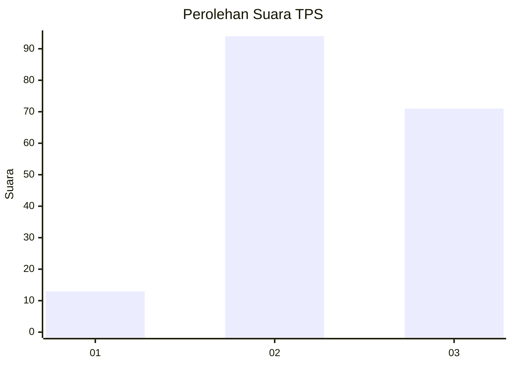
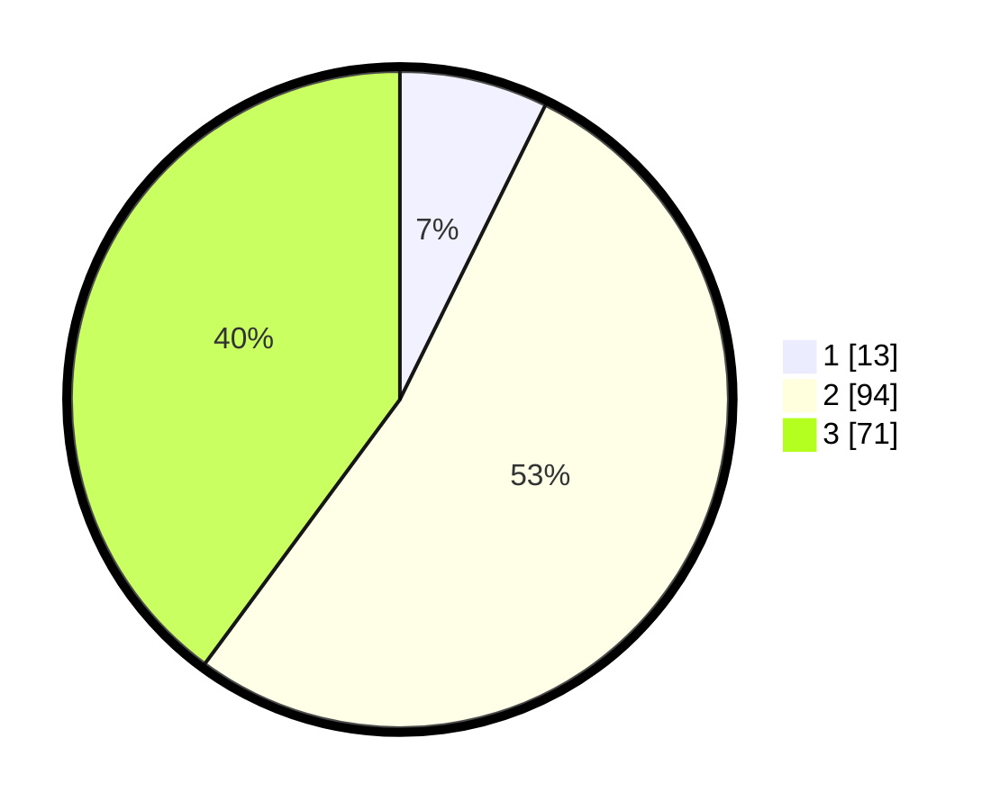

# Hasil

## Grafik

## Tabel

| No. | Nama Paslon    | Suara | Suara (raw) | Persentase |
|:--- |:-------------- | -----:| -----------:| ----------:|
| 1   | ANIES MUHAIMIN | 13    | [13][p-1]   | 7,30       |
| 2   | PRABOWO GIBRAN | 94    | [94][p-2]   | 52,81      |
| 3   | GANJAR MAHFUD  | 71    | [71][p-3]   | 39,89      |

[p-1]: https://github.com/gigit-pemilu/pemilu-2024-33-jawa-tengah/blob/main/pilpres/hitung-suara/sub/33-jawa-tengah/sub/03-purbalingga/sub/13-rembang/sub/2012-panusupan/sub/003-tps/sub/paslon-1.txt
[p-2]: https://github.com/gigit-pemilu/pemilu-2024-33-jawa-tengah/blob/main/pilpres/hitung-suara/sub/33-jawa-tengah/sub/03-purbalingga/sub/13-rembang/sub/2012-panusupan/sub/003-tps/sub/paslon-2.txt
[p-3]: https://github.com/gigit-pemilu/pemilu-2024-33-jawa-tengah/blob/main/pilpres/hitung-suara/sub/33-jawa-tengah/sub/03-purbalingga/sub/13-rembang/sub/2012-panusupan/sub/003-tps/sub/paslon-3.txt

## Foto C Plano

https://sirekap-obj-formc.kpu.go.id/2e86/pemilu/ppwp/33/03/13/20/12/3303132012003-20240219-130129--defd3d40-8710-4448-b4b6-7522f5c0076e.jpg

https://sirekap-obj-formc.kpu.go.id/2e86/pemilu/ppwp/33/03/13/20/12/3303132012003-20240215-000941--39ea934c-e059-49d4-af25-5044ecb03428.jpg

https://sirekap-obj-formc.kpu.go.id/2e86/pemilu/ppwp/33/03/13/20/12/3303132012003-20240219-130354--fc80a45e-e99c-4cb9-a4e6-da52164e4792.jpg

## Metadata

| Key        | Value               |
| ---------- | ------------------- |
| Time Stamp | 2024-02-19 14:00:00 |

