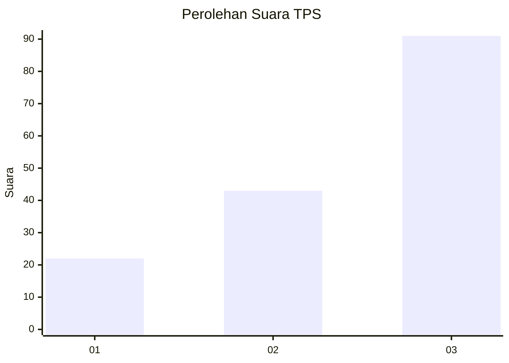
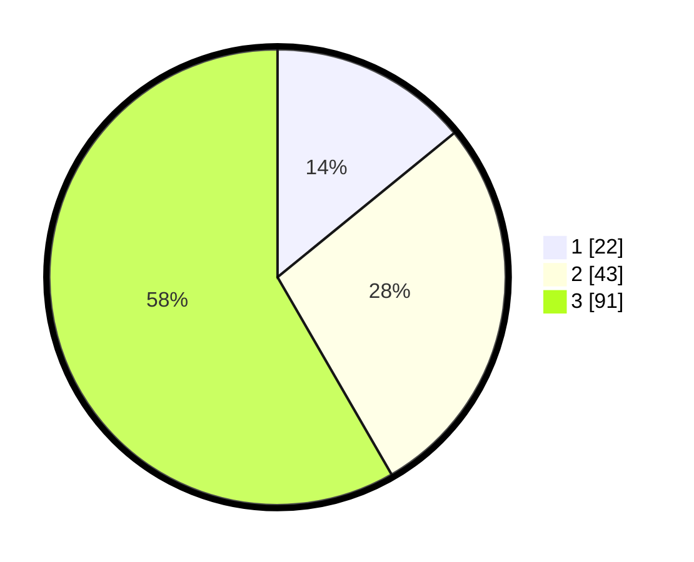

# Hasil

## Grafik

## Tabel

| No. | Nama Paslon    | Suara | Suara (raw) | Persentase |
|:--- |:-------------- | -----:| -----------:| ----------:|
| 1   | ANIES MUHAIMIN | 22    | [22][p-1]   | 14,10      |
| 2   | PRABOWO GIBRAN | 43    | [43][p-2]   | 27,56      |
| 3   | GANJAR MAHFUD  | 91    | [91][p-3]   | 58,33      |

[p-1]: https://github.com/gigit-pemilu/pemilu-2024-33-jawa-tengah/blob/main/pilpres/hitung-suara/sub/33-jawa-tengah/sub/03-purbalingga/sub/13-rembang/sub/2012-panusupan/sub/021-tps/sub/paslon-1.txt
[p-2]: https://github.com/gigit-pemilu/pemilu-2024-33-jawa-tengah/blob/main/pilpres/hitung-suara/sub/33-jawa-tengah/sub/03-purbalingga/sub/13-rembang/sub/2012-panusupan/sub/021-tps/sub/paslon-2.txt
[p-3]: https://github.com/gigit-pemilu/pemilu-2024-33-jawa-tengah/blob/main/pilpres/hitung-suara/sub/33-jawa-tengah/sub/03-purbalingga/sub/13-rembang/sub/2012-panusupan/sub/021-tps/sub/paslon-3.txt

## Foto C Plano

https://sirekap-obj-formc.kpu.go.id/1c70/pemilu/ppwp/33/03/13/20/12/3303132012021-20240215-024909--4344d9d1-8895-400f-8a1e-c114cf7996e4.jpg

https://sirekap-obj-formc.kpu.go.id/1c70/pemilu/ppwp/33/03/13/20/12/3303132012021-20240215-025214--f653d951-0d78-4786-a353-7d9a24691419.jpg

https://sirekap-obj-formc.kpu.go.id/1c70/pemilu/ppwp/33/03/13/20/12/3303132012021-20240215-025759--a9334ddb-62eb-485b-89b8-f5729b751039.jpg

## Metadata

| Key        | Value               |
| ---------- | ------------------- |
| Time Stamp | 2024-02-15 15:00:29 |

