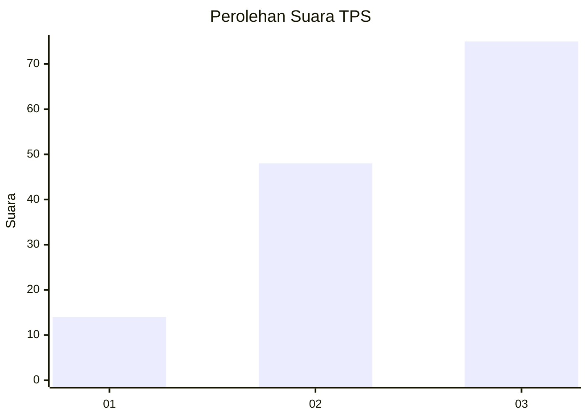
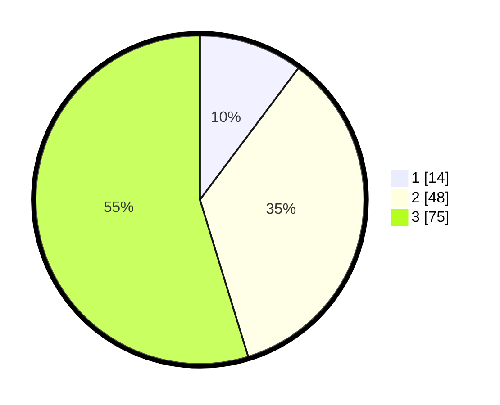

# Hasil

## Grafik

## Tabel

| No. | Nama Paslon    | Suara | Suara (raw) | Persentase |
|:--- |:-------------- | -----:| -----------:| ----------:|
| 1   | ANIES MUHAIMIN | 14    | [14][p-1]   | 10,22      |
| 2   | PRABOWO GIBRAN | 48    | [48][p-2]   | 35,04      |
| 3   | GANJAR MAHFUD  | 75    | [75][p-3]   | 54,74      |

[p-1]: https://github.com/gigit-pemilu/pemilu-2024/blob/main/pilpres/hitung-suara/sub/33-jawa-tengah/sub/03-purbalingga/sub/13-rembang/sub/2012-panusupan/sub/025-tps/sub/paslon-1.txt
[p-2]: https://github.com/gigit-pemilu/pemilu-2024/blob/main/pilpres/hitung-suara/sub/33-jawa-tengah/sub/03-purbalingga/sub/13-rembang/sub/2012-panusupan/sub/025-tps/sub/paslon-2.txt
[p-3]: https://github.com/gigit-pemilu/pemilu-2024/blob/main/pilpres/hitung-suara/sub/33-jawa-tengah/sub/03-purbalingga/sub/13-rembang/sub/2012-panusupan/sub/025-tps/sub/paslon-3.txt

## Foto C Plano

https://sirekap-obj-formc.kpu.go.id/586b/pemilu/ppwp/33/03/13/20/12/3303132012025-20240215-004339--70dda521-1abc-43c2-9d7c-6cfea88cc5a3.jpg

https://sirekap-obj-formc.kpu.go.id/586b/pemilu/ppwp/33/03/13/20/12/3303132012025-20240215-032938--e44a3f5e-d53a-41c0-99f4-f9e016de754c.jpg

https://sirekap-obj-formc.kpu.go.id/586b/pemilu/ppwp/33/03/13/20/12/3303132012025-20240215-004617--b26537d8-878d-4636-bad8-81bce808bded.jpg

## Metadata

| Key        | Value               |
| ---------- | ------------------- |
| Time Stamp | 2024-02-15 15:00:29 |

