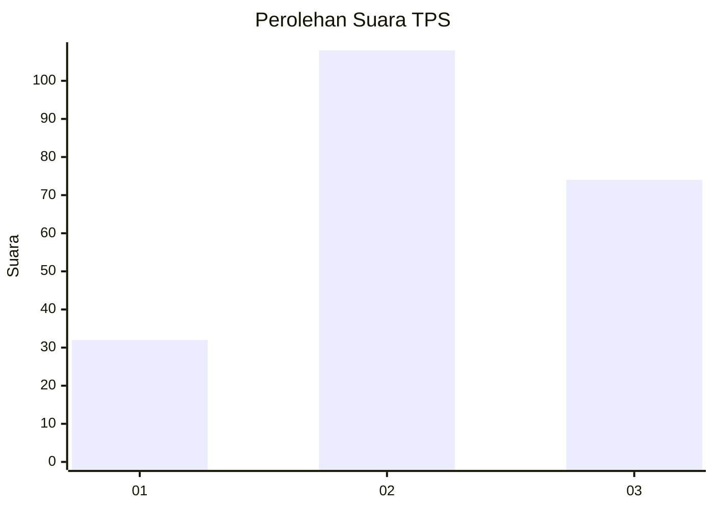
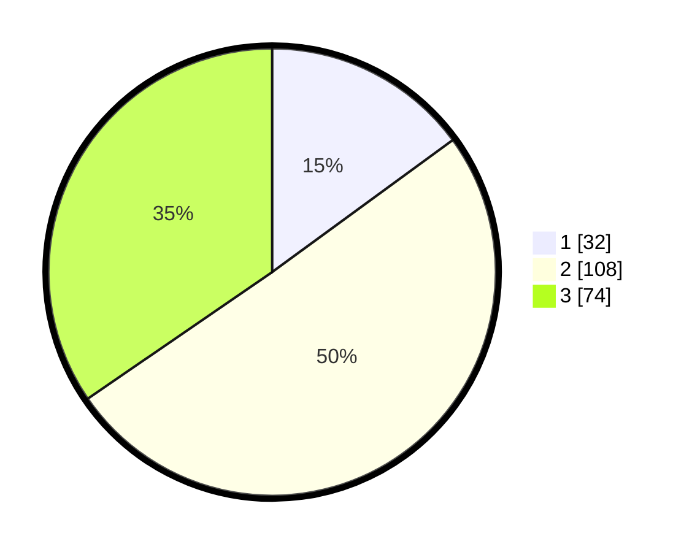

# Hasil

## Grafik

## Tabel

| No. | Nama Paslon    | Suara | Suara (raw) | Persentase |
|:--- |:-------------- | -----:| -----------:| ----------:|
| 1   | ANIES MUHAIMIN | 32    | [32][p-1]   | 14,95      |
| 2   | PRABOWO GIBRAN | 108   | [108][p-2]  | 50,47      |
| 3   | GANJAR MAHFUD  | 74    | [74][p-3]   | 34,58      |

[p-1]: https://github.com/gigit-pemilu/pemilu-2024-33-jawa-tengah/blob/main/pilpres/hitung-suara/sub/33-jawa-tengah/sub/03-purbalingga/sub/14-bojongsari/sub/2001-brobot/sub/003-tps/sub/paslon-1.txt
[p-2]: https://github.com/gigit-pemilu/pemilu-2024-33-jawa-tengah/blob/main/pilpres/hitung-suara/sub/33-jawa-tengah/sub/03-purbalingga/sub/14-bojongsari/sub/2001-brobot/sub/003-tps/sub/paslon-2.txt
[p-3]: https://github.com/gigit-pemilu/pemilu-2024-33-jawa-tengah/blob/main/pilpres/hitung-suara/sub/33-jawa-tengah/sub/03-purbalingga/sub/14-bojongsari/sub/2001-brobot/sub/003-tps/sub/paslon-3.txt

## Foto C Plano

https://sirekap-obj-formc.kpu.go.id/60cb/pemilu/ppwp/33/03/14/20/01/3303142001003-20240220-073728--7d81fdf7-ea81-410e-8d49-2ce0f9c37a03.jpg

https://sirekap-obj-formc.kpu.go.id/60cb/pemilu/ppwp/33/03/14/20/01/3303142001003-20240220-073237--2613aa06-99a4-4f43-8459-5b38fc5fa08a.jpg

https://sirekap-obj-formc.kpu.go.id/60cb/pemilu/ppwp/33/03/14/20/01/3303142001003-20240220-073412--de4132c5-d3d5-4a6b-9d1c-36cc10c94bc0.jpg

## Metadata

| Key        | Value               |
| ---------- | ------------------- |
| Time Stamp | 2024-02-25 13:00:00 |

