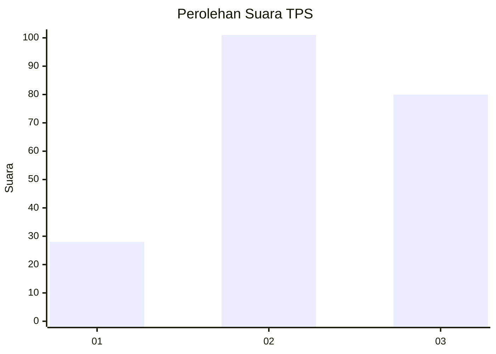
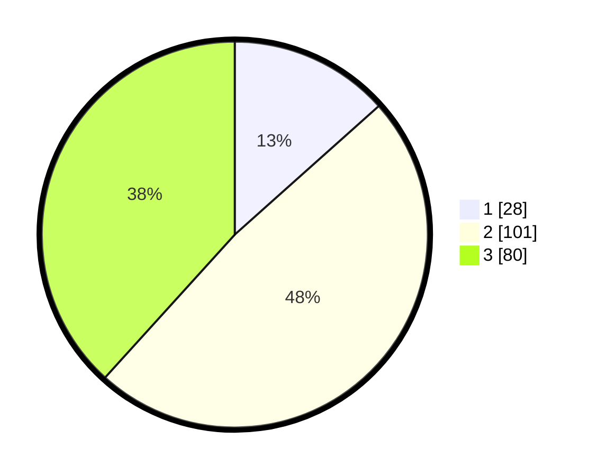

# Hasil

## Grafik

## Tabel

| No. | Nama Paslon    | Suara | Suara (raw) | Persentase |
|:--- |:-------------- | -----:| -----------:| ----------:|
| 1   | ANIES MUHAIMIN | 28    | [28][p-1]   | 13,40      |
| 2   | PRABOWO GIBRAN | 101   | [101][p-2]  | 48,33      |
| 3   | GANJAR MAHFUD  | 80    | [80][p-3]   | 38,28      |

[p-1]: https://github.com/gigit-pemilu/pemilu-2024-33-jawa-tengah/blob/main/pilpres/hitung-suara/sub/33-jawa-tengah/sub/03-purbalingga/sub/14-bojongsari/sub/2001-brobot/sub/005-tps/sub/paslon-1.txt
[p-2]: https://github.com/gigit-pemilu/pemilu-2024-33-jawa-tengah/blob/main/pilpres/hitung-suara/sub/33-jawa-tengah/sub/03-purbalingga/sub/14-bojongsari/sub/2001-brobot/sub/005-tps/sub/paslon-2.txt
[p-3]: https://github.com/gigit-pemilu/pemilu-2024-33-jawa-tengah/blob/main/pilpres/hitung-suara/sub/33-jawa-tengah/sub/03-purbalingga/sub/14-bojongsari/sub/2001-brobot/sub/005-tps/sub/paslon-3.txt

## Foto C Plano

https://sirekap-obj-formc.kpu.go.id/95f5/pemilu/ppwp/33/03/14/20/01/3303142001005-20240215-021015--b93421b2-756e-4909-9cc3-31c3fc3be10a.jpg

https://sirekap-obj-formc.kpu.go.id/95f5/pemilu/ppwp/33/03/14/20/01/3303142001005-20240215-021256--6c063fb1-449e-4e7b-8ce7-ec24485c1ab1.jpg

https://sirekap-obj-formc.kpu.go.id/95f5/pemilu/ppwp/33/03/14/20/01/3303142001005-20240215-022230--d10288c4-8933-4669-a20c-6026748cd188.jpg

## Metadata

| Key        | Value               |
| ---------- | ------------------- |
| Time Stamp | 2024-02-16 17:30:00 |

