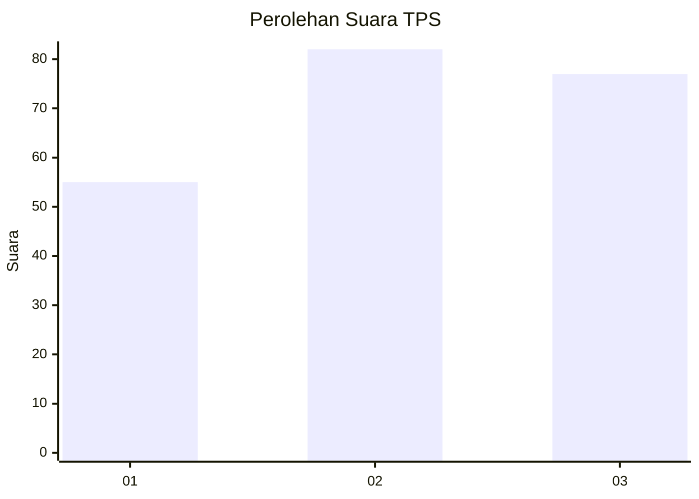
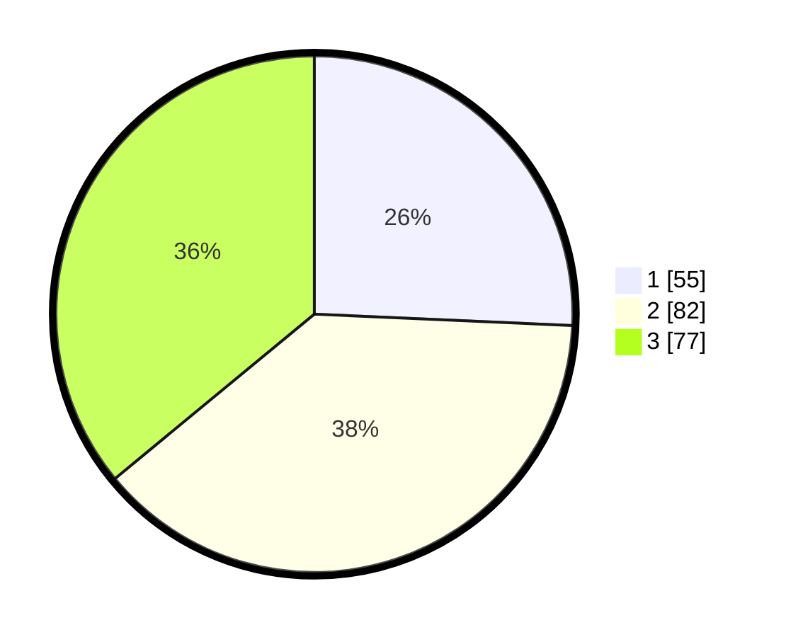

# Hasil

## Grafik

## Tabel

| No. | Nama Paslon    | Suara | Suara (raw) | Persentase |
|:--- |:-------------- | -----:| -----------:| ----------:|
| 1   | ANIES MUHAIMIN | 55    | [55][p-1]   | 25,70      |
| 2   | PRABOWO GIBRAN | 82    | [82][p-2]   | 38,32      |
| 3   | GANJAR MAHFUD  | 77    | [77][p-3]   | 35,98      |

[p-1]: https://github.com/gigit-pemilu/pemilu-2024/blob/main/pilpres/hitung-suara/sub/33-jawa-tengah/sub/03-purbalingga/sub/14-bojongsari/sub/2002-gembong/sub/005-tps/sub/paslon-1.txt
[p-2]: https://github.com/gigit-pemilu/pemilu-2024/blob/main/pilpres/hitung-suara/sub/33-jawa-tengah/sub/03-purbalingga/sub/14-bojongsari/sub/2002-gembong/sub/005-tps/sub/paslon-2.txt
[p-3]: https://github.com/gigit-pemilu/pemilu-2024/blob/main/pilpres/hitung-suara/sub/33-jawa-tengah/sub/03-purbalingga/sub/14-bojongsari/sub/2002-gembong/sub/005-tps/sub/paslon-3.txt

## Foto C Plano

https://sirekap-obj-formc.kpu.go.id/c74e/pemilu/ppwp/33/03/14/20/02/3303142002005-20240215-002735--8a502a4b-c45b-4331-bb2e-d14b098c6442.jpg

https://sirekap-obj-formc.kpu.go.id/c74e/pemilu/ppwp/33/03/14/20/02/3303142002005-20240215-002740--5ade892e-63d4-4a9e-9fb4-b438c8204134.jpg

https://sirekap-obj-formc.kpu.go.id/c74e/pemilu/ppwp/33/03/14/20/02/3303142002005-20240215-002745--588a28a9-f56f-4cab-848f-c59e1325c20d.jpg

## Metadata

| Key        | Value               |
| ---------- | ------------------- |
| Time Stamp | 2024-02-15 12:00:28 |

