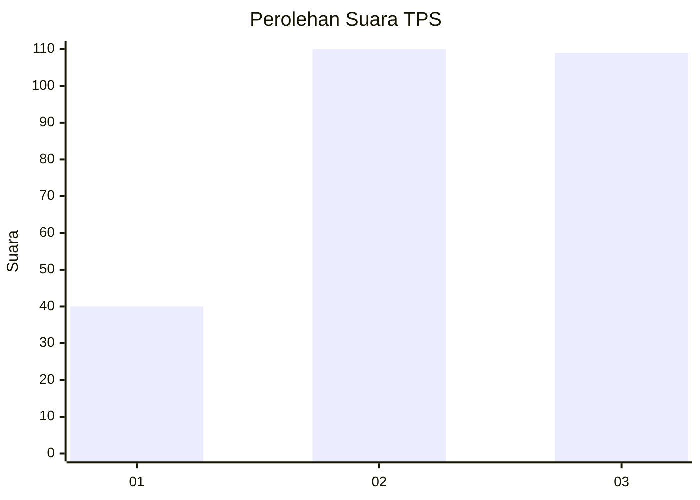
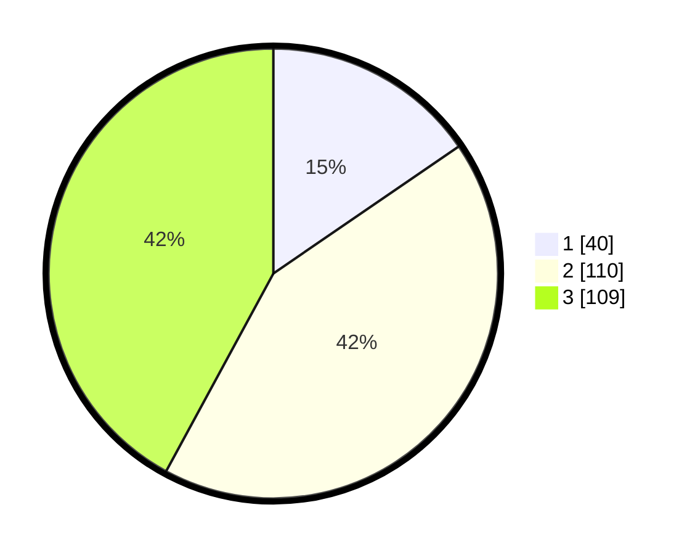

# Hasil

## Grafik

## Tabel

| No. | Nama Paslon    | Suara | Suara (raw) | Persentase |
|:--- |:-------------- | -----:| -----------:| ----------:|
| 1   | ANIES MUHAIMIN | 40    | [40][p-1]   | 15,44      |
| 2   | PRABOWO GIBRAN | 110   | [110][p-2]  | 42,47      |
| 3   | GANJAR MAHFUD  | 109   | [109][p-3]  | 42,08      |

[p-1]: https://github.com/gigit-pemilu/pemilu-2024/blob/main/pilpres/hitung-suara/sub/33-jawa-tengah/sub/03-purbalingga/sub/14-bojongsari/sub/2002-gembong/sub/008-tps/sub/paslon-1.txt
[p-2]: https://github.com/gigit-pemilu/pemilu-2024/blob/main/pilpres/hitung-suara/sub/33-jawa-tengah/sub/03-purbalingga/sub/14-bojongsari/sub/2002-gembong/sub/008-tps/sub/paslon-2.txt
[p-3]: https://github.com/gigit-pemilu/pemilu-2024/blob/main/pilpres/hitung-suara/sub/33-jawa-tengah/sub/03-purbalingga/sub/14-bojongsari/sub/2002-gembong/sub/008-tps/sub/paslon-3.txt

## Foto C Plano

https://sirekap-obj-formc.kpu.go.id/6b23/pemilu/ppwp/33/03/14/20/02/3303142002008-20240215-042539--84451f82-5f96-4407-a796-ed6db29aa49f.jpg

https://sirekap-obj-formc.kpu.go.id/6b23/pemilu/ppwp/33/03/14/20/02/3303142002008-20240215-042924--26691bb5-70af-4bcc-b222-8a7216f740b6.jpg

https://sirekap-obj-formc.kpu.go.id/6b23/pemilu/ppwp/33/03/14/20/02/3303142002008-20240215-043021--9272d5b8-93b2-4a53-bf6a-27bcec53ab52.jpg

## Metadata

| Key        | Value               |
| ---------- | ------------------- |
| Time Stamp | 2024-02-15 17:00:25 |

