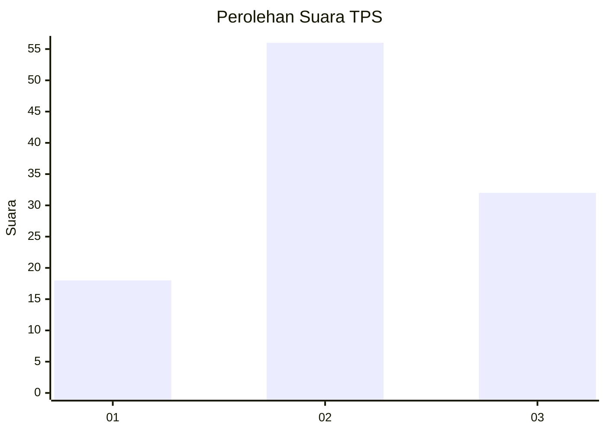
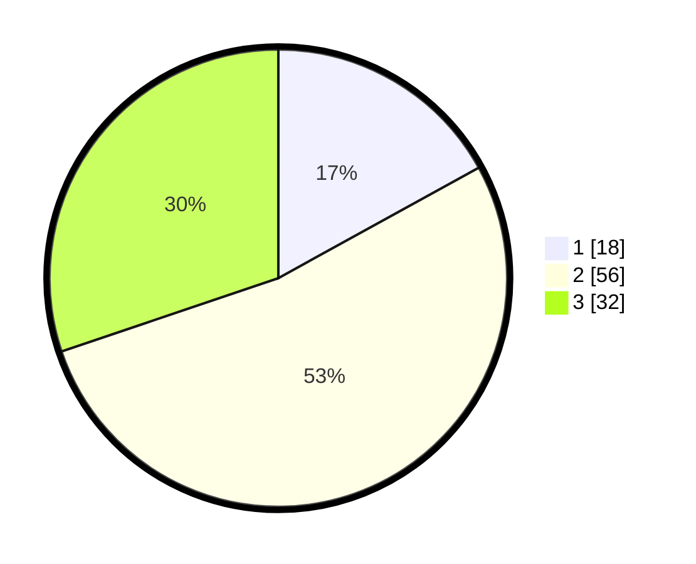

# Hasil

## Grafik

## Tabel

| No. | Nama Paslon    | Suara | Suara (raw) | Persentase |
|:--- |:-------------- | -----:| -----------:| ----------:|
| 1   | ANIES MUHAIMIN | 18    | [18][p-1]   | 16,98      |
| 2   | PRABOWO GIBRAN | 56    | [56][p-2]   | 52,83      |
| 3   | GANJAR MAHFUD  | 32    | [32][p-3]   | 30,19      |

[p-1]: https://github.com/gigit-pemilu/pemilu-2024/blob/main/pilpres/hitung-suara/sub/33-jawa-tengah/sub/03-purbalingga/sub/14-bojongsari/sub/2003-galuh/sub/009-tps/sub/paslon-1.txt
[p-2]: https://github.com/gigit-pemilu/pemilu-2024/blob/main/pilpres/hitung-suara/sub/33-jawa-tengah/sub/03-purbalingga/sub/14-bojongsari/sub/2003-galuh/sub/009-tps/sub/paslon-2.txt
[p-3]: https://github.com/gigit-pemilu/pemilu-2024/blob/main/pilpres/hitung-suara/sub/33-jawa-tengah/sub/03-purbalingga/sub/14-bojongsari/sub/2003-galuh/sub/009-tps/sub/paslon-3.txt

## Foto C Plano

https://sirekap-obj-formc.kpu.go.id/3a6b/pemilu/ppwp/33/03/14/20/03/3303142003009-20240214-211754--78bd6d3c-bacf-42fe-88a0-0d518905f8d2.jpg

https://sirekap-obj-formc.kpu.go.id/3a6b/pemilu/ppwp/33/03/14/20/03/3303142003009-20240214-211946--c7fab003-30d7-46e1-9bb5-d6bbbed226ec.jpg

https://sirekap-obj-formc.kpu.go.id/3a6b/pemilu/ppwp/33/03/14/20/03/3303142003009-20240214-212137--eb5cd1b0-bcab-4b69-a3c0-0b098de9f6d6.jpg

## Metadata

| Key        | Value               |
| ---------- | ------------------- |
| Time Stamp | 2024-02-15 00:41:44 |

## DATA PEMILIH TETAP

Jumlah pemilih dalam DPT: **125**.
 * L: **65**.
 * P: **60**.

## DATA PENGGUNA HAK PILIH

Jumlah pengguna hak pilih dalam DPT: **104**.
 * L: **51**.
 * P: **53**.

Jumlah pengguna hak pilih dalam DPTb: **3**.
 * L: **2**.
 * P: **601**.

Jumlah pengguna hak pilih dalam DPK: **1**.
 * L: **1**.
 * P: **0**.

Jumlah pengguna hak pilih: **109**.
 * L: **854**.
 * P: **54**.

## JUMLAH SUARA SAH DAN TIDAK SAH

JUMLAH SELURUH SUARA SAH: **106**.

JUMLAH SUARA TIDAK SAH: **2**.

JUMLAH SELURUH SUARA SAH DAN SUARA TIDAK SAH: **108**.

