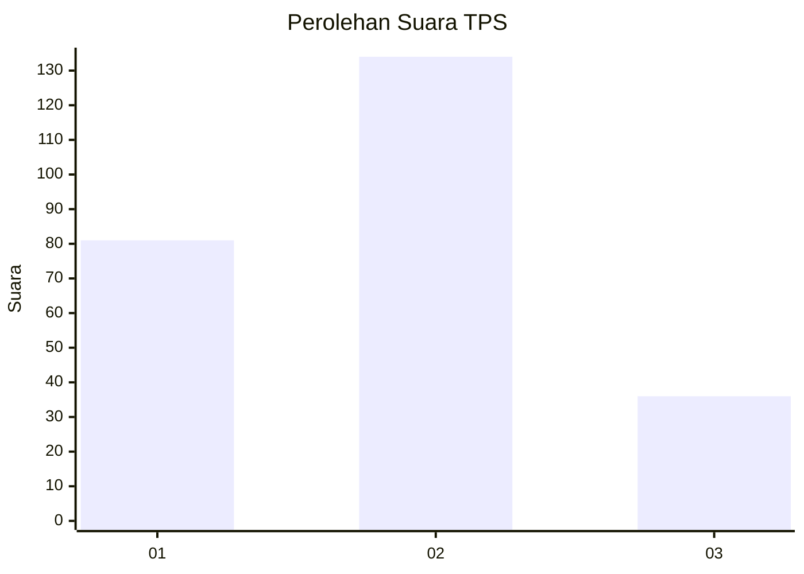
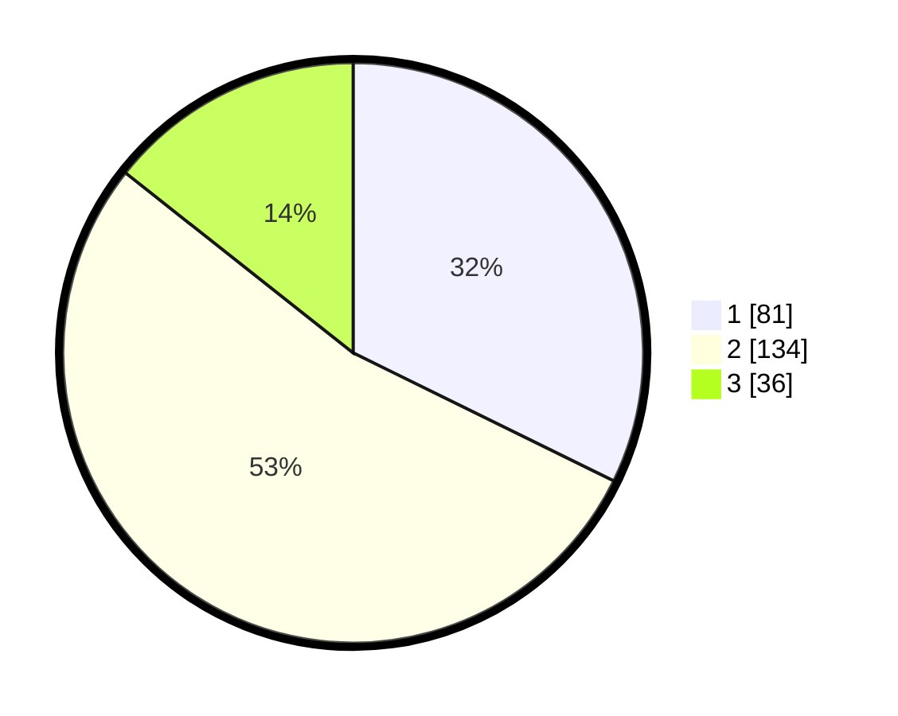

# Hasil

## Grafik

## Tabel

| No. | Nama Paslon    | Suara | Suara (raw) | Persentase |
|:--- |:-------------- | -----:| -----------:| ----------:|
| 1   | ANIES MUHAIMIN | 81    | [81][p-1]   | 32,27      |
| 2   | PRABOWO GIBRAN | 134   | [134][p-2]  | 53,39      |
| 3   | GANJAR MAHFUD  | 36    | [36][p-3]   | 14,34      |

[p-1]: https://github.com/gigit-pemilu/pemilu-2024-33-jawa-tengah/blob/main/pilpres/hitung-suara/sub/33-jawa-tengah/sub/03-purbalingga/sub/14-bojongsari/sub/2004-banjaran/sub/003-tps/sub/paslon-1.txt
[p-2]: https://github.com/gigit-pemilu/pemilu-2024-33-jawa-tengah/blob/main/pilpres/hitung-suara/sub/33-jawa-tengah/sub/03-purbalingga/sub/14-bojongsari/sub/2004-banjaran/sub/003-tps/sub/paslon-2.txt
[p-3]: https://github.com/gigit-pemilu/pemilu-2024-33-jawa-tengah/blob/main/pilpres/hitung-suara/sub/33-jawa-tengah/sub/03-purbalingga/sub/14-bojongsari/sub/2004-banjaran/sub/003-tps/sub/paslon-3.txt

## Foto C Plano

https://sirekap-obj-formc.kpu.go.id/a8e3/pemilu/ppwp/33/03/14/20/04/3303142004003-20240215-003208--354c1141-2015-463d-9ed9-3ed1b2d3ad21.jpg

https://sirekap-obj-formc.kpu.go.id/a8e3/pemilu/ppwp/33/03/14/20/04/3303142004003-20240215-003442--0e72b74b-c003-4af8-9468-90ecc75f8ce5.jpg

https://sirekap-obj-formc.kpu.go.id/a8e3/pemilu/ppwp/33/03/14/20/04/3303142004003-20240215-003533--4aa50138-45f4-42af-ab83-c4e452282c4b.jpg

## Metadata

| Key        | Value               |
| ---------- | ------------------- |
| Time Stamp | 2024-02-15 12:00:28 |

