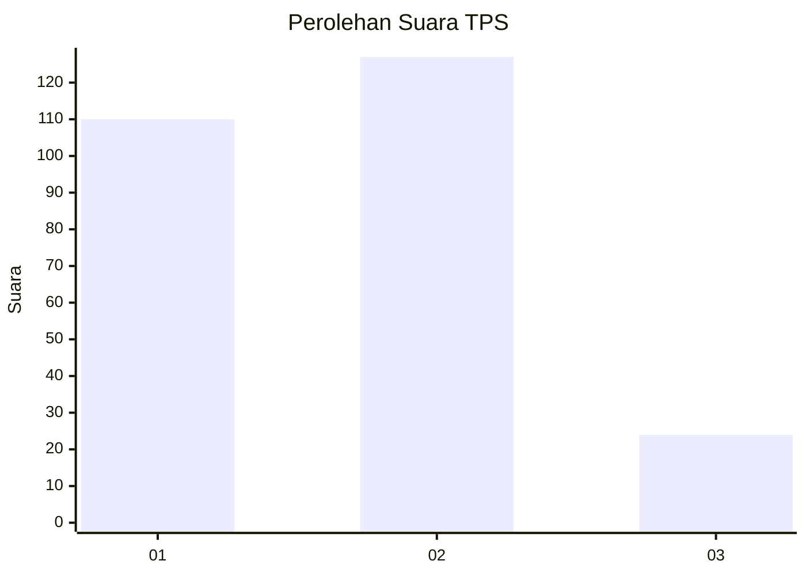
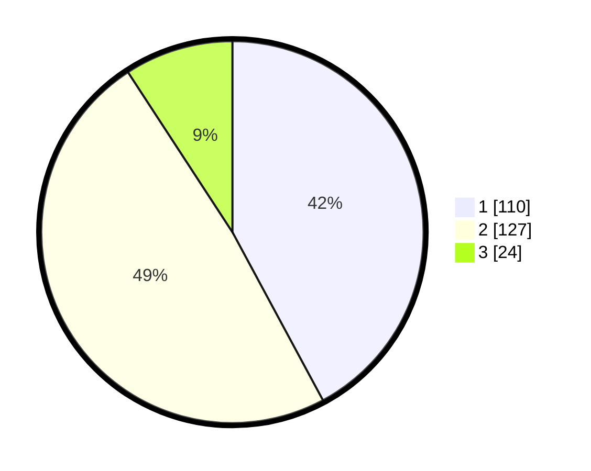

# Hasil

## Grafik

## Tabel

| No. | Nama Paslon    | Suara | Suara (raw) | Persentase |
|:--- |:-------------- | -----:| -----------:| ----------:|
| 1   | ANIES MUHAIMIN | 110   | [110][p-1]  | 42,15      |
| 2   | PRABOWO GIBRAN | 127   | [127][p-2]  | 48,66      |
| 3   | GANJAR MAHFUD  | 24    | [24][p-3]   | 9,20       |

[p-1]: https://github.com/gigit-pemilu/pemilu-2024-33-jawa-tengah/blob/main/pilpres/hitung-suara/sub/33-jawa-tengah/sub/03-purbalingga/sub/14-bojongsari/sub/2004-banjaran/sub/005-tps/sub/paslon-1.txt
[p-2]: https://github.com/gigit-pemilu/pemilu-2024-33-jawa-tengah/blob/main/pilpres/hitung-suara/sub/33-jawa-tengah/sub/03-purbalingga/sub/14-bojongsari/sub/2004-banjaran/sub/005-tps/sub/paslon-2.txt
[p-3]: https://github.com/gigit-pemilu/pemilu-2024-33-jawa-tengah/blob/main/pilpres/hitung-suara/sub/33-jawa-tengah/sub/03-purbalingga/sub/14-bojongsari/sub/2004-banjaran/sub/005-tps/sub/paslon-3.txt

## Foto C Plano

https://sirekap-obj-formc.kpu.go.id/815e/pemilu/ppwp/33/03/14/20/04/3303142004005-20240215-061636--13149b25-fe35-424b-94db-1a98f8f78f60.jpg

https://sirekap-obj-formc.kpu.go.id/815e/pemilu/ppwp/33/03/14/20/04/3303142004005-20240215-061720--debef24f-ecc4-46b9-8d08-c137fa910e5f.jpg

https://sirekap-obj-formc.kpu.go.id/815e/pemilu/ppwp/33/03/14/20/04/3303142004005-20240215-061753--d35ed1cd-14e0-4fe8-8d2b-047d20302807.jpg

## Metadata

| Key        | Value               |
| ---------- | ------------------- |
| Time Stamp | 2024-02-16 16:25:10 |

