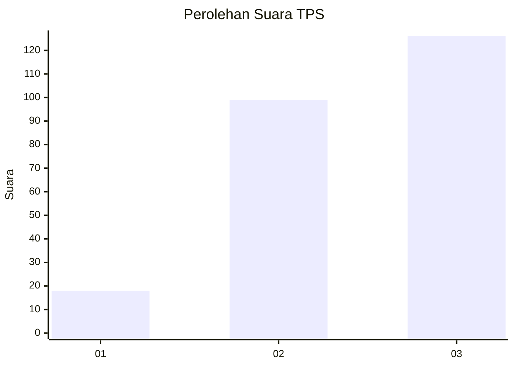
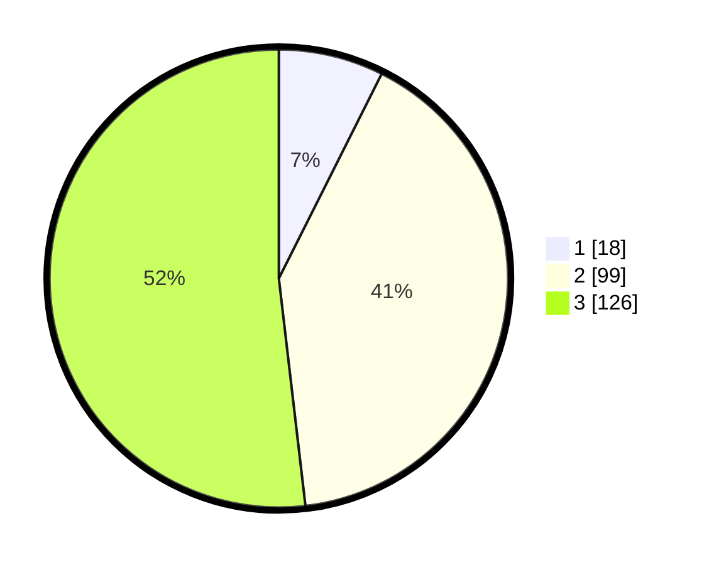

# Hasil

## Grafik

## Tabel

| No. | Nama Paslon    | Suara | Suara (raw) | Persentase |
|:--- |:-------------- | -----:| -----------:| ----------:|
| 1   | ANIES MUHAIMIN | 18    | [18][p-1]   | 7,41       |
| 2   | PRABOWO GIBRAN | 99    | [99][p-2]   | 40,74      |
| 3   | GANJAR MAHFUD  | 126   | [126][p-3]  | 51,85      |

[p-1]: https://github.com/gigit-pemilu/pemilu-2024/blob/main/pilpres/hitung-suara/sub/33-jawa-tengah/sub/03-purbalingga/sub/14-bojongsari/sub/2004-banjaran/sub/011-tps/sub/paslon-1.txt
[p-2]: https://github.com/gigit-pemilu/pemilu-2024/blob/main/pilpres/hitung-suara/sub/33-jawa-tengah/sub/03-purbalingga/sub/14-bojongsari/sub/2004-banjaran/sub/011-tps/sub/paslon-2.txt
[p-3]: https://github.com/gigit-pemilu/pemilu-2024/blob/main/pilpres/hitung-suara/sub/33-jawa-tengah/sub/03-purbalingga/sub/14-bojongsari/sub/2004-banjaran/sub/011-tps/sub/paslon-3.txt

## Foto C Plano

https://sirekap-obj-formc.kpu.go.id/0adb/pemilu/ppwp/33/03/14/20/04/3303142004011-20240216-154927--2e79ea6d-e7db-49a0-8794-a8061c3f5228.jpg

https://sirekap-obj-formc.kpu.go.id/0adb/pemilu/ppwp/33/03/14/20/04/3303142004011-20240216-154958--b1cf71a1-7f06-438f-8c9d-0d342da72439.jpg

https://sirekap-obj-formc.kpu.go.id/0adb/pemilu/ppwp/33/03/14/20/04/3303142004011-20240216-155029--bf9d21f5-a435-49a1-82b5-aa3c947aac61.jpg

## Metadata

| Key        | Value               |
| ---------- | ------------------- |
| Time Stamp | 2024-02-16 17:30:00 |

