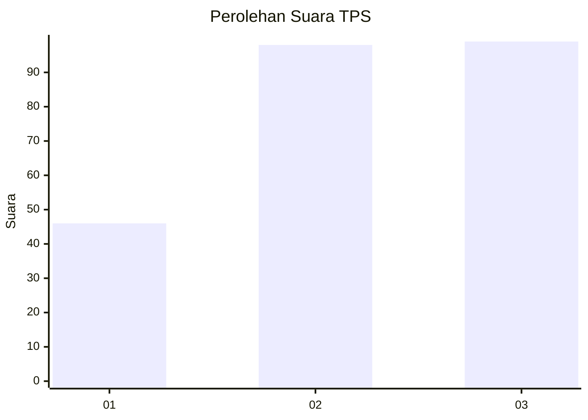
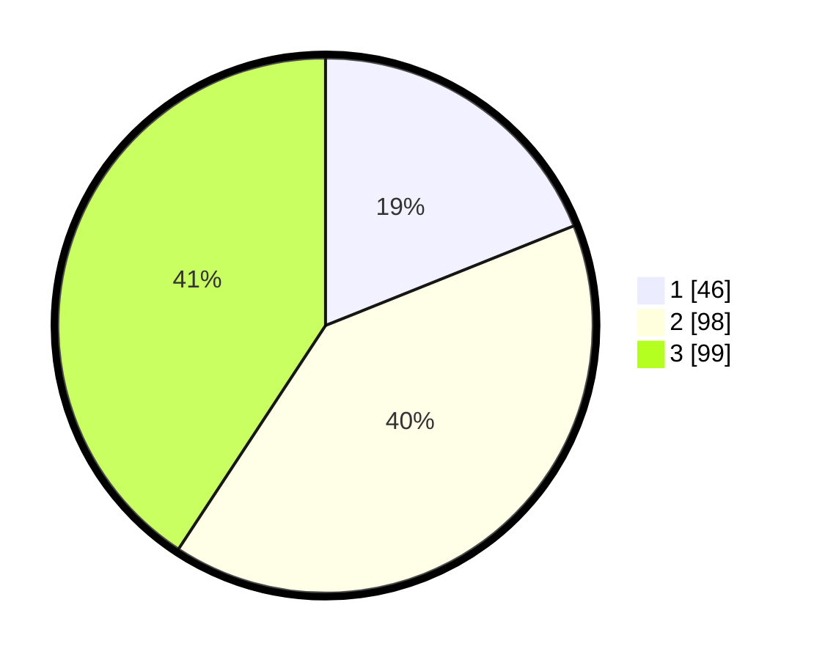

# Hasil

## Grafik

## Tabel

| No. | Nama Paslon    | Suara | Suara (raw) | Persentase |
|:--- |:-------------- | -----:| -----------:| ----------:|
| 1   | ANIES MUHAIMIN | 46    | [46][p-1]   | 18,93      |
| 2   | PRABOWO GIBRAN | 98    | [98][p-2]   | 40,33      |
| 3   | GANJAR MAHFUD  | 99    | [99][p-3]   | 40,74      |

[p-1]: https://github.com/gigit-pemilu/pemilu-2024-33-jawa-tengah/blob/main/pilpres/hitung-suara/sub/33-jawa-tengah/sub/03-purbalingga/sub/14-bojongsari/sub/2006-bojongsari/sub/008-tps/sub/paslon-1.txt
[p-2]: https://github.com/gigit-pemilu/pemilu-2024-33-jawa-tengah/blob/main/pilpres/hitung-suara/sub/33-jawa-tengah/sub/03-purbalingga/sub/14-bojongsari/sub/2006-bojongsari/sub/008-tps/sub/paslon-2.txt
[p-3]: https://github.com/gigit-pemilu/pemilu-2024-33-jawa-tengah/blob/main/pilpres/hitung-suara/sub/33-jawa-tengah/sub/03-purbalingga/sub/14-bojongsari/sub/2006-bojongsari/sub/008-tps/sub/paslon-3.txt

## Foto C Plano

https://sirekap-obj-formc.kpu.go.id/33ae/pemilu/ppwp/33/03/14/20/06/3303142006008-20240214-221624--190073cf-1be2-4632-ae09-3e0b48dc3bd7.jpg

https://sirekap-obj-formc.kpu.go.id/33ae/pemilu/ppwp/33/03/14/20/06/3303142006008-20240214-221752--b7591d5e-7ce3-43b4-a5de-aa684c333228.jpg

https://sirekap-obj-formc.kpu.go.id/33ae/pemilu/ppwp/33/03/14/20/06/3303142006008-20240214-221846--6e83c7c3-7a05-474f-81e3-761a7070de36.jpg

## Metadata

| Key        | Value               |
| ---------- | ------------------- |
| Time Stamp | 2024-02-15 15:00:29 |

