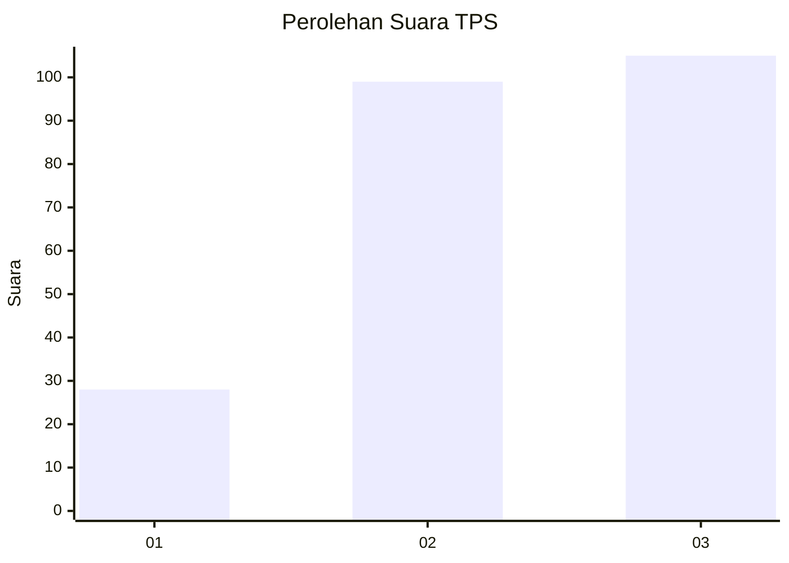
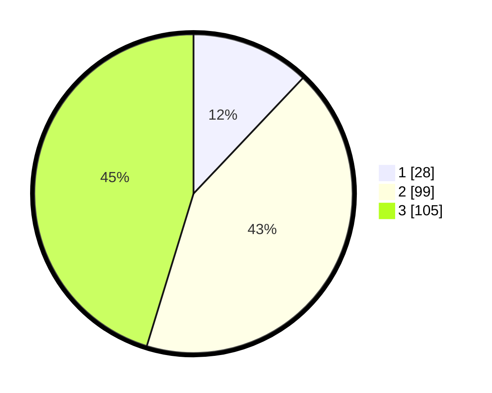

# Hasil

## Grafik

## Tabel

| No. | Nama Paslon    | Suara | Suara (raw) | Persentase |
|:--- |:-------------- | -----:| -----------:| ----------:|
| 1   | ANIES MUHAIMIN | 28    | [28][p-1]   | 12,07      |
| 2   | PRABOWO GIBRAN | 99    | [99][p-2]   | 42,67      |
| 3   | GANJAR MAHFUD  | 105   | [105][p-3]  | 45,26      |

[p-1]: https://github.com/gigit-pemilu/pemilu-2024-33-jawa-tengah/blob/main/pilpres/hitung-suara/sub/33-jawa-tengah/sub/03-purbalingga/sub/14-bojongsari/sub/2007-kajongan/sub/003-tps/sub/paslon-1.txt
[p-2]: https://github.com/gigit-pemilu/pemilu-2024-33-jawa-tengah/blob/main/pilpres/hitung-suara/sub/33-jawa-tengah/sub/03-purbalingga/sub/14-bojongsari/sub/2007-kajongan/sub/003-tps/sub/paslon-2.txt
[p-3]: https://github.com/gigit-pemilu/pemilu-2024-33-jawa-tengah/blob/main/pilpres/hitung-suara/sub/33-jawa-tengah/sub/03-purbalingga/sub/14-bojongsari/sub/2007-kajongan/sub/003-tps/sub/paslon-3.txt

## Foto C Plano

https://sirekap-obj-formc.kpu.go.id/dbb9/pemilu/ppwp/33/03/14/20/07/3303142007003-20240215-073906--6446f742-f966-444a-b9a5-7041e59f0810.jpg

https://sirekap-obj-formc.kpu.go.id/dbb9/pemilu/ppwp/33/03/14/20/07/3303142007003-20240215-074054--442c33dc-cc40-4863-b9f0-28d3f87aa5cc.jpg

https://sirekap-obj-formc.kpu.go.id/dbb9/pemilu/ppwp/33/03/14/20/07/3303142007003-20240215-074306--6c76a5f3-8199-42d3-ba9e-30ac3995ea02.jpg

## Metadata

| Key        | Value               |
| ---------- | ------------------- |
| Time Stamp | 2024-02-15 15:00:29 |

