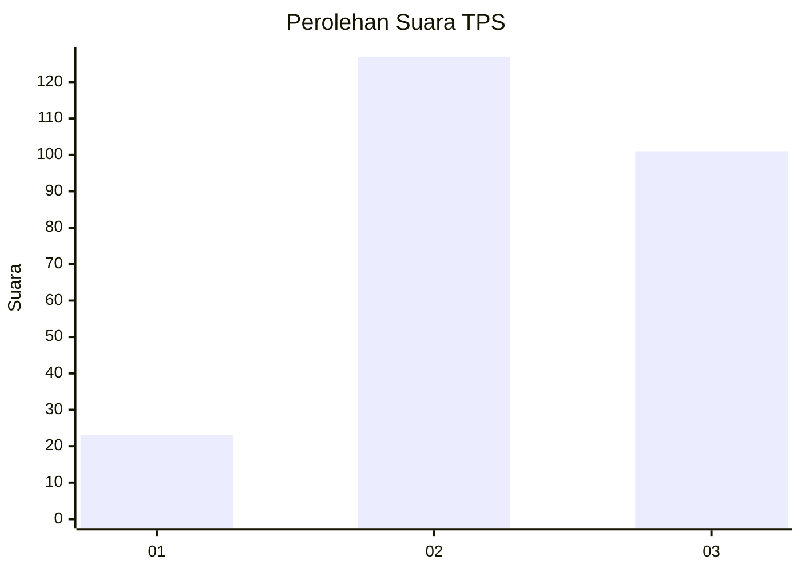
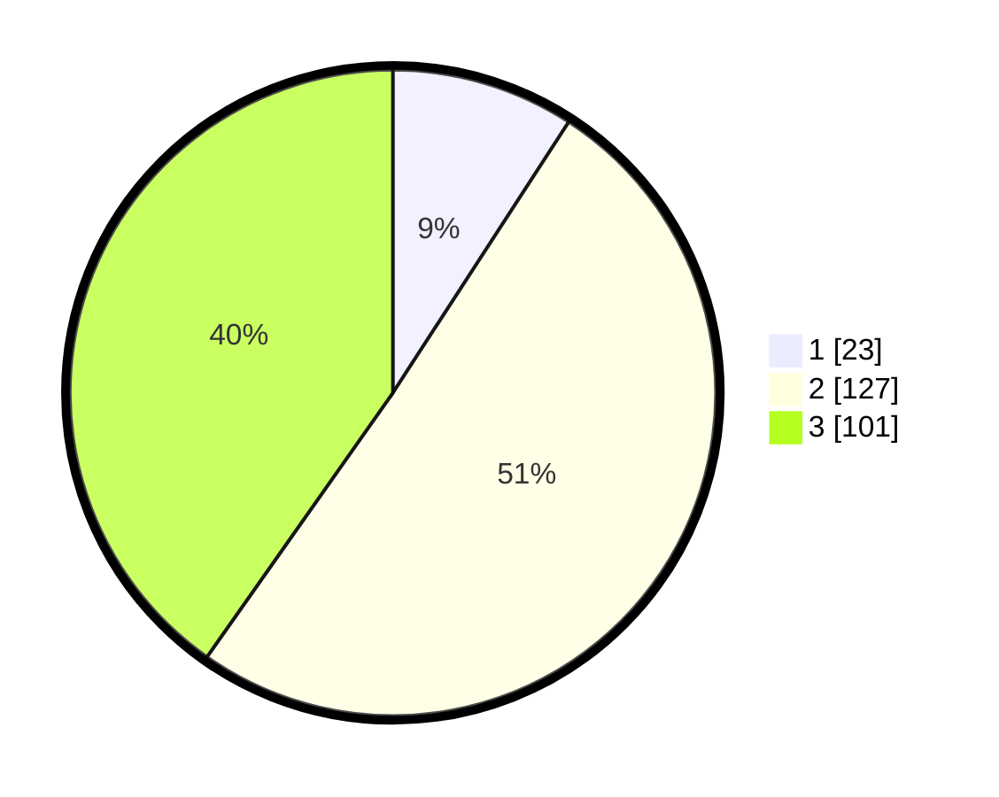

# Hasil

## Grafik

## Tabel

| No. | Nama Paslon    | Suara | Suara (raw) | Persentase |
|:--- |:-------------- | -----:| -----------:| ----------:|
| 1   | ANIES MUHAIMIN | 23    | [23][p-1]   | 9,16       |
| 2   | PRABOWO GIBRAN | 127   | [127][p-2]  | 50,60      |
| 3   | GANJAR MAHFUD  | 101   | [101][p-3]  | 40,24      |

[p-1]: https://github.com/gigit-pemilu/pemilu-2024/blob/main/pilpres/hitung-suara/sub/33-jawa-tengah/sub/03-purbalingga/sub/14-bojongsari/sub/2007-kajongan/sub/007-tps/sub/paslon-1.txt
[p-2]: https://github.com/gigit-pemilu/pemilu-2024/blob/main/pilpres/hitung-suara/sub/33-jawa-tengah/sub/03-purbalingga/sub/14-bojongsari/sub/2007-kajongan/sub/007-tps/sub/paslon-2.txt
[p-3]: https://github.com/gigit-pemilu/pemilu-2024/blob/main/pilpres/hitung-suara/sub/33-jawa-tengah/sub/03-purbalingga/sub/14-bojongsari/sub/2007-kajongan/sub/007-tps/sub/paslon-3.txt

## Foto C Plano

https://sirekap-obj-formc.kpu.go.id/7577/pemilu/ppwp/33/03/14/20/07/3303142007007-20240215-090227--7d7b806f-a160-4439-acce-5075634212bb.jpg

https://sirekap-obj-formc.kpu.go.id/7577/pemilu/ppwp/33/03/14/20/07/3303142007007-20240215-090407--734a1c9a-45c7-4591-88a6-8c1df5750c14.jpg

https://sirekap-obj-formc.kpu.go.id/7577/pemilu/ppwp/33/03/14/20/07/3303142007007-20240215-090506--3b65fd01-8350-41f1-81bf-973169957284.jpg

## Metadata

| Key        | Value               |
| ---------- | ------------------- |
| Time Stamp | 2024-02-15 15:00:29 |

