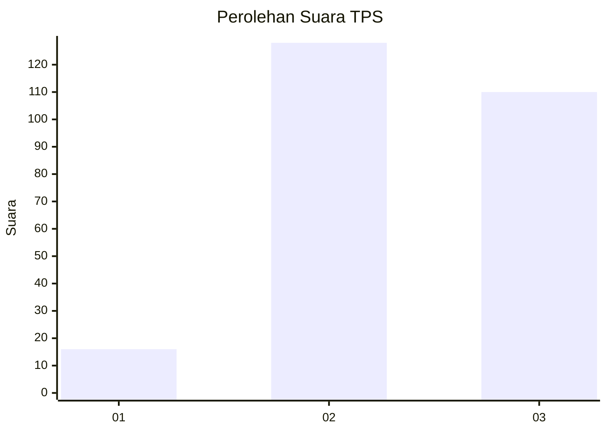
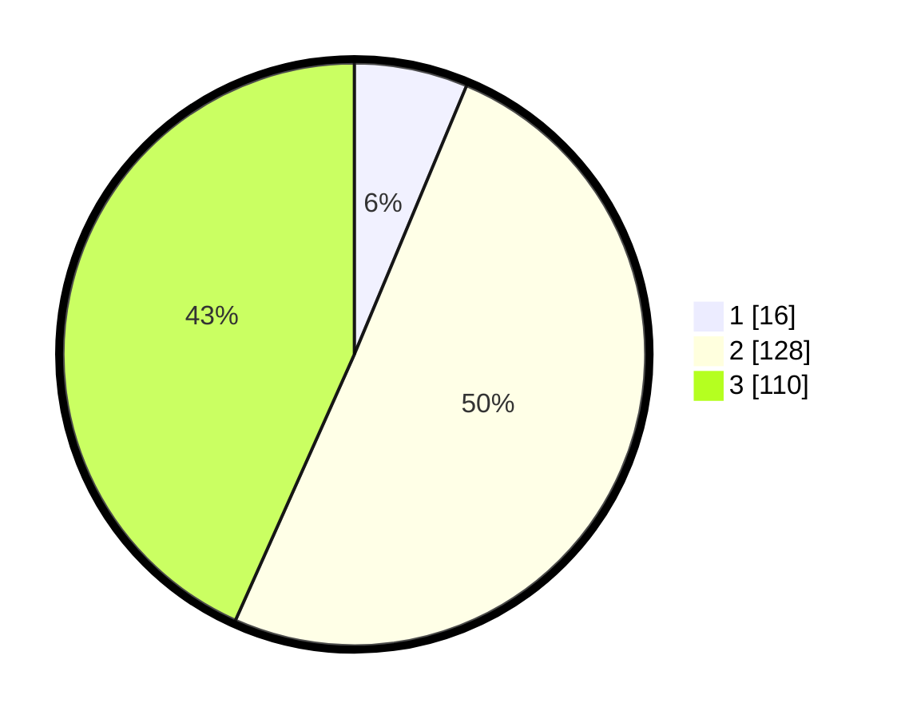

# Hasil

## Grafik

## Tabel

| No. | Nama Paslon    | Suara | Suara (raw) | Persentase |
|:--- |:-------------- | -----:| -----------:| ----------:|
| 1   | ANIES MUHAIMIN | 16    | [16][p-1]   | 6,30       |
| 2   | PRABOWO GIBRAN | 128   | [128][p-2]  | 50,39      |
| 3   | GANJAR MAHFUD  | 110   | [110][p-3]  | 43,31      |

[p-1]: https://github.com/gigit-pemilu/pemilu-2024-33-jawa-tengah/blob/main/pilpres/hitung-suara/sub/33-jawa-tengah/sub/03-purbalingga/sub/14-bojongsari/sub/2007-kajongan/sub/012-tps/sub/paslon-1.txt
[p-2]: https://github.com/gigit-pemilu/pemilu-2024-33-jawa-tengah/blob/main/pilpres/hitung-suara/sub/33-jawa-tengah/sub/03-purbalingga/sub/14-bojongsari/sub/2007-kajongan/sub/012-tps/sub/paslon-2.txt
[p-3]: https://github.com/gigit-pemilu/pemilu-2024-33-jawa-tengah/blob/main/pilpres/hitung-suara/sub/33-jawa-tengah/sub/03-purbalingga/sub/14-bojongsari/sub/2007-kajongan/sub/012-tps/sub/paslon-3.txt

## Foto C Plano

https://sirekap-obj-formc.kpu.go.id/8d54/pemilu/ppwp/33/03/14/20/07/3303142007012-20240214-205207--dfb9d775-7bec-4fe6-9357-2a3552a15994.jpg

https://sirekap-obj-formc.kpu.go.id/8d54/pemilu/ppwp/33/03/14/20/07/3303142007012-20240214-205449--79011d01-9791-44df-833d-5c593083ddfd.jpg

https://sirekap-obj-formc.kpu.go.id/8d54/pemilu/ppwp/33/03/14/20/07/3303142007012-20240214-205830--ee8c915c-c050-4992-91c9-7fbe3042445c.jpg

## Metadata

| Key        | Value               |
| ---------- | ------------------- |
| Time Stamp | 2024-02-15 15:30:25 |

