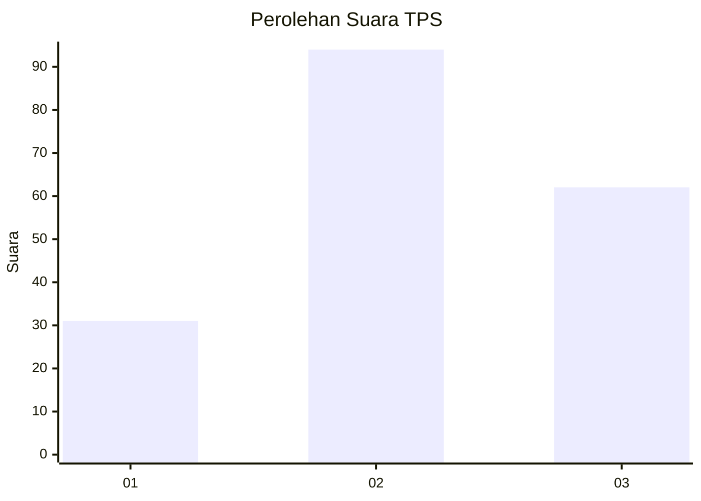
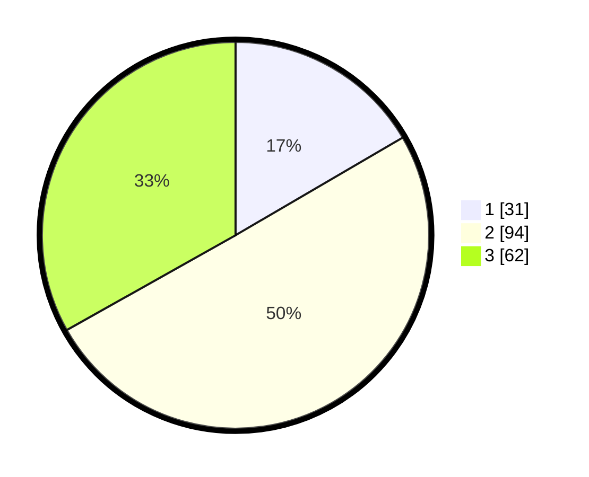

# Hasil

## Grafik

## Tabel

| No. | Nama Paslon    | Suara | Suara (raw) | Persentase |
|:--- |:-------------- | -----:| -----------:| ----------:|
| 1   | ANIES MUHAIMIN | 31    | [31][p-1]   | 16,58      |
| 2   | PRABOWO GIBRAN | 94    | [94][p-2]   | 50,27      |
| 3   | GANJAR MAHFUD  | 62    | [62][p-3]   | 33,16      |

[p-1]: https://github.com/gigit-pemilu/pemilu-2024/blob/main/pilpres/hitung-suara/sub/33-jawa-tengah/sub/03-purbalingga/sub/14-bojongsari/sub/2012-metenggeng/sub/006-tps/sub/paslon-1.txt
[p-2]: https://github.com/gigit-pemilu/pemilu-2024/blob/main/pilpres/hitung-suara/sub/33-jawa-tengah/sub/03-purbalingga/sub/14-bojongsari/sub/2012-metenggeng/sub/006-tps/sub/paslon-2.txt
[p-3]: https://github.com/gigit-pemilu/pemilu-2024/blob/main/pilpres/hitung-suara/sub/33-jawa-tengah/sub/03-purbalingga/sub/14-bojongsari/sub/2012-metenggeng/sub/006-tps/sub/paslon-3.txt

## Foto C Plano

https://sirekap-obj-formc.kpu.go.id/6e99/pemilu/ppwp/33/03/14/20/12/3303142012006-20240215-034900--f25aca5d-0f8d-440f-821a-0ccc19218953.jpg

https://sirekap-obj-formc.kpu.go.id/6e99/pemilu/ppwp/33/03/14/20/12/3303142012006-20240215-035017--3c9b51e1-38ed-4948-8cfa-ccdbbaff1b4a.jpg

https://sirekap-obj-formc.kpu.go.id/6e99/pemilu/ppwp/33/03/14/20/12/3303142012006-20240215-035044--d968578c-0b41-473d-ad9d-0ae00cfde084.jpg

## Metadata

| Key        | Value               |
| ---------- | ------------------- |
| Time Stamp | 2024-02-15 15:30:25 |

