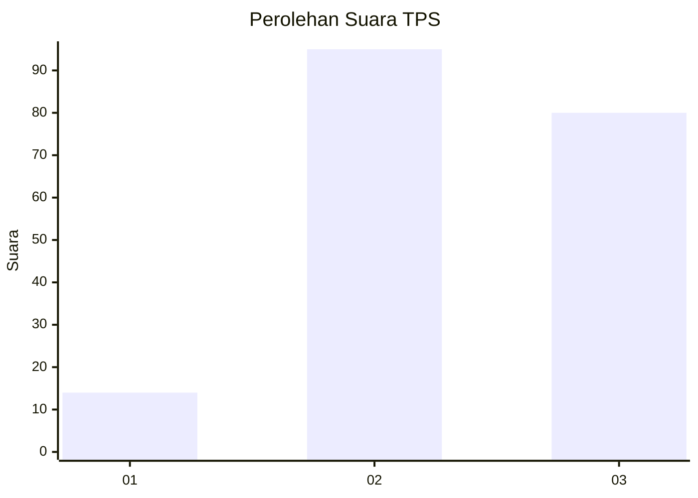
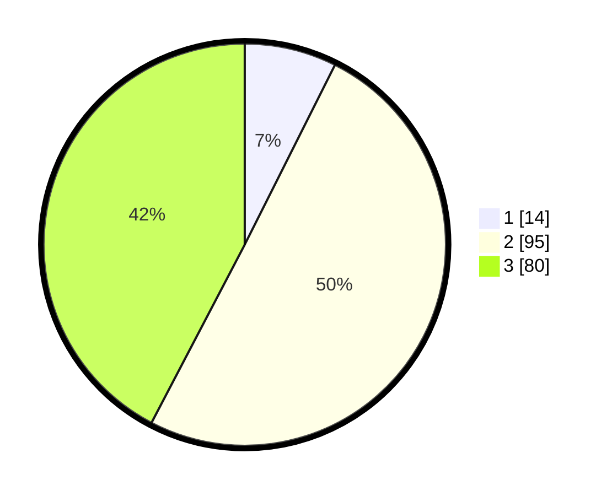

# Hasil

## Grafik

## Tabel

| No. | Nama Paslon    | Suara | Suara (raw) | Persentase |
|:--- |:-------------- | -----:| -----------:| ----------:|
| 1   | ANIES MUHAIMIN | 14    | [14][p-1]   | 7,41       |
| 2   | PRABOWO GIBRAN | 95    | [95][p-2]   | 50,26      |
| 3   | GANJAR MAHFUD  | 80    | [80][p-3]   | 42,33      |

[p-1]: https://github.com/gigit-pemilu/pemilu-2024/blob/main/pilpres/hitung-suara/sub/33-jawa-tengah/sub/03-purbalingga/sub/14-bojongsari/sub/2013-bumisari/sub/004-tps/sub/paslon-1.txt
[p-2]: https://github.com/gigit-pemilu/pemilu-2024/blob/main/pilpres/hitung-suara/sub/33-jawa-tengah/sub/03-purbalingga/sub/14-bojongsari/sub/2013-bumisari/sub/004-tps/sub/paslon-2.txt
[p-3]: https://github.com/gigit-pemilu/pemilu-2024/blob/main/pilpres/hitung-suara/sub/33-jawa-tengah/sub/03-purbalingga/sub/14-bojongsari/sub/2013-bumisari/sub/004-tps/sub/paslon-3.txt

## Foto C Plano

https://sirekap-obj-formc.kpu.go.id/bf9d/pemilu/ppwp/33/03/14/20/13/3303142013004-20240214-221007--af45fd61-ed05-4515-b5ea-ce8409d4f8c4.jpg

https://sirekap-obj-formc.kpu.go.id/bf9d/pemilu/ppwp/33/03/14/20/13/3303142013004-20240214-221136--97cfbb29-c528-4a9b-8e63-8be3cc3e0f68.jpg

https://sirekap-obj-formc.kpu.go.id/bf9d/pemilu/ppwp/33/03/14/20/13/3303142013004-20240214-221253--f8e1f3fb-a610-43d0-8f07-098f264d264b.jpg

## Metadata

| Key        | Value               |
| ---------- | ------------------- |
| Time Stamp | 2024-02-15 15:00:29 |

