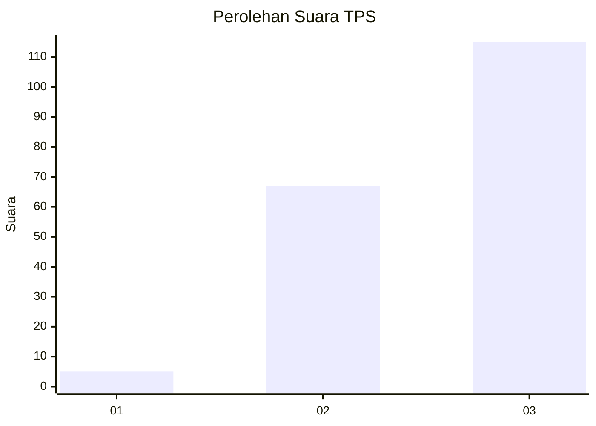
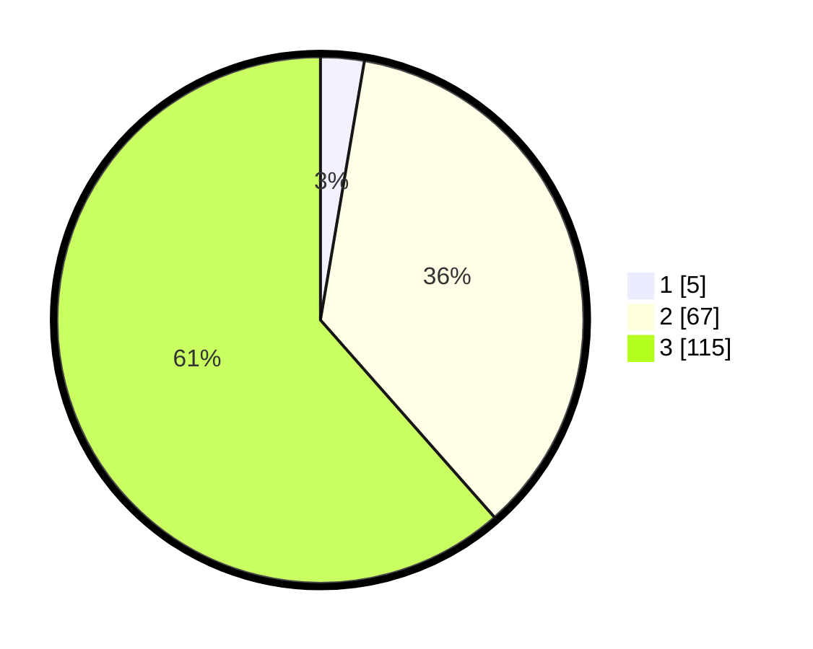

# Hasil

## Grafik

## Tabel

| No. | Nama Paslon    | Suara | Suara (raw) | Persentase |
|:--- |:-------------- | -----:| -----------:| ----------:|
| 1   | ANIES MUHAIMIN | 5     | [5][p-1]    | 2,67       |
| 2   | PRABOWO GIBRAN | 67    | [67][p-2]   | 35,83      |
| 3   | GANJAR MAHFUD  | 115   | [115][p-3]  | 61,50      |

[p-1]: https://github.com/gigit-pemilu/pemilu-2024/blob/main/pilpres/hitung-suara/sub/33-jawa-tengah/sub/03-purbalingga/sub/14-bojongsari/sub/2013-bumisari/sub/012-tps/sub/paslon-1.txt
[p-2]: https://github.com/gigit-pemilu/pemilu-2024/blob/main/pilpres/hitung-suara/sub/33-jawa-tengah/sub/03-purbalingga/sub/14-bojongsari/sub/2013-bumisari/sub/012-tps/sub/paslon-2.txt
[p-3]: https://github.com/gigit-pemilu/pemilu-2024/blob/main/pilpres/hitung-suara/sub/33-jawa-tengah/sub/03-purbalingga/sub/14-bojongsari/sub/2013-bumisari/sub/012-tps/sub/paslon-3.txt

## Foto C Plano

https://sirekap-obj-formc.kpu.go.id/6c46/pemilu/ppwp/33/03/14/20/13/3303142013012-20240214-200715--f822c12a-f030-43b0-a091-29f4c07a5a68.jpg

https://sirekap-obj-formc.kpu.go.id/6c46/pemilu/ppwp/33/03/14/20/13/3303142013012-20240214-200735--5b08fe5c-3653-4d67-b8c7-1d207d6c5b5f.jpg

https://sirekap-obj-formc.kpu.go.id/6c46/pemilu/ppwp/33/03/14/20/13/3303142013012-20240214-222735--428583aa-9b70-4f1e-82f9-4710db1112ac.jpg

## Metadata

| Key        | Value               |
| ---------- | ------------------- |
| Time Stamp | 2024-02-15 00:41:44 |

