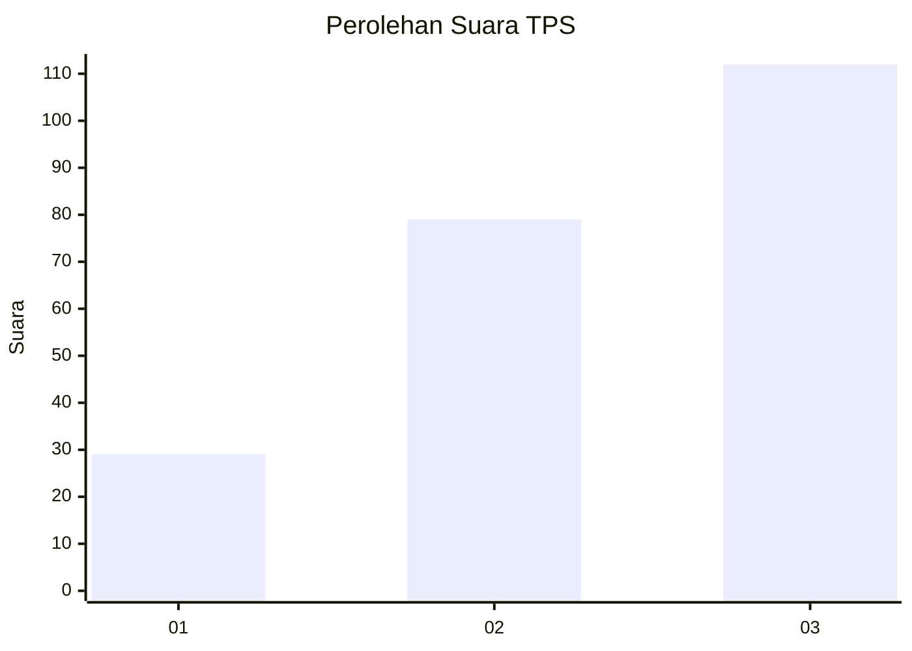
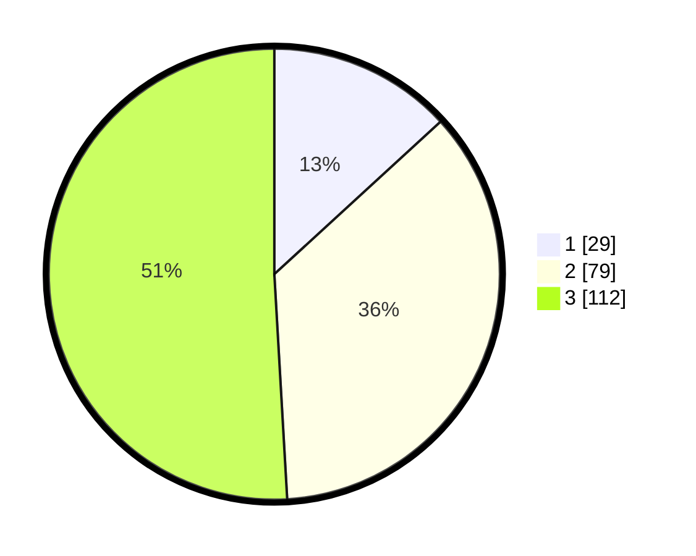

# Hasil

## Grafik

## Tabel

| No. | Nama Paslon    | Suara | Suara (raw) | Persentase |
|:--- |:-------------- | -----:| -----------:| ----------:|
| 1   | ANIES MUHAIMIN | 29    | [29][p-1]   | 13,18      |
| 2   | PRABOWO GIBRAN | 79    | [79][p-2]   | 35,91      |
| 3   | GANJAR MAHFUD  | 112   | [112][p-3]  | 50,91      |

[p-1]: https://github.com/gigit-pemilu/pemilu-2024/blob/main/pilpres/hitung-suara/sub/33-jawa-tengah/sub/03-purbalingga/sub/15-padamara/sub/1004-karangsentul/sub/005-tps/sub/paslon-1.txt
[p-2]: https://github.com/gigit-pemilu/pemilu-2024/blob/main/pilpres/hitung-suara/sub/33-jawa-tengah/sub/03-purbalingga/sub/15-padamara/sub/1004-karangsentul/sub/005-tps/sub/paslon-2.txt
[p-3]: https://github.com/gigit-pemilu/pemilu-2024/blob/main/pilpres/hitung-suara/sub/33-jawa-tengah/sub/03-purbalingga/sub/15-padamara/sub/1004-karangsentul/sub/005-tps/sub/paslon-3.txt

## Foto C Plano

https://sirekap-obj-formc.kpu.go.id/f642/pemilu/ppwp/33/03/15/10/04/3303151004005-20240214-201242--ce181063-f342-4916-bf8e-a871f82d5755.jpg

https://sirekap-obj-formc.kpu.go.id/f642/pemilu/ppwp/33/03/15/10/04/3303151004005-20240214-195651--913726df-bb18-401c-8f65-4c6bf8829859.jpg

https://sirekap-obj-formc.kpu.go.id/f642/pemilu/ppwp/33/03/15/10/04/3303151004005-20240214-200932--91e82d58-2136-4458-ab23-07a9aac00847.jpg

## Metadata

| Key        | Value               |
| ---------- | ------------------- |
| Time Stamp | 2024-02-14 21:46:01 |

