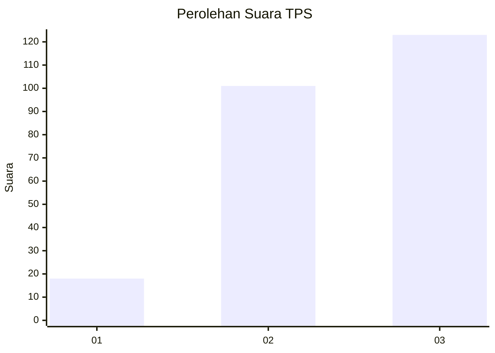
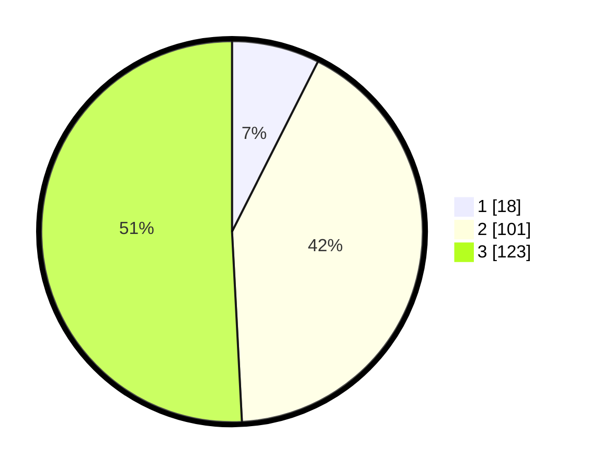

# Hasil

## Grafik

## Tabel

| No. | Nama Paslon    | Suara | Suara (raw) | Persentase |
|:--- |:-------------- | -----:| -----------:| ----------:|
| 1   | ANIES MUHAIMIN | 18    | [18][p-1]   | 7,44       |
| 2   | PRABOWO GIBRAN | 101   | [101][p-2]  | 41,74      |
| 3   | GANJAR MAHFUD  | 123   | [123][p-3]  | 50,83      |

[p-1]: https://github.com/gigit-pemilu/pemilu-2024/blob/main/pilpres/hitung-suara/sub/33-jawa-tengah/sub/03-purbalingga/sub/15-padamara/sub/2006-gemuruh/sub/004-tps/sub/paslon-1.txt
[p-2]: https://github.com/gigit-pemilu/pemilu-2024/blob/main/pilpres/hitung-suara/sub/33-jawa-tengah/sub/03-purbalingga/sub/15-padamara/sub/2006-gemuruh/sub/004-tps/sub/paslon-2.txt
[p-3]: https://github.com/gigit-pemilu/pemilu-2024/blob/main/pilpres/hitung-suara/sub/33-jawa-tengah/sub/03-purbalingga/sub/15-padamara/sub/2006-gemuruh/sub/004-tps/sub/paslon-3.txt

## Foto C Plano

https://sirekap-obj-formc.kpu.go.id/b1b5/pemilu/ppwp/33/03/15/20/06/3303152006004-20240215-022850--daae1e84-4110-46de-be80-a2a78823db47.jpg

https://sirekap-obj-formc.kpu.go.id/b1b5/pemilu/ppwp/33/03/15/20/06/3303152006004-20240215-022950--61e6c073-cada-429e-bcb8-038a212734e9.jpg

https://sirekap-obj-formc.kpu.go.id/b1b5/pemilu/ppwp/33/03/15/20/06/3303152006004-20240215-023039--2a7222b5-4cb3-4320-9f21-959cfe93c767.jpg

## Metadata

| Key        | Value               |
| ---------- | ------------------- |
| Time Stamp | 2024-02-15 16:30:25 |

