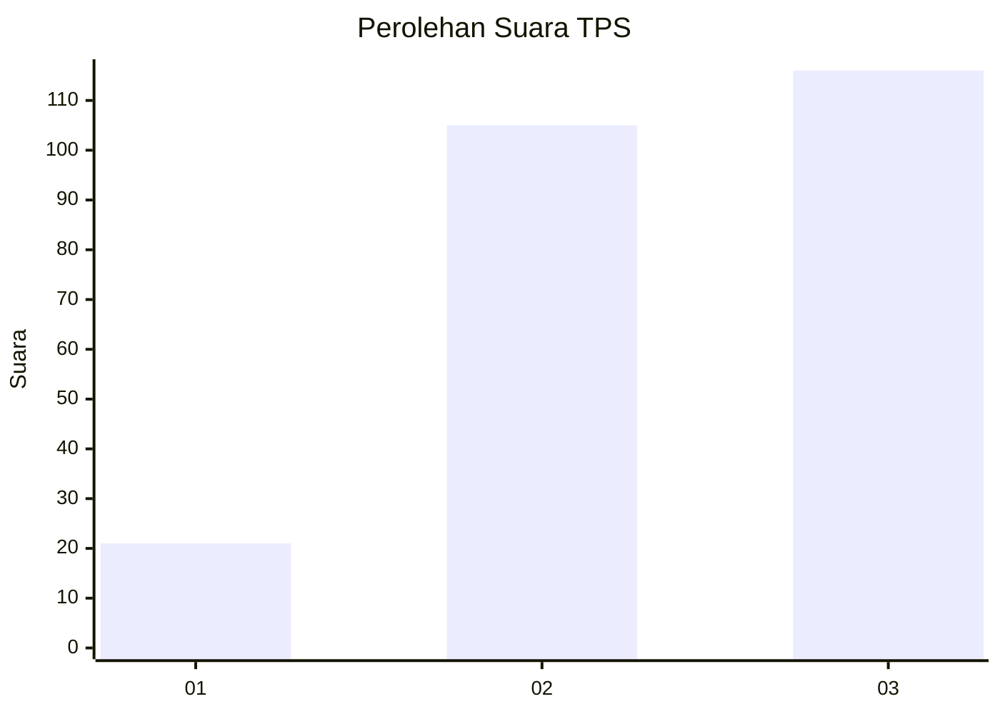
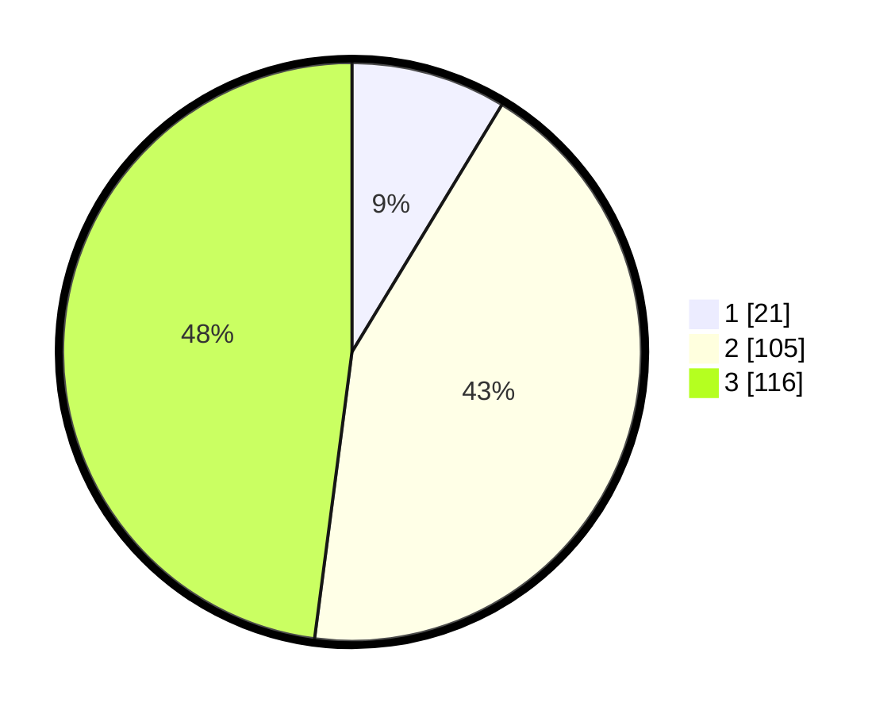

# Hasil

## Grafik

## Tabel

| No. | Nama Paslon    | Suara | Suara (raw) | Persentase |
|:--- |:-------------- | -----:| -----------:| ----------:|
| 1   | ANIES MUHAIMIN | 21    | [21][p-1]   | 8,68       |
| 2   | PRABOWO GIBRAN | 105   | [105][p-2]  | 43,39      |
| 3   | GANJAR MAHFUD  | 116   | [116][p-3]  | 47,93      |

[p-1]: https://github.com/gigit-pemilu/pemilu-2024-33-jawa-tengah/blob/main/pilpres/hitung-suara/sub/33-jawa-tengah/sub/03-purbalingga/sub/15-padamara/sub/2007-dawuhan/sub/010-tps/sub/paslon-1.txt
[p-2]: https://github.com/gigit-pemilu/pemilu-2024-33-jawa-tengah/blob/main/pilpres/hitung-suara/sub/33-jawa-tengah/sub/03-purbalingga/sub/15-padamara/sub/2007-dawuhan/sub/010-tps/sub/paslon-2.txt
[p-3]: https://github.com/gigit-pemilu/pemilu-2024-33-jawa-tengah/blob/main/pilpres/hitung-suara/sub/33-jawa-tengah/sub/03-purbalingga/sub/15-padamara/sub/2007-dawuhan/sub/010-tps/sub/paslon-3.txt

## Foto C Plano

https://sirekap-obj-formc.kpu.go.id/67a1/pemilu/ppwp/33/03/15/20/07/3303152007010-20240215-032505--9fe99231-d317-4732-81db-13dbbedfe19d.jpg

https://sirekap-obj-formc.kpu.go.id/67a1/pemilu/ppwp/33/03/15/20/07/3303152007010-20240215-032509--34eb6d3e-18cd-40a5-9eec-ea9be192a165.jpg

https://sirekap-obj-formc.kpu.go.id/67a1/pemilu/ppwp/33/03/15/20/07/3303152007010-20240215-032511--07cbaa3a-d446-4e2d-9722-b5a21c062671.jpg

## Metadata

| Key        | Value               |
| ---------- | ------------------- |
| Time Stamp | 2024-02-15 12:00:28 |

