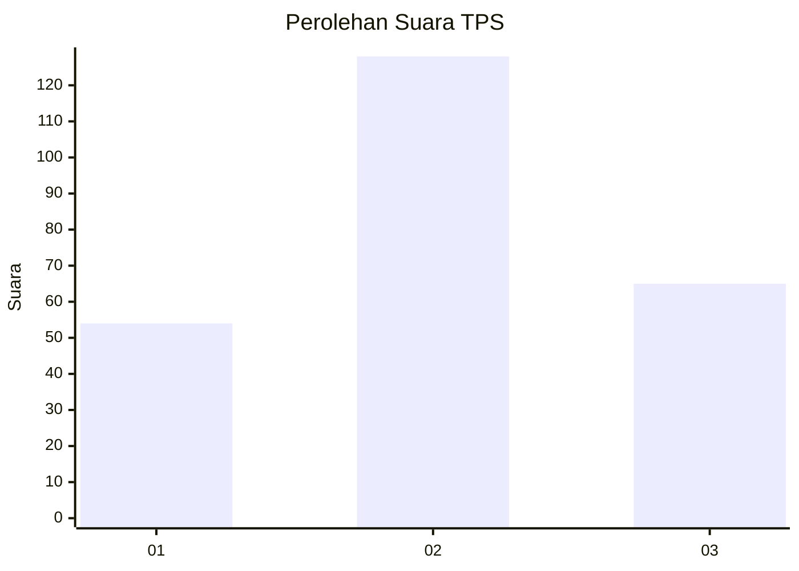
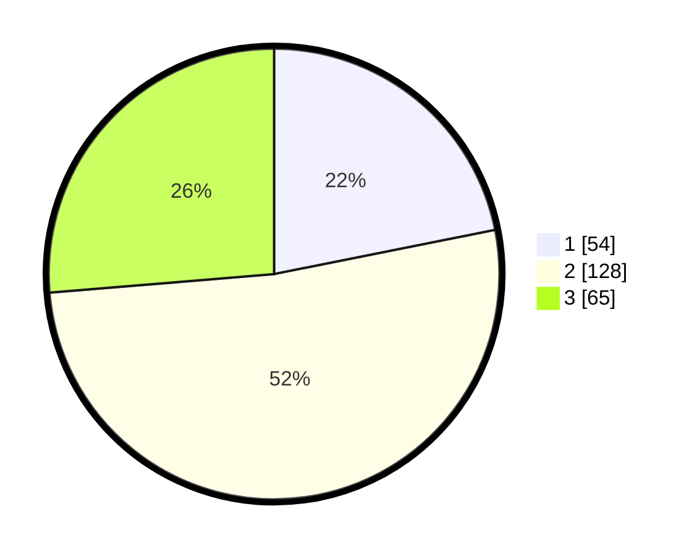

# Hasil

## Grafik

## Tabel

| No. | Nama Paslon    | Suara | Suara (raw) | Persentase |
|:--- |:-------------- | -----:| -----------:| ----------:|
| 1   | ANIES MUHAIMIN | 54    | [54][p-1]   | 21,86      |
| 2   | PRABOWO GIBRAN | 128   | [128][p-2]  | 51,82      |
| 3   | GANJAR MAHFUD  | 65    | [65][p-3]   | 26,32      |

[p-1]: https://github.com/gigit-pemilu/pemilu-2024-33-jawa-tengah/blob/main/pilpres/hitung-suara/sub/33-jawa-tengah/sub/03-purbalingga/sub/15-padamara/sub/2009-padamara/sub/002-tps/sub/paslon-1.txt
[p-2]: https://github.com/gigit-pemilu/pemilu-2024-33-jawa-tengah/blob/main/pilpres/hitung-suara/sub/33-jawa-tengah/sub/03-purbalingga/sub/15-padamara/sub/2009-padamara/sub/002-tps/sub/paslon-2.txt
[p-3]: https://github.com/gigit-pemilu/pemilu-2024-33-jawa-tengah/blob/main/pilpres/hitung-suara/sub/33-jawa-tengah/sub/03-purbalingga/sub/15-padamara/sub/2009-padamara/sub/002-tps/sub/paslon-3.txt

## Foto C Plano

https://sirekap-obj-formc.kpu.go.id/ab09/pemilu/ppwp/33/03/15/20/09/3303152009002-20240214-223131--096ba603-b5af-4f45-86de-31e9db749ab2.jpg

https://sirekap-obj-formc.kpu.go.id/ab09/pemilu/ppwp/33/03/15/20/09/3303152009002-20240214-223253--786bd75f-cd57-4707-845c-8db2e84c8cf5.jpg

https://sirekap-obj-formc.kpu.go.id/ab09/pemilu/ppwp/33/03/15/20/09/3303152009002-20240214-223455--6612b7fd-b453-46fe-a9a7-54e86c6e9424.jpg

## Metadata

| Key        | Value               |
| ---------- | ------------------- |
| Time Stamp | 2024-02-15 15:00:29 |

