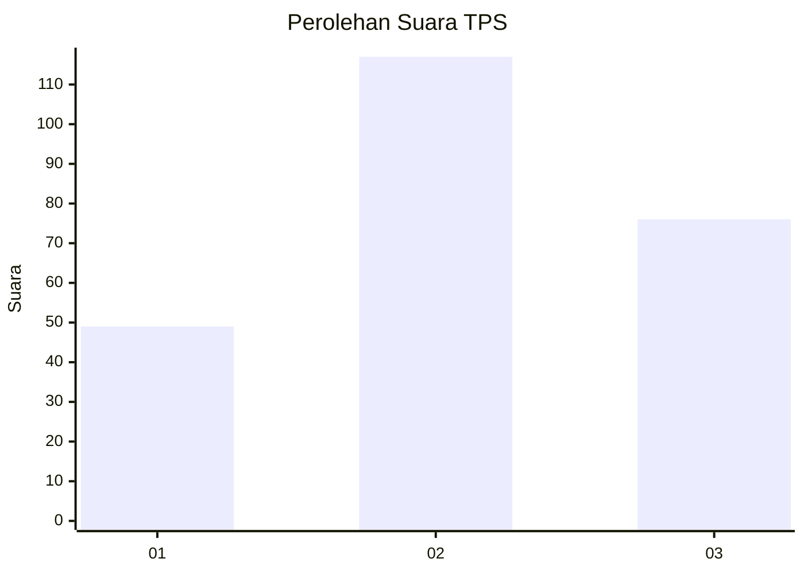
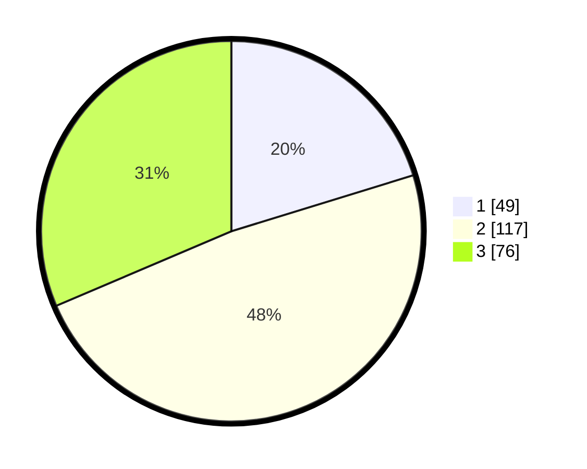

# Hasil

## Grafik

## Tabel

| No. | Nama Paslon    | Suara | Suara (raw) | Persentase |
|:--- |:-------------- | -----:| -----------:| ----------:|
| 1   | ANIES MUHAIMIN | 49    | [49][p-1]   | 20,25      |
| 2   | PRABOWO GIBRAN | 117   | [117][p-2]  | 48,35      |
| 3   | GANJAR MAHFUD  | 76    | [76][p-3]   | 31,40      |

[p-1]: https://github.com/gigit-pemilu/pemilu-2024/blob/main/pilpres/hitung-suara/sub/33-jawa-tengah/sub/03-purbalingga/sub/15-padamara/sub/2014-kalitinggar-kidul/sub/001-tps/sub/paslon-1.txt
[p-2]: https://github.com/gigit-pemilu/pemilu-2024/blob/main/pilpres/hitung-suara/sub/33-jawa-tengah/sub/03-purbalingga/sub/15-padamara/sub/2014-kalitinggar-kidul/sub/001-tps/sub/paslon-2.txt
[p-3]: https://github.com/gigit-pemilu/pemilu-2024/blob/main/pilpres/hitung-suara/sub/33-jawa-tengah/sub/03-purbalingga/sub/15-padamara/sub/2014-kalitinggar-kidul/sub/001-tps/sub/paslon-3.txt

## Foto C Plano

https://sirekap-obj-formc.kpu.go.id/8c68/pemilu/ppwp/33/03/15/20/14/3303152014001-20240214-191823--e169a461-2963-4446-919d-d8dfed55d4d4.jpg

https://sirekap-obj-formc.kpu.go.id/8c68/pemilu/ppwp/33/03/15/20/14/3303152014001-20240214-191827--f6c9bedd-9dab-4354-af81-5ef6e7dea302.jpg

https://sirekap-obj-formc.kpu.go.id/8c68/pemilu/ppwp/33/03/15/20/14/3303152014001-20240214-191833--126118bf-4f76-423a-885d-de1597c11080.jpg

## Metadata

| Key        | Value               |
| ---------- | ------------------- |
| Time Stamp | 2024-02-15 12:00:28 |

